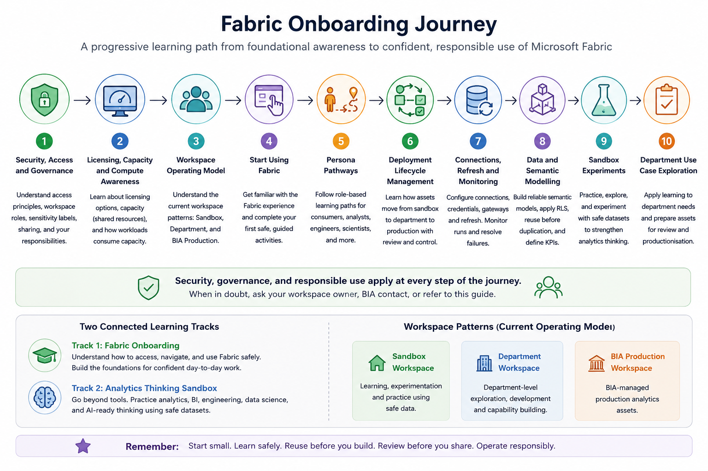

# Start Here

Welcome to the Fabric Onboarding Experience.

This repository is designed to support Microsoft Fabric onboarding at scale. As interest in Fabric grows across the University, BIA cannot provide high-touch, one-to-one onboarding for every potential learner, department representative, or Fabric enthusiast.

Instead, this repo provides a structured self-service pathway for users to learn, practise, and apply Fabric safely and progressively.

## Why this onboarding is layered

Microsoft Fabric is not just a reporting tool. It is a shared analytics platform that may involve reports, semantic models, Lakehouses, pipelines, notebooks, dataflows, and institutional data.

Because of this, users should not jump straight into creating Fabric items without first understanding:

- What they are allowed to access
- Which workspace they should use
- What data they can use safely
- How shared Fabric capacity is consumed
- When outputs are experimental
- When work may need review before productionisation

The onboarding is therefore layered so that users start with common foundations before moving into hands-on activities and persona-specific pathways.



> Image placeholder: A simple left-to-right journey map showing users moving from security and access, to licensing and capacity, to workspace model, to hands-on Fabric use, to persona pathways, to sandbox experiments, and finally to review or productionisation where applicable.

## Who this repo is for

This repo is intended for several groups of users.

| User Group | How this repo helps |
|---|---|
| New Fabric users | Understand the basics before using Fabric |
| Report consumers | Learn how to access and interpret approved reports responsibly |
| Report developers | Learn how to work with reports, semantic models, and workspace expectations |
| Department representatives | Understand how department workspaces fit into the operating model |
| Fabric enthusiasts | Practise safely in sandbox workspaces using safe data |
| Data analysts | Build analytical confidence through guided activities |
| Data engineers | Learn common Fabric data patterns such as Lakehouse, pipeline, and notebook workflows |
| Data scientists | Explore advanced analytics experiments using synthetic or approved data |
| BIA colleagues | Reuse onboarding materials to support adoption at scale |

## How to use this repo

If you are new to Fabric, start with the foundation sections:

1. Security, Access and Governance
2. Licensing, Capacity and Compute Awareness
3. Fabric Workspace Operating Model

After that, continue to:

4. Start Using Fabric
5. Persona Pathways
6. Sandbox Experiments, if you want to practise or go deeper

## Recommended onboarding flow

```text
Start Here
   ↓
Security, Access and Governance
   ↓
Licensing, Capacity and Compute Awareness
   ↓
Workspace Operating Model
   ↓
Start Using Fabric
   ↓
Persona Pathway
   ↓
Sandbox Experiments
   ↓
Department Use Case Exploration
   ↓
Review / Productionisation, where applicable
```

## Two connected learning tracks

This repo supports two connected tracks.

### Track 1: Fabric Onboarding

This track helps users understand how to access, navigate, and use Fabric safely.

It covers:

- Security and access expectations
- Licensing and capacity awareness
- Workspace operating model
- First safe activities in Fabric
- Persona-based pathways
- Deployment and productionisation expectations

### Track 2: Analytics Thinking Sandbox

This track is for users who want to go beyond basic tool familiarity.

It provides guided sandbox experiments that help users practise analytics, BI, semantic modelling, data engineering, data science, and AI-ready data thinking using safe datasets.

The aim is not only to teach Fabric features, but also to develop better analytics judgement.

## Sandbox as an entry point for enthusiasts

Sandbox workspaces provide a safe entry point for Fabric enthusiasts and learners who may not yet have a formal department use case.

Sandbox experiments should use:

- Mocked data
- Synthetic data
- Public data
- Approved non-sensitive data

Sandbox outputs should not be treated as official reports, validated analytics products, or production-ready assets.

## Before you start

Before doing hands-on work in Fabric, make sure you can answer these questions:

- Do I know which workspace I should use?
- Do I know whether I am in a sandbox, department, or production workspace?
- Do I understand my workspace role?
- Do I know what data I am allowed to use?
- Do I understand whether the data is sensitive?
- Do I know whether my output is experimental or production-facing?
- Do I know who to contact if I need help?

## References and further learning

| Resource | Purpose |
|---|---|
| [Microsoft Fabric documentation](https://learn.microsoft.com/en-us/fabric/) | Official Microsoft documentation for Fabric concepts, workloads, and platform capabilities |
| [What is Microsoft Fabric?](https://learn.microsoft.com/en-us/fabric/fundamentals/microsoft-fabric-overview) | Introduction to Fabric as an end-to-end analytics platform |
| [Power BI service basic concepts](https://learn.microsoft.com/en-us/power-bi/fundamentals/service-basic-concepts) | Helpful for users new to workspaces, reports, dashboards, and semantic models |
| [Power BI get started documentation](https://learn.microsoft.com/en-us/power-bi/fundamentals/) | Starting point for users learning how to navigate Power BI and related concepts |

## Next section

Proceed to:

```text
01-security-access-governance/
```

Security, access, and governance should be understood before using Fabric hands-on.
