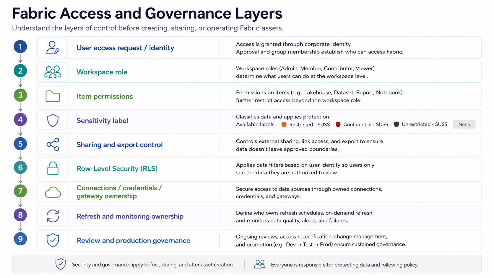

# Security, Access and Governance

Security, access, and governance come before hands-on Fabric usage.

Microsoft Fabric is a shared analytics platform. Users may interact with reports, semantic models, Lakehouses, pipelines, notebooks, dataflows, warehouses, connections, refresh schedules, and institutional data. This means users should understand their responsibilities before they start creating, editing, sharing, or publishing Fabric assets.

This section explains the basic security and access principles that apply before users begin working in Fabric.

## Why security comes first

Fabric makes it easier for users to create analytics assets, but easier creation also means stronger responsibility.

Before using Fabric, users should understand:

- What they are allowed to access
- Which workspace they should use
- What data they are allowed to work with
- Whether the data or asset is labelled as `Confidential - SUSS`, `Restricted - SUSS`, `Unrestricted - SUSS`, or `None`
- What they are allowed to share
- Whether they are working in a sandbox, department, or production workspace
- Who owns the workspace or asset
- Who owns the connection or refresh process
- When work should remain experimental
- When work requires review before wider use

The aim is not to slow users down. The aim is to help users work safely and consistently.

> Image: A layered governance diagram showing user access, workspace role, item permission, sensitivity label, sharing control, row-level security, connection ownership, refresh monitoring, and production review as connected layers before users work with Fabric assets.

## Core access principles

| Principle | Meaning |
|---|---|
| Least privilege | Users should only receive the access required for their role or learning need |
| Purpose-based access | Access should be granted for a clear business, learning, or project purpose |
| Workspace accountability | Each workspace should have a clear owner or responsible group |
| Sensitivity label awareness | Users should check whether an asset is labelled `Confidential - SUSS`, `Restricted - SUSS`, `Unrestricted - SUSS`, or `None` |
| Controlled sharing | Reports, data, screenshots, and exports should only be shared with authorised users |
| Production control | Production assets should not be changed casually or without review |
| Reuse before duplication | Users should reuse approved assets where appropriate instead of creating unnecessary duplicates |
| Operational ownership | Connections, credentials, refresh schedules, and failure monitoring should have clear ownership |

## Workspace roles

Fabric workspaces use role-based access. The exact permissions may depend on the item and workspace configuration, but users will generally encounter the following roles.

| Workspace Role | Typical Use | General Expectation |
|---|---|---|
| Viewer | Report consumers and users who only need to view approved content | Can view permitted content but should not edit or manage assets |
| Contributor | Analysts, developers, or learners creating content in an assigned workspace | Can create or edit content where permitted |
| Member | Senior contributors, project leads, or trusted collaborators | Can collaborate more broadly and may manage some workspace content |
| Admin | Workspace owner or administrator | Can manage workspace access, settings, and overall workspace governance |

Having a higher workspace role does not mean a user should freely access, export, or share all data. Users must still follow sensitivity label, sharing, connection, refresh, and production expectations.

## Tenant and admin-controlled settings

Some Fabric capabilities may be controlled by tenant-level, capacity-level, or administrator-managed settings.

This means a user may not be able to use a feature simply because they have workspace access. Examples may include:

- Creating certain Fabric items
- Sharing content externally
- Exporting data
- Applying or changing sensitivity labels
- Using Copilot or AI-assisted features
- Connecting to certain data sources
- Using specific connectors or gateways

Where a feature is unavailable, users should check whether the issue is related to:

- User licensing
- Workspace role
- Workspace settings
- Capacity assignment
- Tenant-level settings
- Data source or gateway configuration

## Sensitivity label expectations

Users should check and respect the sensitivity label applied to Fabric items, Power BI reports, semantic models, files, and related analytics assets.

In our current environment, users may see sensitivity labels such as:

| Sensitivity Label | General Meaning | Expected Handling |
|---|---|---|
| `Confidential - SUSS` | Higher-sensitivity institutional information that should be tightly controlled | Use only with explicit approval and within authorised audiences. Avoid unnecessary exports, screenshots, or onward sharing. |
| `Restricted - SUSS` | Sensitive institutional information that should not be shared broadly | Use only within approved internal audiences. Access, export, and sharing should be controlled. |
| `Unrestricted - SUSS` | Information that is not classified as confidential or restricted, but still belongs to the organisation | Can be used more broadly within appropriate work contexts, but should still be handled responsibly. |
| `None` | No sensitivity label has been applied | Do not assume the data is safe to share. If unsure, check the data source, owner, or workspace owner before using or sharing it. |

Sandbox workspaces should generally use mocked, synthetic, public, or approved non-sensitive data.

Real data labelled `Confidential - SUSS` or `Restricted - SUSS` should not be uploaded into sandbox workspaces unless explicitly approved.

## Sharing and export expectations

Users should be careful when sharing Fabric content or exporting data.

Before sharing a report, dataset, screenshot, table, file, or workspace item, users should ask:

- Is the recipient authorised to see this information?
- What sensitivity label is applied to the content?
- Does the content contain restricted or confidential information?
- Is this an official output or only an experimental sandbox output?
- Is the report or data asset validated?
- Is export allowed for this data?
- Could the screenshot or export be forwarded beyond the intended audience?

Sharing should follow the principle of least privilege. Users should share only what is needed, with only the people who need it.

## Row-Level Security

Some reports or semantic models may require Row-Level Security, commonly known as RLS.

RLS is used when different users are allowed to access the same report but should only see the rows of data relevant to them. For example, users from one school or department may only be allowed to see records belonging to their own school or department.

RLS should be designed, tested, and validated carefully before reports are shared more widely. Users should not assume that workspace access alone is sufficient to control what data each user can see inside a report.

RLS is not a substitute for good access governance. It should be used together with appropriate workspace access, sharing controls, sensitivity labels, semantic model permissions, and validation.

Detailed RLS design and testing guidance is covered in the persona pathways, data and semantic modelling section, and deployment checklist.

## Connections, credentials, and refresh security

Connections, credentials, gateways, and refresh settings can affect both data access and operational reliability.

Users should not casually configure shared credentials, connect to restricted data sources, or set up refreshes without understanding who owns the connection and who is responsible for monitoring failures.

Before configuring a connection or refresh, users should check:

- Who owns the source system or file location?
- What account or credential is being used?
- Is the data source labelled `Confidential - SUSS` or `Restricted - SUSS`?
- Is a gateway required?
- Who will maintain the connection if the original creator leaves?
- Who will monitor refresh failures?
- Who should be contacted if refresh fails?

Detailed connection, gateway, refresh, and monitoring guidance is covered in the connections, refresh, and monitoring section.

## Sandbox, department, and production boundaries

Different workspace types carry different expectations.

| Workspace Type | Security Expectation |
|---|---|
| Sandbox Workspace | Use safe data for learning and experimentation. Outputs are not official. |
| Department Workspace | Use for approved department-level exploration and development. Outputs are not automatically production assets. |
| BIA Production Workspace | Reserved for BIA-managed production assets. Changes require stronger control, validation, and review. |

Users should not treat sandbox or department workspace outputs as official production assets unless they have gone through appropriate review.

## External collaborators

External collaborators may require additional review before access is granted.

Before granting access to an external collaborator, consider:

- Why does the external collaborator need access?
- Do they need view-only access or edit access?
- Which workspace should they access?
- What data will they be able to see?
- Is the data labelled `Confidential - SUSS` or `Restricted - SUSS`?
- Is a separate license required?
- Should access be time-bound?
- Who is responsible for removing access later?

External collaborator access should be reviewed only when the need arises and should be aligned with licensing, sensitivity label, and workspace governance expectations.

## Minimum checklist before using Fabric

Before doing hands-on work in Fabric, users should confirm:

- [ ] I know which workspace I should use
- [ ] I understand my workspace role
- [ ] I know whether I am in a sandbox, department, or production workspace
- [ ] I know what data I am allowed to use
- [ ] I know whether the data or asset is labelled `Confidential - SUSS`, `Restricted - SUSS`, `Unrestricted - SUSS`, or `None`
- [ ] I know whether sharing or export is allowed
- [ ] I know who owns the workspace or asset
- [ ] I understand whether my output is experimental or production-facing
- [ ] I know who owns the connection, credentials, and refresh process
- [ ] I know when to ask for review before wider sharing or production use

## References and further learning

| Resource | Purpose |
|---|---|
| [Microsoft Fabric permission model](https://learn.microsoft.com/en-us/fabric/security/permission-model) | Explains how different Fabric permissions work together to control access to data |
| [Security in Microsoft Fabric](https://learn.microsoft.com/en-us/fabric/security/security-overview) | Provides Microsoft’s overview of workspace access, item permissions, and Fabric security concepts |
| [Roles in workspaces in Microsoft Fabric](https://learn.microsoft.com/en-us/fabric/fundamentals/roles-workspaces) | Explains workspace roles such as Admin, Member, Contributor, and Viewer |
| [Share items in Microsoft Fabric](https://learn.microsoft.com/en-us/fabric/fundamentals/share-items) | Explains how Fabric item sharing and item permissions work |
| [Sensitivity labels in Power BI](https://learn.microsoft.com/en-us/fabric/enterprise/powerbi/service-security-sensitivity-label-overview) | Explains how Microsoft Purview sensitivity labels apply to Power BI content |
| [OneLake security access control model](https://learn.microsoft.com/en-us/fabric/onelake/security/data-access-control-model) | Explains how OneLake security interacts with workspace permissions and data access controls |

## Next section

Proceed to:

[Licensing, Capacity and Compute Awareness](../02-licensing-capacity/)
