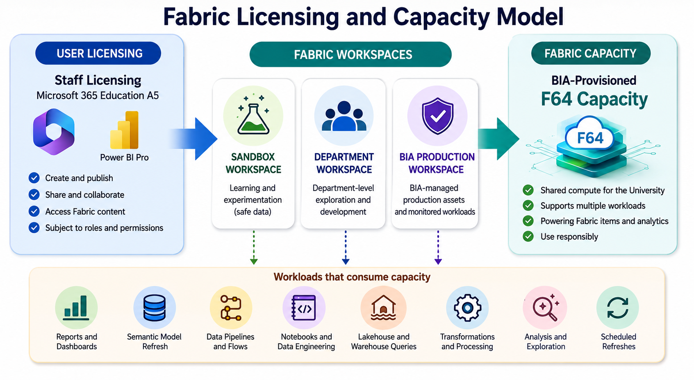

# Licensing, Capacity and Compute Awareness

Before users start creating Fabric items, they should understand the relationship between user licensing, Fabric capacity, and shared compute consumption.

In our current environment, Microsoft Fabric access is supported by both:

1. Staff licensing through the University’s Microsoft Office 365 Education A5 plan
2. BIA-provisioned Fabric capacity for the University’s analytics workloads

This section explains the local licensing and capacity context in practical terms.

## Why this matters

Fabric is not an unlimited free-for-all environment.

A user may be able to access Fabric because they have the right license, but the work they perform still consumes shared Fabric capacity. This means users should understand both:

- Whether they are licensed to create, share, or consume Fabric content
- Whether their work is running on shared compute that must be used responsibly

This matters especially because Fabric is being used to support both BIA-managed analytics assets and department-level exploration.

> Image placeholder: A simple diagram showing user licensing on one side, shared F64 Fabric capacity on the other side, and workspaces in the middle consuming compute from the capacity.

## Staff licensing

All staff experience on Fabric is currently powered by the University’s Microsoft Office 365 Education A5 plan.

The A5 plan includes Power BI Pro capabilities, which are needed for users who create, publish, share, or collaborate on Power BI and Fabric-related analytics assets.

For staff users, this means they may be able to create or work with Fabric items, subject to appropriate access permissions and workspace roles.

However, having a license does not automatically mean a user should have access to every workspace, report, dataset, Lakehouse, pipeline, notebook, or semantic model.

Access must still follow:

- Least privilege
- Purpose-based access
- Workspace ownership
- Sensitivity label expectations
- Production control

## Fabric capacity

BIA has provisioned an F64 Fabric capacity for the University’s analytics workloads.

A simple way to understand Fabric capacity is to think of it as buying a fixed amount of electricity for a household.

Every action or activity in Fabric consumes compute, just as every appliance consumes electricity.

Examples of activities that consume compute include:

- Opening and interacting with reports
- Refreshing semantic models
- Running data pipelines
- Executing notebooks
- Querying Lakehouse or Warehouse tables
- Running data transformations
- Building and testing reports
- Running exploratory or experimental workloads

Because the F64 capacity is shared, users should be mindful of how they use Fabric resources.

## Capacity as shared compute

The F64 capacity supports approved analytics workloads across the University.

This shared capacity may support different types of work, such as:

| Workload Type | Example |
|---|---|
| BIA-managed production assets | Official dashboards, governed semantic models, scheduled refreshes |
| Department-level exploration | Department workspace reports, prototypes, local analytics development |
| Sandbox experimentation | Learning activities using mocked, synthetic, public, or approved non-sensitive data |
| Data engineering workloads | Pipelines, notebooks, transformations, Lakehouse operations |
| Analytical workloads | Modelling, exploration, segmentation, prediction, and advanced analytics experiments |

The more activity that runs on shared capacity, the more important responsible usage becomes.

## Responsible capacity use

Users should treat Fabric capacity as a shared institutional resource.

Users should:

- Use sandbox workspaces for learning and experimentation
- Use department workspaces for approved department-level exploration and development
- Avoid running unnecessary workloads in production workspaces
- Avoid excessive refresh schedules unless justified
- Avoid inefficient queries, transformations, or repeated heavy notebook runs
- Reuse approved semantic models and curated data assets where appropriate
- Clean up unused or obsolete items
- Inform the workspace owner or BIA before running heavy or recurring workloads

Users should not use Fabric as an unmanaged dumping ground for files, reports, or experiments.

## Capacity and workspace expectations

Different workspace types may consume the same shared capacity, but they carry different expectations.

| Workspace Type | Capacity Expectation |
|---|---|
| Sandbox Workspace | Suitable for learning and controlled experimentation using safe data |
| Department Workspace | Suitable for department-level exploration, prototyping, and development |
| BIA Production Workspace | Reserved for BIA-managed production assets and monitored workloads |

Production workloads should be more carefully managed because they may support official reporting, operational dashboards, scheduled refreshes, or wider organisational use.

## External collaborators

External collaborators are not covered by the University’s staff licensing arrangement.

If an external collaborator needs to access Fabric or Power BI content in the University environment, they may need to be invited as a Microsoft Entra B2B guest user in the University tenant. This allows external sharing and access to be governed centrally through Microsoft Entra.

Licensing must also be reviewed. If an external collaborator needs to create, edit, publish, or collaborate on Fabric or Power BI items, a separate Power BI Pro or Premium Per User license may be required. This license may come from their own organisation or be assigned by the University, depending on the scenario.

For some viewing scenarios, licensing requirements may differ if the content is hosted in a Premium capacity or Fabric capacity such as F64 or greater. These cases should be reviewed when the need arises.

Before onboarding an external collaborator, users should consider:

- What does the collaborator need to do?
- Do they need view-only access or edit access?
- Do they need to create, edit, publish, or collaborate on Fabric items?
- Do they need to be invited as a Microsoft Entra B2B guest user?
- Which workspace do they need access to?
- What data will they be able to see?
- Is the data labelled `Confidential - SUSS` or `Restricted - SUSS`?
- Is a separate Power BI Pro or Premium Per User license required?
- Should access be time-bound?
- Who will review and remove access later?

External collaborator access should be reviewed together with security, governance, licensing, identity, and data sensitivity considerations.

## Common misconceptions

| Misconception | Clarification |
|---|---|
| If I can access Fabric, I can use any workspace | Workspace access is still controlled by role and business need |
| If I have Power BI Pro, I can access all data | Licensing does not override data access control |
| If a workspace exists, anything inside it is official | Sandbox and department workspace outputs are not automatically production assets |
| If something works once, it is ready for production | Production requires validation, ownership, refresh planning, and review |
| Capacity is invisible, so it does not matter | Every Fabric activity consumes compute from shared capacity |

## Minimum checklist before creating workloads

Before creating or running Fabric workloads, users should confirm:

- [ ] I know whether I am working in sandbox, department, or production workspace
- [ ] I understand that Fabric activities consume shared capacity
- [ ] I know whether my work is experimental, departmental, or production-facing
- [ ] I have checked whether an approved semantic model or data asset already exists
- [ ] I have avoided unnecessary refreshes or repeated heavy workloads
- [ ] I know who owns the workspace
- [ ] I know who to inform if I plan to run a heavy or recurring workload
- [ ] I understand whether external collaborator licensing and guest access are relevant

## References and further learning

| Resource | Purpose |
|---|---|
| [Understand Microsoft Fabric licenses](https://learn.microsoft.com/en-us/fabric/enterprise/licenses) | Explains how Fabric licenses and capacities determine how users create, share, and view items |
| [A5 products and features list for Microsoft 365 Education](https://learn.microsoft.com/en-us/microsoft-365/education/guide/0-start-advanced/advanced-products-features) | Provides Microsoft’s education-specific information, including Power BI Pro in education |
| [Microsoft Fabric pricing](https://azure.microsoft.com/en-us/pricing/details/microsoft-fabric/) | Shows Fabric capacity SKUs, including F64, and explains that capacity powers Fabric workloads |
| [Microsoft Fabric capacity planning overview](https://learn.microsoft.com/en-us/fabric/enterprise/capacity-planning-overview) | Starting point for Microsoft’s Fabric capacity planning guidance |
| [Scale for centralized and managed self-service analytics](https://learn.microsoft.com/en-us/fabric/enterprise/capacity-planning-enterprise-managed-self-service-solutions) | Useful for understanding capacity planning across centrally managed and self-service analytics scenarios |
| [Distribute Power BI content to external guest users with Microsoft Entra B2B](https://learn.microsoft.com/en-us/fabric/enterprise/powerbi/service-admin-entra-b2b) | Explains how Power BI supports external sharing through Microsoft Entra B2B guest users |

## Next section

Proceed to:

[Fabric Workspace Operating Model](../03-workspace-operating-model/)
