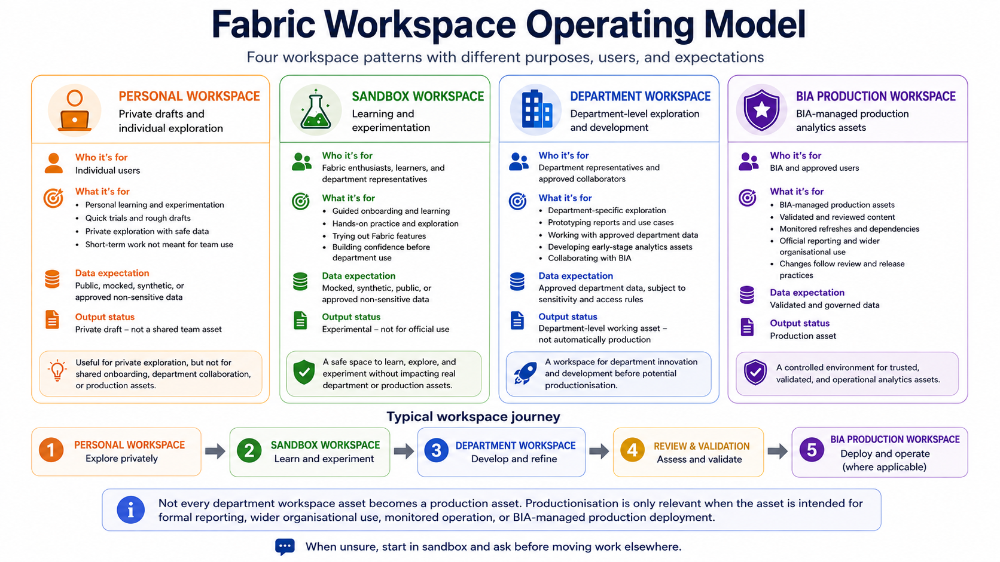

# Fabric Workspace Operating Model

This section explains how workspaces should be used in the Fabric onboarding experience.

A workspace is where Fabric items are created, managed, shared, and used. These items may include reports, semantic models, Lakehouses, notebooks, pipelines, dataflows, dashboards, and other Fabric artefacts.

Understanding workspace boundaries is important because not all work belongs in the same place.



## Why workspace operating model matters

Microsoft Fabric makes it easy to create and share analytics artefacts. Without a clear workspace operating model, users may accidentally create confusion, duplication, access risks, or unsupported assets.

A workspace operating model helps users understand:

* Where to do learning and experimentation
* Where department work should happen
* Where production assets should live
* Who owns the workspace
* Who acts as backup owner
* Who can access the workspace
* What data is allowed
* What outputs can be shared
* When BIA review is needed
* When an artefact should remain sandbox
* When an artefact may move towards productionisation

The goal is not to stop experimentation. The goal is to make sure experimentation happens safely.

## Main workspace types

Fabric users may encounter different workspace types.

| Workspace Type           | Main Purpose                                                                                 |
| ------------------------ | -------------------------------------------------------------------------------------------- |
| Personal Workspace       | Individual exploration and private drafts                                                    |
| Sandbox Workspace        | Guided onboarding and safe experimentation                                                   |
| Department Workspace     | Department-level exploration, prototyping, and working assets                                |
| BIA Production Workspace | BIA-managed production analytics assets with direct workspace access restricted to BIA users |

Each workspace type has a different boundary and expectation.

## Workspace boundaries

Fabric users should understand the boundary between personal workspace, sandbox workspace, department workspace, and BIA production workspace.

| Workspace Type           | Purpose                                                       | Suitable Use                                                                              | Not Suitable For                                                                                          |
| ------------------------ | ------------------------------------------------------------- | ----------------------------------------------------------------------------------------- | --------------------------------------------------------------------------------------------------------- |
| Personal Workspace       | Individual exploration and private drafts                     | Personal learning, quick trials, temporary report drafts                                  | Team learning, department assets, shared reports, production work                                         |
| Sandbox Workspace        | Guided onboarding and safe experimentation                    | Training exercises, public data practice, HDB Resales sandbox activities, learning copies | Official reporting, confidential or restricted institutional data, production dashboards                  |
| Department Workspace     | Department-level exploration, prototyping, and working assets | Approved department use cases, team collaboration, department-owned reports or models     | BIA-managed production assets, unmanaged cross-department sharing, unclear ownership                      |
| BIA Production Workspace | BIA-managed production analytics assets                       | Validated reports, governed semantic models, monitored production outputs managed by BIA  | Personal experimentation, unreviewed prototypes, casual testing, direct workspace access by non-BIA users |

## Personal workspace boundary

A personal workspace is useful for individual learning or private drafts.

However, users should be careful not to treat personal workspace content as official or team-owned.

Personal workspaces are suitable for:

* Trying a feature individually
* Drafting a rough report
* Exploring a public or approved non-sensitive dataset
* Learning Power BI or Fabric basics
* Testing a small idea privately before deciding whether it belongs elsewhere

Personal workspaces are not suitable for:

* Department-owned reports
* Shared operational dashboards
* Production reports
* Long-term team assets
* Confidential or restricted institutional data
* Work that other users need to maintain
* Artefacts that should survive beyond the individual creator

If an artefact becomes useful beyond personal learning, it should be reviewed before being recreated, copied, or transitioned into the appropriate sandbox or department workspace.

## Sandbox workspace boundary

A sandbox workspace is the correct place for onboarding and guided practice.

Sandbox workspaces are suitable for:

* Fabric onboarding exercises
* HDB Resales sandbox experiments
* Public data practice
* Mocked or synthetic data practice
* Learning how reports, Lakehouses, notebooks, semantic models, pipelines, and dataflows work
* Creating learning outputs that are clearly marked as sandbox or experimental
* Practising report development, data preparation, modelling, and semantic thinking using safe data

Sandbox workspaces are not suitable for:

* Official reports
* Production dashboards
* Operational decision-support tools
* Confidential or restricted institutional data
* Student personal data
* Staff personal data
* Financial records
* Donor records
* Department-owned assets that need long-term support

Sandbox outputs are learning artefacts. They should not be interpreted as official analytics products.

## Department workspace boundary

A department workspace is used when a department has an approved use case, clear ownership, and a legitimate need to collaborate on analytics assets.

Department workspaces are suitable for:

* Department-owned reports
* Department-level prototypes
* Approved department data exploration
* User acceptance testing
* Department collaboration
* Working assets that are not yet BIA production assets

Department workspaces should have:

* A clear workspace owner
* A clear deputy workspace owner
* A clear business purpose
* Defined users and roles
* Sensitivity and access review
* Refresh and ownership expectations
* A support and escalation route

Department workspaces are not automatically production workspaces.

A report, semantic model, Lakehouse, notebook, pipeline, dataflow, or dashboard in a department workspace may still require review before wider sharing or productionisation.

## BIA production workspace boundary

BIA production workspaces are reserved for BIA-managed production analytics assets and are restricted to BIA users.

These workspaces are suitable for:

* Validated production reports
* Governed semantic models
* Monitored production dashboards
* Analytics assets with clear ownership, refresh, access control, and support arrangements
* Assets that have been reviewed for wider or official use
* BIA-managed production operations

BIA production workspaces are not suitable for:

* Personal experimentation
* Early prototypes
* Unreviewed department reports
* Training exercises
* Casual testing
* Unclear or unsupported assets
* Direct workspace access by non-BIA users

Non-BIA users should not be added directly to BIA production workspaces.

Where approved production reports or outputs need to be shared with non-BIA users, sharing should happen through approved report or app sharing channels, not by granting direct workspace membership.

Assets should only move into BIA production workspaces after review.

## Simple rule

Use this rule:

```text
Personal workspace = private draft
Sandbox workspace = safe learning
Department workspace = department-owned working asset
BIA production workspace = governed production asset restricted to BIA workspace users
```

When unsure, start in sandbox and ask before moving work elsewhere.

## Boundary decision guide

Use this guide when deciding where work should happen.

| Scenario                                                                   | Recommended Workspace or Access Pattern                                            |
| -------------------------------------------------------------------------- | ---------------------------------------------------------------------------------- |
| I am learning Fabric for the first time                                    | Sandbox Workspace                                                                  |
| I am doing the HDB Resales exercise                                        | Sandbox Workspace                                                                  |
| I am trying something privately with safe data                             | Personal Workspace or Sandbox Workspace                                            |
| I am building something for a department use case                          | Department Workspace                                                               |
| I am working with confidential or restricted data                          | Department Workspace or BIA Production Workspace, subject to approval              |
| I am preparing an official report                                          | Department Workspace or BIA Production Workspace, subject to review                |
| I am building or maintaining a BIA-managed production report as a BIA user | BIA Production Workspace                                                           |
| I am a non-BIA user who needs to view an approved production output        | Approved report or app sharing channel, not direct BIA Production Workspace access |
| I am unsure where this should go                                           | Ask the workspace owner or BIA                                                     |

## Movement between workspaces

Work should not move from one workspace type to another casually.

A common maturity path is:

```text
Personal exploration
   ↓
Sandbox learning
   ↓
Department exploration or prototype
   ↓
Review
   ↓
Productionisation, where applicable
   ↓
BIA production workspace, where applicable
```

Before moving an artefact beyond sandbox, check:

* Is there a real business purpose?
* Is there a department owner?
* Is there a deputy owner?
* Is the data approved for use?
* Is the sensitivity level understood?
* Is access controlled appropriately?
* Is refresh needed?
* Who owns the connection or credential?
* Who will support the asset after it is created?
* Is BIA review needed?
* If the asset is moving to BIA production, will direct workspace access remain restricted to BIA users?

## Workspace roles

Workspace roles determine what users can do inside a workspace.

The exact access granted should follow the principle of least privilege.

| Role        | Typical Meaning                                    | Use Carefully Because                                                                  |
| ----------- | -------------------------------------------------- | -------------------------------------------------------------------------------------- |
| Viewer      | Can view content shared through the workspace      | Viewers may still see sensitive information if the workspace contains sensitive assets |
| Contributor | Can create or edit content                         | Contributors can change or create assets, so this should be granted only when needed   |
| Member      | Has broader collaboration rights                   | Members may have more control than needed for basic report use                         |
| Admin       | Can manage workspace settings, access, and content | Admin access should be limited to authorised workspace owners or administrators        |

Not every learner needs edit rights.

Report consumers usually need view access only. Report developers, analysts, engineers, or data scientists may need contributor-level access in sandbox depending on the exercise.

BIA Production Workspace membership should be restricted to BIA users. Non-BIA users should consume approved production outputs through approved sharing channels rather than direct workspace access.

## Least privilege principle

Users should receive only the minimum access needed for their role or task.

Examples:

| User Need                                                | Likely Access                                                                          |
| -------------------------------------------------------- | -------------------------------------------------------------------------------------- |
| View a sandbox report                                    | Viewer                                                                                 |
| Complete report development practice                     | Contributor in sandbox                                                                 |
| Create a notebook during a guided exercise               | Contributor in sandbox                                                                 |
| Manage workspace users and settings                      | Admin, only if authorised                                                              |
| Review department reports                                | Viewer or Contributor, depending on role                                               |
| Maintain department assets                               | Contributor, Member, or Admin, depending on responsibility                             |
| View an approved BIA production output as a non-BIA user | Approved report or app sharing channel, not direct BIA Production Workspace membership |

Access should be reviewed when:

* A user changes role
* A project ends
* A temporary exercise ends
* An external collaborator no longer needs access
* A workspace moves closer to department use or production use
* An output is being shared beyond the workspace

## Workspace ownership

Every non-personal workspace should have clear ownership.

For department workspaces, this means both a named workspace owner and a named deputy workspace owner.

A workspace owner should help ensure that:

* The workspace purpose is clear
* Users have appropriate access
* Items are named clearly
* Sandbox, draft, prototype, department, and production statuses are not confused
* Sensitive data is handled correctly
* Refresh and connection ownership are understood
* Obsolete or duplicate items are cleaned up
* Escalation routes are known

Workspace ownership is not only about having admin rights. It is also about maintaining clarity and accountability.

## Department workspace owner and deputy requirement

Every department workspace request should identify both:

* A workspace owner
* A deputy workspace owner

This is required so that the workspace does not depend on a single person.

The owner and deputy should be able to help with access requests, ownership questions, refresh or connection issues, clean-up decisions, and continuity when one person is unavailable or leaves the University.

| Role                   | Responsibility                                                                          |
| ---------------------- | --------------------------------------------------------------------------------------- |
| Workspace owner        | Primary accountable person for the department workspace                                 |
| Deputy workspace owner | Backup accountable person who can support workspace continuity or take over when needed |

The workspace owner and deputy should preferably be from the requesting department or business area. They should understand the purpose of the workspace, who should have access, what data is being used, and who should be contacted when issues arise.

A department workspace request should not proceed if no owner or deputy owner is identified.

## Why a deputy owner is required

A deputy owner is required because:

* Staff may leave the University
* Staff may change role or department
* Staff may be unavailable during urgent issues
* Access requests may still need to be reviewed
* Refresh or connection issues may need attention
* Department assets may require continuity
* BIA should not become the default owner of unclear department assets

The deputy owner helps ensure that the department workspace remains accountable and maintainable.

## Minimum ownership information for department workspace requests

A department workspace request should include:

| Field                        | Required      |
| ---------------------------- | ------------- |
| Department workspace name    | Yes           |
| Business purpose             | Yes           |
| Workspace owner              | Yes           |
| Deputy workspace owner       | Yes           |
| Requesting department        | Yes           |
| Intended users               | Yes           |
| Data source or data category | Yes           |
| Sensitivity level, if known  | Yes           |
| Expected artefacts           | Yes           |
| Refresh or operational needs | If applicable |
| External collaborators       | If applicable |

If the owner or deputy owner changes, the workspace ownership record should be updated.

## Naming expectations

Workspace and item names should help users understand what they are looking at.

Good names should indicate:

* The subject or use case
* Whether the item is sandbox, draft, prototype, department, or production
* The main purpose of the item
* The owning team where relevant

Recommended examples:

```text
sandbox_hdb_resales_report
sandbox_hdb_resales_semantic_model
sandbox_hdb_resales_lakehouse
dept_admissions_application_dashboard
bia_prod_student_engagement_dashboard
```

Avoid names such as:

```text
test
final
latest
copy
copy_of_copy
new_dashboard
official_final_v3
```

Names should reduce confusion, not create more of it.

## Data expectations by workspace type

Different workspaces have different data expectations.

| Workspace Type           | Data Expectations                                                                                                                          |
| ------------------------ | ------------------------------------------------------------------------------------------------------------------------------------------ |
| Personal Workspace       | Public, mocked, synthetic, or approved non-sensitive data for private exploration                                                          |
| Sandbox Workspace        | Public, mocked, synthetic, or approved non-sensitive data for guided learning                                                              |
| Department Workspace     | Department-approved data for approved use cases, subject to access and sensitivity review                                                  |
| BIA Production Workspace | Governed production data with clear ownership, validation, access control, monitoring, and direct workspace access restricted to BIA users |

Do not upload confidential or restricted institutional data into a sandbox workspace unless explicitly approved through the proper process.

Do not assume that workspace access means data reuse, export, or redistribution is allowed.

## Sandbox workspace expectations

In a sandbox workspace, users should:

* Use only safe data
* Follow the exercise instructions
* Avoid overwriting shared starter artefacts
* Use clear sandbox naming
* Document assumptions and caveats
* Avoid unnecessary heavy refreshes or repeated runs
* Avoid sharing outputs as official results
* Clean up or label experimental artefacts where appropriate

Sandbox workspace outputs should remain clearly marked as learning or experimental.

## Department workspace expectations

In a department workspace, users should:

* Have a clear department owner
* Have a clear deputy workspace owner
* Use approved data sources
* Document business purpose
* Define intended users
* Review sensitivity and access expectations
* Identify refresh ownership
* Identify support and escalation routes
* Avoid uncontrolled duplication of reports and semantic models
* Review assets before wider sharing
* Update workspace ownership records when owners change

Department workspace assets may support real department work, but they are not automatically BIA production assets.

## BIA production workspace expectations

In a BIA production workspace, assets should have:

* Clear business ownership
* Clear technical ownership
* Validated outputs
* Governed semantic models where applicable
* Appropriate sensitivity labels
* Appropriate access controls
* Tested RLS where applicable
* Documented refresh and monitoring
* Support and escalation arrangements
* Release or change management where needed
* Direct workspace access restricted to BIA users

Productionisation is not simply moving a report into a production workspace. It requires review and readiness.

Non-BIA users should consume approved production outputs through approved report or app sharing channels, not direct BIA Production Workspace membership.

## External collaborators

External collaborators should be handled carefully.

External collaborators may require:

* Microsoft Entra B2B guest access
* Licensing review
* Workspace role review
* Sensitivity and sharing review
* Time-bound access
* Access removal planning
* BIA review where required

External collaborators should not be added casually to sandbox or department workspaces.

External collaborators should not be granted direct access to BIA Production Workspaces. If an approved production output needs to be shared externally, this must go through the appropriate review and approved sharing channel.

Use the relevant checklist:

[External Collaborator Checklist](../11-templates-checklists/checklists/external-collaborator-checklist.md)

## Tenant-level and capacity-level settings

Some Fabric and Power BI settings are controlled at tenant or capacity level.

These may affect:

* Sharing
* Export
* Publish to web
* External collaboration
* Fabric item creation
* Preview features
* Copilot or AI features
* Capacity usage and workload behaviour

Relevant tenant-level or capacity-level requests should be escalated to BIA for review.

Users should not assume that a feature can be enabled just because it is visible in documentation or available in another environment.

## When to ask BIA

Ask BIA when:

* You are unsure which workspace should be used
* A sandbox output may become a department use case
* A department workspace request does not have both an owner and deputy owner
* A department asset may become production-facing
* External collaborators need access
* Confidential or restricted data may be involved
* RLS may be required
* A semantic model is intended for reuse
* A report is intended for wider sharing
* A connection, gateway, or refresh setup needs operational support
* A tenant-level or capacity-level setting is involved
* A non-BIA user needs access to an approved BIA production output

It is better to ask early than to move an artefact into the wrong workspace.

## Related templates and checklists

| Resource                                                                                                                | Purpose                                                                               |
| ----------------------------------------------------------------------------------------------------------------------- | ------------------------------------------------------------------------------------- |
| [Workspace Inventory Template](../11-templates-checklists/templates/workspace-inventory-template.md)                    | Review and document items inside a workspace                                          |
| [Workspace Health Note](../11-templates-checklists/templates/workspace-health-note.md)                                  | Summarise workspace purpose, access, ownership, sensitivity, refresh, and issues      |
| [Workspace Access Checklist](../11-templates-checklists/checklists/workspace-access-checklist.md)                       | Review workspace access requests using least privilege                                |
| [Sandbox Readiness Checklist](../11-templates-checklists/checklists/sandbox-readiness-checklist.md)                     | Confirm that users are ready to start sandbox work safely                             |
| [Productionisation Readiness Checklist](../11-templates-checklists/checklists/productionisation-readiness-checklist.md) | Review whether an asset is ready to move beyond sandbox or department experimentation |
| [External Collaborator Checklist](../11-templates-checklists/checklists/external-collaborator-checklist.md)             | Review external access, licensing, guest account, sensitivity, and removal planning   |

## Minimum checklist

Before completing this section, users should confirm:

* [ ] I understand the difference between personal, sandbox, department, and BIA production workspaces
* [ ] I know why sandbox is the default place for onboarding exercises
* [ ] I know that personal workspace content is not official or team-owned
* [ ] I know that department workspaces require ownership and approved use
* [ ] I know that department workspace requests require both an owner and deputy owner
* [ ] I know that BIA production workspaces are for governed production assets
* [ ] I know that BIA Production Workspace membership is restricted to BIA users
* [ ] I understand that non-BIA users should consume approved production outputs through approved sharing channels
* [ ] I understand that sandbox outputs are not official reports
* [ ] I understand that workspace access does not automatically allow data export or redistribution
* [ ] I know that tenant-level and capacity-level requests should be escalated to BIA
* [ ] I know who to ask if I am unsure where work should happen

## Next section

Proceed to:

[Start Using Fabric](../04-start-using-fabric/)
