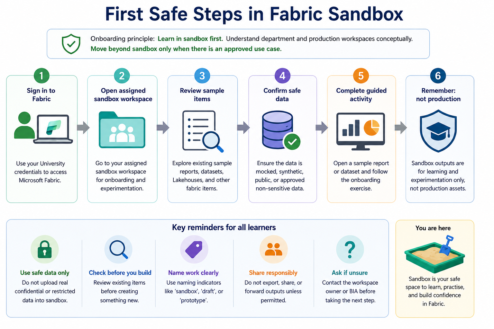

# Start Using Fabric

This section begins the hands-on part of the onboarding experience.

Learners should start this section after reading the foundation sections:

1. [Security, Access and Governance](../01-security-access-governance/)
2. [Licensing, Capacity and Compute Awareness](../02-licensing-capacity/)
3. [Fabric Workspace Operating Model](../03-workspace-operating-model/)

The aim is to help learners enter Fabric safely, understand what they are looking at, and complete their first safe activity without accidentally treating exploratory work as production-ready output.

## Sandbox-first onboarding

For this onboarding experience, hands-on learning should start in the assigned Fabric Sandbox Workspace.

The sandbox is the standard hands-on environment for:

* New Fabric users
* Department representatives
* Fabric enthusiasts
* Analysts
* Report developers
* Data engineering learners
* Data science learners

Onboarding exercises should use safe datasets, such as:

* Public data
* Mocked data
* Synthetic data
* Approved non-sensitive data

Department workspaces and BIA Production Workspaces are introduced in this guide so learners understand the wider operating model.

They should not be used for onboarding practice unless explicitly instructed.

Sandbox outputs are for learning and experimentation only. They should not be treated as official reports, validated analytics products, production dashboards, or formal decision-support tools.

## Accessing Microsoft Fabric

To access Microsoft Fabric:

1. Go to https://app.fabric.microsoft.com/
2. Sign in using your University account.
3. In the left navigation menu, select **Workspaces**.
4. Open the assigned Fabric Sandbox Workspace.

The actual workspace and artefact links are shared through internal BIA onboarding channels and are not published in this repo.

If you cannot see the assigned Fabric Sandbox Workspace, check with the workspace owner or BIA contact.

## Before you create anything

When learners first enter Fabric, they should not immediately create a report, Lakehouse, pipeline, notebook, or semantic model without confirming the context.

First confirm:

* Am I in the assigned Fabric Sandbox Workspace?
* Is this workspace intended for onboarding or experimentation?
* What is my workspace role?
* What sample items already exist?
* Is there an existing report, semantic model, Lakehouse, notebook, or dataset I should use for the exercise?
* What data am I allowed to use?
* Is this activity clearly for learning and experimentation?



## Basic first-use journey

A typical first-use journey should look like this:

```text
Sign in to Fabric
   ↓
Open the assigned Fabric Sandbox Workspace
   ↓
Confirm workspace purpose and role
   ↓
Review existing sample items
   ↓
Check data and sensitivity expectations
   ↓
Create or open the relevant Fabric item
   ↓
Save work with clear naming
   ↓
Treat output as learning or experimentation only
```

## Common Fabric items

Learners may see different types of items in a Fabric workspace.

| Fabric Item     | Used For                                                                               | Typical Users                                 |
| --------------- | -------------------------------------------------------------------------------------- | --------------------------------------------- |
| Power BI Report | Visual reporting, dashboards, and interactive analysis                                 | Report consumers, analysts, report developers |
| Semantic Model  | A reusable business layer for Power BI reporting, including relationships and measures | Report developers, analysts, data modellers   |
| Lakehouse       | Storing and analysing structured and semi-structured data                              | Data engineers, analysts, data scientists     |
| Warehouse       | SQL-based analytics and data warehousing                                               | Data engineers, SQL users, analysts           |
| Data Pipeline   | Moving, orchestrating, and scheduling data workflows                                   | Data engineers, advanced analysts             |
| Dataflow Gen2   | Low-code data preparation and transformation                                           | Analysts, data engineers                      |
| Notebook        | Code-based data preparation, transformation, analytics, and machine learning           | Data engineers, data scientists               |
| Dashboard       | A Power BI visual summary, usually for monitoring selected metrics                     | Report consumers, analysts                    |

Learners do not need to learn every Fabric item at once. The relevant item depends on the persona, exercise, and learning objective.

## Start from the assigned sandbox workspace

For onboarding, the correct workspace is usually the assigned Fabric Sandbox Workspace.

| Workspace Type           | What learners should do during onboarding                                                                                             |
| ------------------------ | ------------------------------------------------------------------------------------------------------------------------------------- |
| Personal Workspace       | Do not use for shared onboarding activities unless instructed. Personal workspaces are for private drafts and individual exploration. |
| Sandbox Workspace        | Use this for standard hands-on onboarding activities.                                                                                 |
| Department Workspace     | Understand conceptually, but do not use for onboarding unless approved or explicitly instructed.                                      |
| BIA Production Workspace | Do not use for onboarding practice. Direct workspace access is restricted to BIA users.                                               |

If learners are unsure which sandbox workspace to use, they should ask the workspace owner or BIA before creating new items.

## First safe activity for all learners

All learners should complete their first hands-on activity in the assigned Fabric Sandbox Workspace.

Recommended first activity:

1. Sign in to Fabric.
2. Open the assigned Fabric Sandbox Workspace.
3. Confirm that the workspace is intended for onboarding or experimentation.
4. Review the list of existing sample items.
5. Open an existing sample report or dataset.
6. Check the report title, owner, refresh date, and sensitivity label, if applicable.
7. Apply basic filters or slicers.
8. Do not export, share, or forward screenshots unless permitted.

This activity is suitable for most new learners because it focuses on navigation, interpretation, and responsible use without involving real operational data.

## Starter activity examples by learner type

Different learners may continue with different starter activities after the first safe activity.

These are examples only. The detailed hands-on steps are provided in the relevant persona pathways and sandbox experiments.

### Fabric enthusiasts

Fabric enthusiasts may continue with a simple hands-on activity using safe data.

Example:

1. Open the assigned Fabric Sandbox Workspace.
2. Locate the approved sample dataset.
3. Create or open a simple Power BI report.
4. Build one or two simple visuals.
5. Save the report using the recommended naming convention.
6. Add a short note explaining the purpose of the report.
7. Treat the output as learning material only.

### Report developers

Report developers should begin by checking whether an approved sample semantic model or existing sample report is available in the sandbox.

Example:

1. Open the assigned Fabric Sandbox Workspace.
2. Review existing sample reports and semantic models.
3. Check whether the exercise already provides a sample business definition.
4. Create a draft report only if the exercise requires it.
5. Use clear naming to indicate that the report is a sandbox activity.
6. Validate the numbers against the exercise instructions or expected output before sharing with the training group.

Report developers should avoid creating duplicate semantic models or conflicting KPI definitions in actual department workspaces unless there is a clear reason and appropriate review.

### Data engineering learners

Data engineering learners should also start in the assigned Fabric Sandbox Workspace.

Example:

1. Open the assigned Fabric Sandbox Workspace.
2. Create or open a Lakehouse.
3. Load public, mocked, synthetic, or approved non-sensitive data.
4. Inspect the data structure.
5. Create a simple table.
6. Query the table.
7. Document what was created and what the data represents.

This activity helps learners understand how Fabric stores and exposes data before moving into pipelines, notebooks, or production workflows.

## Naming early work clearly

Early work should be named clearly so others understand its purpose and status.

Recommended naming indicators:

| Indicator   | Meaning                                                    |
| ----------- | ---------------------------------------------------------- |
| `sandbox`   | Learning or experiment only                                |
| `draft`     | Work in progress                                           |
| `prototype` | Early version for feedback                                 |
| `uat`       | Under user validation                                      |
| `prod`      | Production or production-facing asset, only where approved |

Example names:

```text
sandbox_course_feedback_report
sandbox_student_engagement_lakehouse
sandbox_applicant_persona_model
draft_student_engagement_dashboard
prototype_applicant_persona_model
```

Avoid names such as:

```text
final_report
latest_dashboard
new_dataset
test123
copy_of_copy_final
```

## What not to do during onboarding

New learners should avoid:

* Uploading real confidential data into sandbox
* Creating duplicate semantic models without checking existing sample assets
* Sharing unfinished reports as official outputs
* Setting up refresh schedules without ownership
* Using personal credentials for long-term operational assets
* Publishing directly into department or BIA production workspaces
* Exporting data or screenshots without checking whether it is allowed
* Treating a successful sandbox prototype as production-ready

## Moving beyond sandbox

Sandbox is the starting point for onboarding and experimentation.

Learners should only move beyond sandbox when there is:

* A clear department use case
* An approved department workspace, where needed
* Agreement on what data may be used
* A clear workspace owner
* A clear deputy workspace owner, for department workspace work
* Understanding of sensitivity labels and sharing expectations
* A plan for validation if the output will be used beyond learning
* BIA involvement where productionisation may be required

Department workspaces and BIA Production Workspaces are covered in more detail in the workspace operating model and deployment lifecycle sections.

BIA Production Workspace membership is restricted to BIA users. Non-BIA users should consume approved production outputs through approved report or app sharing channels.

## First-use checklist

Before completing the first hands-on session, learners should confirm:

* [ ] I signed in successfully
* [ ] I opened the assigned Fabric Sandbox Workspace
* [ ] I confirmed that the workspace is for onboarding or experimentation
* [ ] I understand my workspace role
* [ ] I reviewed existing sample items before creating anything new
* [ ] I checked whether the data or asset has a sensitivity label, if applicable
* [ ] I avoided uploading restricted or confidential data into sandbox
* [ ] I named any new work clearly
* [ ] I understand that my output is experimental
* [ ] I know who to ask before sharing more widely

## References and further learning

| Resource                                                                                                                                         | Purpose                                                                                 |
| ------------------------------------------------------------------------------------------------------------------------------------------------ | --------------------------------------------------------------------------------------- |
| [Microsoft Fabric documentation](https://learn.microsoft.com/en-us/fabric/)                                                                      | Official starting point for Fabric concepts, workloads, and product capabilities        |
| [What is Microsoft Fabric?](https://learn.microsoft.com/en-us/fabric/fundamentals/microsoft-fabric-overview)                                     | Introduces Fabric as an end-to-end analytics platform with integrated experiences       |
| [Power BI service basic concepts](https://learn.microsoft.com/en-us/power-bi/fundamentals/service-basic-concepts)                                | Explains basic concepts such as workspaces, reports, dashboards, and semantic models    |
| [Navigate the Power BI service](https://learn.microsoft.com/en-us/power-bi/explore-reports/end-user-experience)                                  | Useful for report consumers learning how to find and open reports, dashboards, and apps |
| [Create a lakehouse, ingest sample data, and build a report](https://learn.microsoft.com/en-us/fabric/data-engineering/tutorial-build-lakehouse) | Microsoft tutorial showing a basic end-to-end lakehouse and reporting activity          |

## Next section

Proceed to:

[Persona Pathways](../05-persona-pathways/)
