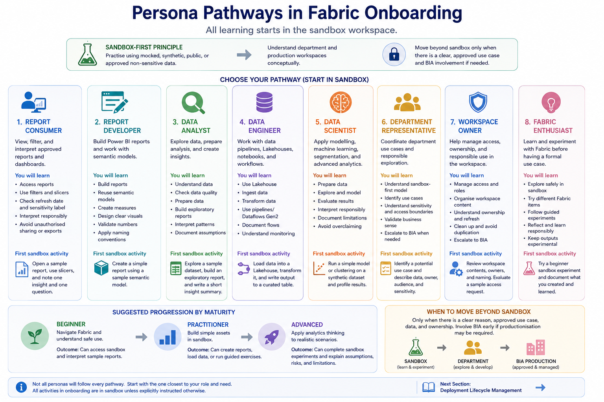

# Persona Pathways

This section helps users choose the Fabric learning pathway that best matches their role, responsibility, or learning interest.

Not every user needs to learn every Fabric capability. A report consumer does not need to start with pipelines and notebooks. A data engineering learner does not need to start with dashboard design. A department representative may need a broad understanding without becoming a technical expert.

The persona pathways help users start with the learning track that is closest to their immediate need.

## Sandbox-first principle

All persona pathways begin in the sandbox workspace.

For onboarding purposes, users should practise using:

- Mocked data
- Synthetic data
- Public data
- Approved non-sensitive data

Department workspaces and BIA production workspaces are introduced conceptually, but hands-on onboarding activities should happen in sandbox unless BIA explicitly instructs otherwise.

## Choose your pathway

Start with the persona closest to your current role or learning need.

| Persona | Choose this pathway if you mainly need to... | Pathway |
|---|---|---|
| Report Consumer | View, filter, and interpret approved reports or dashboards | [Report Consumer](./report-consumer/) |
| Report Developer | Build Power BI reports and work with semantic models | [Report Developer](./report-developer/) |
| Data Analyst | Explore data, prepare analysis, and create insights | [Data Analyst](./data-analyst/) |
| Data Engineer | Work with Lakehouses, pipelines, notebooks, and data movement | [Data Engineer](./data-engineer/) |
| Data Scientist | Explore modelling, machine learning, segmentation, or advanced analytics | [Data Scientist](./data-scientist/) |
| Department Representative | Coordinate department-level Fabric exploration and use cases | [Department Representative](./department-representative/) |
| Workspace Owner | Help manage access, ownership, organisation, and responsible use | [Workspace Owner](./workspace-owner/) |
| Fabric Enthusiast | Learn and experiment with Fabric before having a formal use case | [Fabric Enthusiast](./fabric-enthusiast/) |

Users may eventually follow more than one pathway, but they should start with the one closest to their immediate need.

## How the pathways are structured

Each pathway includes:

1. Who the pathway is for
2. Learning objectives
3. Prerequisites
4. Sandbox activities
5. Expected outputs
6. Reflection questions
7. Related sandbox experiments
8. Recommended Microsoft Learn or documentation resources
9. Suggested next step

The pathway pages provide the learning sequence. The detailed hands-on experiments are maintained separately in:

[Sandbox Experiments](../09-sandbox-experiments/)

## Suggested progression by maturity

Users can progress through three broad maturity levels.

| Level | Focus | Example Outcome |
|---|---|---|
| Beginner | Navigate Fabric and understand safe use | Can access sandbox and interpret sample reports |
| Practitioner | Build simple assets in sandbox | Can create reports, load data, or run guided exercises |
| Advanced | Apply analytics thinking to realistic scenarios | Can complete sandbox experiments and explain assumptions, risks, and limitations |

Progression should be based on demonstrated understanding, not just tool usage.

## Relationship between persona pathways and sandbox experiments

Persona pathways explain **what a user should learn**.

Sandbox experiments provide **guided practice activities**.

For example:

| Persona | Example sandbox experiment |
|---|---|
| Report Consumer | Open and interpret a sample dashboard |
| Report Developer | Build a report from a sample semantic model |
| Data Analyst | Explore a sample dataset and write an insight summary |
| Data Engineer | Load data into a Lakehouse and create a curated table |
| Data Scientist | Run applicant persona clustering on synthetic data |
| Department Representative | Review a department use case scenario and identify data, audience, and ownership |
| Workspace Owner | Review a sample workspace and assess access, naming, and ownership |
| Fabric Enthusiast | Complete a beginner sandbox challenge |

## When to move beyond sandbox

Users should only move beyond sandbox when there is a clear reason.

Before moving into a department workspace, confirm:

- There is an approved department use case
- The workspace owner is known
- The data source is approved
- Sensitivity labels and access expectations are understood
- The intended audience is clear
- The output is exploratory, departmental, or production-facing
- BIA involvement is requested if productionisation may be required

Before moving towards BIA production, confirm:

- The asset has been reviewed and validated
- Ownership is clear
- Refresh and monitoring are planned
- Access and RLS, if applicable, have been tested
- Sensitivity labels are applied appropriately
- The release has been agreed with BIA

## Minimum checklist for choosing a pathway

Before selecting a pathway, users should confirm:

- [ ] I know my main purpose for using Fabric
- [ ] I know whether I am consuming, building, analysing, engineering, modelling, coordinating, owning, or experimenting
- [ ] I know that onboarding starts in the sandbox workspace
- [ ] I know what data I am allowed to use in sandbox
- [ ] I understand that sandbox outputs are not production assets
- [ ] I know when to ask BIA before moving beyond sandbox

## References and further learning

| Resource | Purpose |
|---|---|
| [Microsoft Learn: Get started with Microsoft Fabric](https://learn.microsoft.com/en-us/training/paths/get-started-fabric/) | Beginner learning path for users who need a broad introduction to Fabric |
| [Get started with Microsoft data analytics](https://learn.microsoft.com/en-us/training/paths/data-analytics-microsoft/) | Useful for users beginning with data analytics, Power BI, and Fabric concepts |
| [Prepare and visualize data with Microsoft Power BI](https://learn.microsoft.com/en-us/training/paths/prepare-visualize-data-power-bi/) | Useful for report consumers, report developers, and analysts learning Power BI reporting |
| [Ingest data with Microsoft Fabric](https://learn.microsoft.com/en-us/training/paths/ingest-data-with-microsoft-fabric/) | Useful for data engineering learners working with ingestion, orchestration, Dataflows Gen2, notebooks, and pipelines |
| [Work with semantic models in Microsoft Fabric](https://learn.microsoft.com/en-us/training/paths/work-semantic-models-microsoft-fabric/) | Useful for users learning semantic model concepts and reusable reporting layers |
| [Implement a data science and machine learning solution with Microsoft Fabric](https://learn.microsoft.com/en-us/training/paths/implement-data-science-machine-learning-fabric/) | Useful for advanced analytics users and data scientists exploring modelling in Fabric |
| [Administer and Govern Microsoft Fabric](https://learn.microsoft.com/en-us/training/paths/microsoft-fabric-admin-governance/) | Useful for workspace owners, administrators, and governance-focused users |

## Next section

Proceed to:

[Report Consumer Pathway](./report-consumer/)
