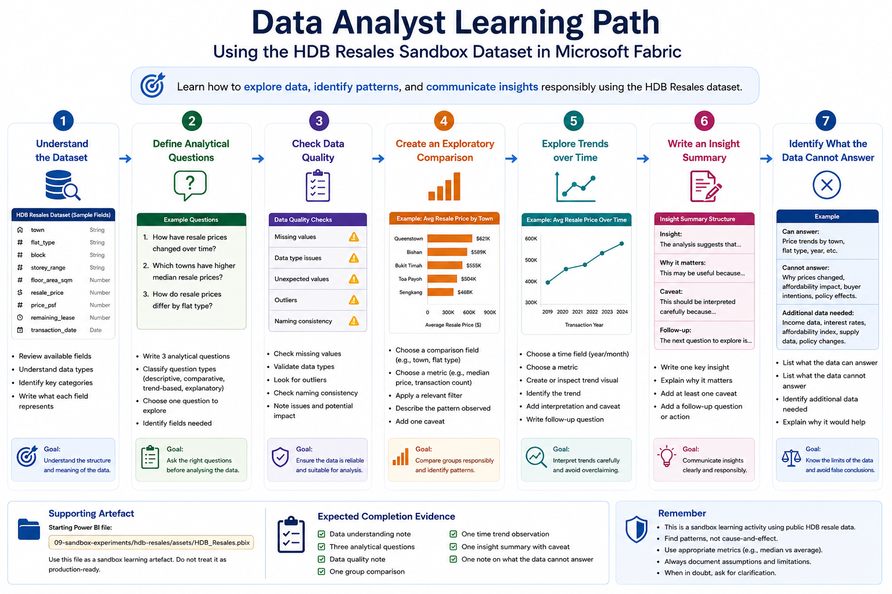

# Data Analyst Pathway

This pathway is for users who need to explore data, identify patterns, prepare analysis, and communicate insights responsibly.

Data analysts may work with reports, datasets, semantic models, Power Query, Dataflows Gen2, simple transformations, and exploratory analysis. They are not only expected to create charts, but also to understand what the data means, what assumptions are being made, and what conclusions can or cannot be supported.

This pathway uses the **HDB Resales** sandbox dataset and report as the common learning artefact.

## Who this pathway is for

Choose this pathway if you mainly need to:

- Explore datasets
- Understand data structure and field meanings
- Check data quality
- Prepare data for analysis
- Build exploratory reports
- Compare groups or segments
- Interpret patterns and trends
- Document assumptions and limitations
- Translate data into useful insights

## Learning objectives

By the end of this pathway, users should be able to:

- Access the assigned sandbox workspace
- Open the HDB Resales dataset or report
- Understand the basic structure of the dataset
- Identify useful analytical questions
- Check common data quality issues
- Use filters, grouping, and simple derived measures
- Compare resale patterns by town, flat type, transaction year, and other available fields
- Write an insight summary with caveats
- Avoid overclaiming from descriptive analysis
- Explain what additional data may be needed for stronger conclusions

## Prerequisites

Before starting this pathway, users should have completed:

1. [Start Here](../../00-start-here/)
2. [Security, Access and Governance](../../01-security-access-governance/)
3. [Licensing, Capacity and Compute Awareness](../../02-licensing-capacity/)
4. [Fabric Workspace Operating Model](../../03-workspace-operating-model/)
5. [Start Using Fabric](../../04-start-using-fabric/)
6. [Report Consumer Pathway](../report-consumer/)

Users should also know which sandbox workspace they have been assigned to.

## Sandbox-first activity

All hands-on activities in this pathway should be completed in the assigned sandbox workspace.

The HDB Resales dataset is used because it is public, relatable, and rich enough for exploratory analysis. It allows learners to practise analytical thinking without using confidential institutional data.

Users should not upload real confidential or restricted data for this pathway.



## Supporting artefact

The starting Power BI file for this sandbox series is stored at:

```text
09-sandbox-experiments/hdb-resales/assets/HDB_Resales.pbix
```

This file should be treated as a sandbox learning artefact and may be repurposed for onboarding activities.

## Activity 1: Understand the dataset

### Goal

Learn what the HDB Resales dataset contains before analysing it.

### Steps

1. Open the assigned sandbox workspace.
2. Open the HDB Resales report, dataset, or semantic model as instructed.
3. Review the available fields.
4. Identify which fields describe location, flat characteristics, transaction timing, and price.
5. Identify fields that may require explanation before analysis.
6. Write down what each key field appears to represent.

### Expected output

Users should complete a short data understanding note:

```text
Dataset name:
Main subject:
Key location fields:
Key flat characteristic fields:
Key time fields:
Key price fields:
Fields requiring clarification:
```

### Reflection questions

- What does one row in the dataset represent?
- Is the dataset transaction-level, summary-level, or mixed?
- Which fields are useful for comparison?
- Which fields may require domain understanding before interpretation?

## Activity 2: Define analytical questions

### Goal

Practise moving from “looking at data” to asking useful analytical questions.

### Steps

1. Review the dataset and report.
2. Write three possible analytical questions.
3. Classify each question as descriptive, comparative, trend-based, or explanatory.
4. Choose one question to explore further.
5. Identify which fields are needed to answer it.

### Example analytical questions

```text
How have resale prices changed over time?
Which towns have higher median resale prices?
How do resale prices differ by flat type?
Do larger flats always have higher resale prices?
How does remaining lease appear to relate to resale price?
Which flat types have the highest transaction volume?
```

### Expected output

Users should complete:

```text
Question 1:
Question type:
Fields needed:

Question 2:
Question type:
Fields needed:

Question 3:
Question type:
Fields needed:

Selected question for analysis:
```

### Reflection questions

- Is the question answerable using the available data?
- Is the question descriptive or does it imply causality?
- What additional data would make the analysis stronger?

## Activity 3: Check data quality

### Goal

Learn to check whether the data is suitable for analysis.

### Steps

1. Check whether key fields have missing values.
2. Check whether data types appear correct.
3. Check whether price fields contain extreme values.
4. Check whether date or year fields are consistent.
5. Check whether categorical fields such as town or flat type are consistently named.
6. Note any issue that may affect interpretation.

### Expected output

Users should complete a data quality note:

```text
Fields checked:
Missing values found:
Unexpected values found:
Possible outliers:
Data type issues:
Naming consistency issues:
Potential impact on analysis:
```

### Reflection questions

- Are there missing values in important fields?
- Are there values that look unusual but may still be valid?
- Should outliers be removed, capped, explained, or retained?
- How could data quality issues affect the final insight?

## Activity 4: Create an exploratory comparison

### Goal

Practise comparing groups in a responsible way.

### Steps

1. Choose a comparison field, such as town, flat type, or year.
2. Choose a metric, such as transaction count, average resale price, median resale price, or price per square metre if available.
3. Create or inspect a visual that compares the groups.
4. Apply one relevant filter.
5. Describe the pattern observed.
6. Add one caveat.

### Expected output

Users should complete:

```text
Comparison field:
Metric used:
Filter applied:
Observed pattern:
Possible explanation:
Caveat:
```

### Reflection questions

- Is the comparison fair?
- Are the groups similar enough to compare directly?
- Could differences be affected by flat size, transaction year, location, lease, or sample size?
- Would median be more appropriate than average?

## Activity 5: Explore trends over time

### Goal

Practise interpreting time-based patterns carefully.

### Steps

1. Choose a time field, such as transaction year or month.
2. Choose a metric, such as transaction count or resale price.
3. Create or inspect a trend visual.
4. Identify whether the trend increases, decreases, fluctuates, or remains stable.
5. Add one possible interpretation.
6. Add one caveat.

### Expected output

Users should complete:

```text
Time period analysed:
Metric used:
Trend observed:
Possible interpretation:
Caveat:
Follow-up question:
```

### Reflection questions

- Is the trend based on enough data points?
- Could the trend be affected by policy, economic, or market conditions?
- Are different flat types or towns moving in the same direction?
- Does the report show nominal prices only, or does it adjust for inflation or affordability?

## Activity 6: Write an insight summary

### Goal

Practise writing an analytical summary that is clear, useful, and appropriately cautious.

### Steps

1. Choose one finding from the analysis.
2. Write one concise observation.
3. Explain why it may matter.
4. Add at least one caveat.
5. Add one recommended follow-up question or action.

### Expected output

Users should use this structure:

```text
Insight:
The analysis suggests that...

Why it matters:
This may be useful because...

Caveat:
This should be interpreted carefully because...

Follow-up:
The next question to explore is...
```

### Example

```text
Insight:
The analysis suggests that some towns have consistently higher resale prices than others.

Why it matters:
This may help users understand broad market differences across locations.

Caveat:
This should be interpreted carefully because prices are also affected by flat type, floor area, remaining lease, storey range, transaction period, and other location-specific factors.

Follow-up:
The next question to explore is whether the pattern remains after comparing similar flat types and transaction periods.
```

## Activity 7: Identify what the data cannot answer

### Goal

Practise recognising analytical limits.

### Steps

1. Review the original analytical question.
2. Identify what the current dataset can answer.
3. Identify what the dataset cannot answer.
4. List additional data that would improve the analysis.
5. Explain why the additional data would help.

### Expected output

Users should complete:

```text
Question analysed:
What the data can answer:
What the data cannot answer:
Additional data needed:
Why this additional data matters:
```

### Reflection questions

- Does the dataset support explanation, or only description?
- Are there external factors not captured in the data?
- Are there user behaviours, policy factors, or economic conditions missing?
- What should users avoid claiming?

## Expected completion evidence

At the end of this pathway, users should be able to provide:

- A data understanding note
- Three analytical questions
- A data quality note
- One group comparison
- One time trend observation
- One insight summary with caveat
- One note on what the data cannot answer

## Related sandbox experiments

Recommended sandbox activities for data analysts:

| Sandbox Experiment | Purpose | Status |
|---|---|---|
| [HDB Resales: Price Trend and Affordability Analysis](../../09-sandbox-experiments/hdb-resales/06-price-trend-and-affordability-analysis/) | Practise analysing resale price trends and interpreting them cautiously | Planned |
| [HDB Resales: Town and Flat Type Comparison](../../09-sandbox-experiments/hdb-resales/07-town-and-flat-type-comparison/) | Practise comparing resale patterns across towns and flat types | Planned |
| [HDB Resales: Dashboard Design and Storytelling](../../09-sandbox-experiments/hdb-resales/02-dashboard-design-and-storytelling/) | Practise communicating findings clearly through visuals | Planned |

## Minimum checklist

Before completing this pathway, users should confirm:

- [ ] I can access the assigned sandbox workspace
- [ ] I can open the HDB Resales dataset or report
- [ ] I understand what one row in the dataset represents
- [ ] I can identify key fields for analysis
- [ ] I can write analytical questions
- [ ] I can check basic data quality issues
- [ ] I can compare groups responsibly
- [ ] I can interpret a trend with caveats
- [ ] I can write one insight summary
- [ ] I can explain what the data cannot answer

## References and further learning

| Resource | Purpose |
|---|---|
| [Get started with Microsoft data analytics](https://learn.microsoft.com/en-us/training/paths/data-analytics-microsoft/) | Microsoft Learn pathway introducing data analytics concepts and Power BI |
| [Prepare data for analysis with Power BI](https://learn.microsoft.com/en-us/training/paths/prepare-data-power-bi/) | Useful for learning data preparation and cleaning concepts |
| [Model data with Power BI](https://learn.microsoft.com/en-us/training/paths/model-data-power-bi/) | Introduces relationships, calculations, and modelling concepts that support analysis |
| [Visualize data with Power BI](https://learn.microsoft.com/en-us/training/paths/visualize-data-power-bi/) | Helps learners communicate insights using Power BI visuals |
| [Power BI guidance documentation](https://learn.microsoft.com/en-us/power-bi/guidance/) | Provides best practices and guidance for building effective Power BI solutions |

## Next pathway

Proceed to:

[Data Engineer Pathway](../data-engineer/)
