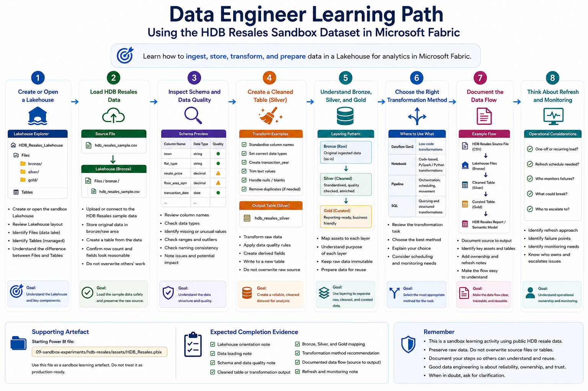

# Data Engineer Pathway

This pathway is for users who need to understand how data is ingested, stored, transformed, and prepared for analytics in Microsoft Fabric.

Data engineering learners should understand that getting data to load once is not the same as building a reliable data workflow. They need to think about source data, Lakehouses, tables, transformations, pipelines, notebooks, refresh, monitoring, and ownership.

This pathway uses the **HDB Resales** sandbox dataset and data engineering artefacts as the common learning materials.

## Who this pathway is for

Choose this pathway if you mainly need to:

- Load data into a Lakehouse
- Understand the difference between files and tables
- Prepare data for reporting or analysis
- Use Dataflows Gen2, pipelines, or notebooks
- Understand Bronze, Silver, and Gold data layers
- Document data movement and transformation steps
- Understand connection, refresh, and monitoring responsibilities
- Support repeatable data preparation workflows

## Learning objectives

By the end of this pathway, users should be able to:

- Access the assigned sandbox workspace
- Create or open a Lakehouse
- Load the HDB Resales sample data into the Lakehouse
- Understand files versus tables
- Inspect schema, data types, and basic data quality
- Create a cleaned or curated table
- Understand when to use Dataflow Gen2, pipeline, notebook, or SQL
- Describe a simple Bronze, Silver, and Gold pattern
- Document the source-to-output flow
- Explain why ownership and monitoring matter

## Prerequisites

Before starting this pathway, users should have completed:

1. [Start Here](../../00-start-here/)
2. [Security, Access and Governance](../../01-security-access-governance/)
3. [Licensing, Capacity and Compute Awareness](../../02-licensing-capacity/)
4. [Fabric Workspace Operating Model](../../03-workspace-operating-model/)
5. [Start Using Fabric](../../04-start-using-fabric/)
6. [Data Analyst Pathway](../data-analyst/), recommended

Users should also know which sandbox workspace they have been assigned to.

## Sandbox-first activity

All hands-on activities in this pathway should be completed in the assigned sandbox workspace.

The HDB Resales dataset is used because it is public, relatable, and safe for learning. It allows data engineering learners to practise ingestion, cleaning, table creation, and transformation without using confidential institutional data.

Users should not upload real confidential or restricted data for this pathway.



## Supporting artefacts

This pathway mainly uses the HDB Resales source data and data engineering materials.

```text
09-sandbox-experiments/hdb-resales/data/
09-sandbox-experiments/hdb-resales/notebooks/
```

Suggested supporting artefacts:

```text
09-sandbox-experiments/hdb-resales/data/hdb_resales_sample.csv
09-sandbox-experiments/hdb-resales/data/hdb_resales_data_dictionary.md
09-sandbox-experiments/hdb-resales/notebooks/hdb_resales_data_preparation.ipynb
```

The HDB Resales PBIX may be used as a downstream reporting example, but the main focus of this pathway is ingestion, cleaning, transformation, table creation, and data flow documentation.

## Activity 1: Create or open a Lakehouse

### Goal

Understand the Lakehouse as the main sandbox area for storing and working with data.

### Steps

1. Open the assigned sandbox workspace.
2. Create or open the Lakehouse provided for the HDB Resales exercise.
3. Review the Lakehouse layout.
4. Identify the `Files` area.
5. Identify the `Tables` area.
6. Note the difference between storing a raw file and creating a managed table.

### Expected output

Users should complete:

```text
Lakehouse name:
Workspace:
Files area located: Yes / No
Tables area located: Yes / No
Difference between Files and Tables:
Questions:
```

### Reflection questions

- Why might raw files and curated tables be kept separately?
- What risks arise if users build reports directly from unmanaged files?
- What would make a table more suitable for reporting?

## Activity 2: Load HDB Resales data

### Goal

Practise loading safe sample data into the sandbox Lakehouse.

### Steps

1. Locate the HDB Resales sample data file provided for the exercise.
2. Upload or connect to the sample data as instructed.
3. Store the original data in a raw or Bronze-like area.
4. Create a table from the data, if instructed.
5. Confirm that the row count and fields look reasonable.
6. Do not replace or overwrite another learner’s work unless instructed.

### Expected output

Users should complete:

```text
Source file name:
Lakehouse location:
Number of rows:
Number of columns:
Raw storage location:
Table created:
Issues noticed:
```

### Reflection questions

- Is the source data clearly identifiable?
- Is the original raw version preserved?
- Can another learner understand where the data came from?
- What would need to be documented if this were a real operational dataset?

## Activity 3: Inspect schema and data quality

### Goal

Understand the structure and quality of the ingested data before transformation.

### Steps

1. Review the column names.
2. Check data types.
3. Identify date, numeric, categorical, and text fields.
4. Check for missing or unusual values.
5. Check whether price, floor area, and transaction period fields behave as expected.
6. Record any issue that may affect downstream analysis.

### Expected output

Users should complete:

```text
Important columns:
Date fields:
Numeric fields:
Categorical fields:
Missing values:
Unexpected values:
Data type issues:
Potential impact:
```

### Reflection questions

- Are data types suitable for analysis?
- Which fields may need standardisation?
- Which fields should not be changed without understanding their meaning?
- How could poor schema handling affect reports?

## Activity 4: Create a cleaned table

### Goal

Practise creating a cleaner version of the HDB Resales dataset for analysis.

### Steps

1. Start from the raw ingested data.
2. Rename fields if the exercise requires clearer naming.
3. Ensure date and numeric fields are correctly typed.
4. Create simple derived fields if appropriate, such as transaction year.
5. Remove duplicate records only if the exercise confirms they are duplicates.
6. Write the cleaned output to a new table.
7. Do not overwrite the raw source.

### Expected output

Users should create or identify:

```text
Raw source table:
Cleaned output table:
Fields renamed:
Fields typed:
Derived fields created:
Records removed, if any:
Reason for changes:
```

### Reflection questions

- What changed between the raw and cleaned version?
- Is the transformation reproducible?
- Could another user understand how the cleaned table was created?
- Why should the raw source not be overwritten?

## Activity 5: Understand Bronze, Silver, and Gold thinking

### Goal

Learn how data layers help separate raw, cleaned, and reporting-ready data.

### Suggested interpretation for this sandbox

| Layer | Meaning in the HDB Resales exercise | Example |
|---|---|---|
| Bronze | Original raw file or raw ingested table | Original HDB resale transaction data |
| Silver | Cleaned and standardised table | Cleaned fields, corrected data types, transaction year |
| Gold | Reporting-ready or analysis-ready table | Curated table with measures, categories, or summary fields |

### Expected output

Users should complete:

```text
Bronze asset:
Silver asset:
Gold asset:
Purpose of each layer:
What should not be overwritten:
```

### Reflection questions

- Why is it useful to separate raw and cleaned data?
- When is a table ready for reporting?
- What additional validation would be needed for production use?
- How does layering support reuse?

## Activity 6: Choose the right transformation method

### Goal

Understand that Fabric offers multiple ways to transform data.

Common options include:

| Method | Best suited for |
|---|---|
| Dataflow Gen2 | Low-code data preparation and Power Query-style transformations |
| Notebook | Code-based transformation, PySpark, Python, or advanced analytics preparation |
| Pipeline | Orchestration, scheduling, and movement of data between steps |
| SQL | Querying and transforming structured data where appropriate |

### Steps

1. Review the HDB Resales transformation task.
2. Decide whether it is better suited for Dataflow Gen2, notebook, pipeline, or SQL.
3. Explain your choice.
4. Identify what would change if the task had to run repeatedly.

### Expected output

Users should complete:

```text
Transformation task:
Recommended method:
Reason:
Would this need scheduling?
Would this need monitoring?
Who would own it?
```

### Reflection questions

- Is the task one-off or recurring?
- Is the transformation simple or complex?
- Does the method support documentation and repeatability?
- What skills are required to maintain it?

## Activity 7: Document the data flow

### Goal

Practise documenting a simple data flow from source to reporting-ready output.

### Steps

1. Identify the source data.
2. Identify the raw storage location.
3. Identify the cleaned table.
4. Identify the reporting-ready output.
5. Identify the report or semantic model using the data.
6. Draw or write the flow in sequence.
7. Add ownership and refresh notes.

### Expected output

Users should document:

```text
Source:
Raw location:
Cleaned table:
Curated table:
Report or semantic model:
Refresh approach:
Owner:
Known limitations:
```

### Example flow

```text
HDB resale source file
   ↓
Lakehouse Files / Bronze
   ↓
Cleaned HDB resale table / Silver
   ↓
Curated resale analytics table / Gold
   ↓
HDB Resales report or semantic model
```

### Reflection questions

- Could another person understand the data flow without asking you?
- Is it clear what is raw and what is curated?
- Is ownership clear?
- Is refresh responsibility clear?

## Activity 8: Think about refresh and monitoring

### Goal

Understand that data workflows need operational ownership.

### Steps

1. Identify whether the data load is one-off or recurring.
2. Identify whether a refresh schedule would be needed.
3. Identify who would monitor refresh failures.
4. Identify what could break if the source structure changes.
5. Identify when BIA or the workspace owner should be informed.

### Expected output

Users should complete:

```text
One-off or recurring:
Refresh needed:
Refresh frequency, if any:
Likely owner:
Possible failure points:
Escalation contact:
```

### Reflection questions

- What happens if the source file format changes?
- What happens if credentials expire?
- What happens if a scheduled refresh fails silently?
- Who should be accountable for fixing failures?

## Expected completion evidence

At the end of this pathway, users should be able to provide:

- A Lakehouse orientation note
- A data loading note
- A schema and data quality note
- A cleaned table or transformation output
- A Bronze, Silver, and Gold mapping
- A transformation method recommendation
- A documented source-to-output data flow
- A refresh and monitoring note

## Related sandbox experiments

Recommended sandbox activities for data engineers:

| Sandbox Experiment | Purpose | Status |
|---|---|---|
| [HDB Resales: Lakehouse Ingestion and Cleaning](../../09-sandbox-experiments/hdb-resales/04-lakehouse-ingestion-and-cleaning/) | Practise loading public HDB resale data into a Lakehouse and creating cleaned tables | Planned |
| [HDB Resales: Semantic Model and KPI Definitions](../../09-sandbox-experiments/hdb-resales/03-semantic-model-and-kpi-definitions/) | Understand how curated tables support semantic models and reporting | Planned |
| [HDB Resales: AI-Ready Data and Semantic Layer](../../09-sandbox-experiments/hdb-resales/09-ai-ready-data-and-semantic-layer/) | Explore how clean, documented data supports AI-ready analytics | Planned |

## Minimum checklist

Before completing this pathway, users should confirm:

- [ ] I can access the assigned sandbox workspace
- [ ] I can create or open a Lakehouse
- [ ] I understand Files versus Tables
- [ ] I can load or access the HDB Resales sample data
- [ ] I can inspect schema and data quality
- [ ] I can create or describe a cleaned table
- [ ] I understand Bronze, Silver, and Gold thinking
- [ ] I can choose an appropriate transformation method
- [ ] I can document a source-to-output data flow
- [ ] I understand why refresh and monitoring ownership matter

## References and further learning

| Resource | Purpose |
|---|---|
| [Fabric Data Engineering documentation](https://learn.microsoft.com/en-us/fabric/data-engineering/) | Official Microsoft documentation for Fabric Data Engineering, Lakehouses, notebooks, and related tutorials |
| [Implement a Lakehouse with Microsoft Fabric](https://learn.microsoft.com/en-us/training/paths/implement-lakehouse-microsoft-fabric/) | Microsoft Learn pathway covering Lakehouse concepts, data ingestion, orchestration, and transformation |
| [Ingest data with Microsoft Fabric](https://learn.microsoft.com/en-us/training/paths/ingest-data-with-microsoft-fabric/) | Microsoft Learn pathway on ingesting and orchestrating data using dataflows, notebooks, and pipelines |
| [Create a lakehouse, ingest sample data, and build a report](https://learn.microsoft.com/en-us/fabric/data-engineering/tutorial-build-lakehouse) | Microsoft tutorial for building a Lakehouse, ingesting sample data, transforming data, and creating reports |
| [Develop, execute, and manage Microsoft Fabric notebooks](https://learn.microsoft.com/en-us/fabric/data-engineering/author-execute-notebook) | Explains how to author and manage Fabric notebooks for Spark jobs and data engineering tasks |
| [Explore analytics data stores in Microsoft Fabric](https://learn.microsoft.com/en-us/training/paths/explore-analytics-data-stores/) | Microsoft Learn pathway introducing Lakehouses, Warehouses, and analytics data stores in Fabric |

## Next pathway

Proceed to:

[Data Scientist Pathway](../data-scientist/)
