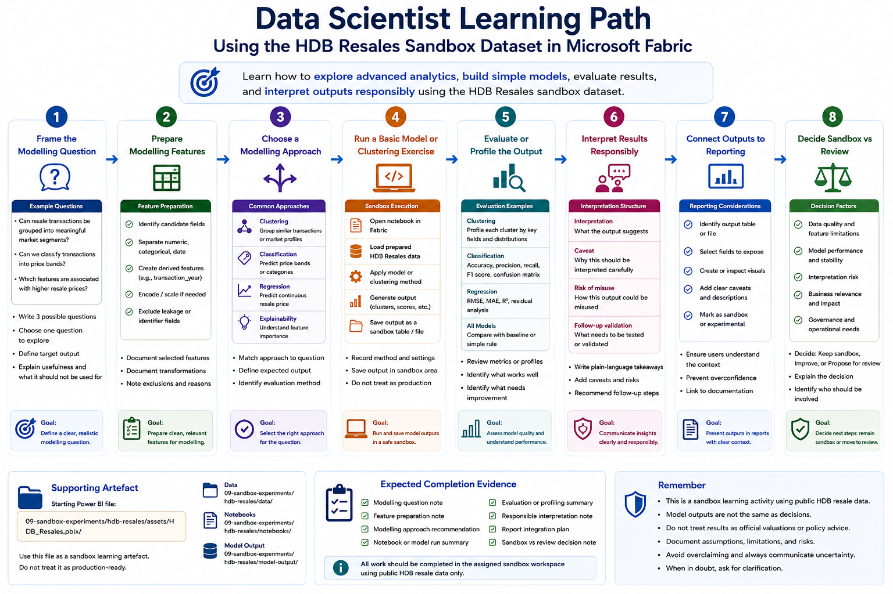

# Data Scientist Pathway

This pathway is for users who want to explore modelling, machine learning, segmentation, prediction, experimentation, or advanced analytics in Microsoft Fabric.

Data science learners should understand that a model output is not the same as a decision. Modelling work requires careful framing, data preparation, evaluation, interpretation, documentation, and responsible use.

This pathway uses the **HDB Resales** sandbox dataset as the common learning artefact.

## Who this pathway is for

Choose this pathway if you mainly need to:

- Explore advanced analytics use cases
- Prepare data for modelling
- Build simple machine learning models
- Perform clustering or segmentation
- Analyse feature patterns
- Evaluate model outputs
- Interpret model results responsibly
- Document assumptions, limitations, and intended use
- Connect model outputs back to reports or dashboards

## Learning objectives

By the end of this pathway, users should be able to:

- Access the assigned sandbox workspace
- Use the HDB Resales dataset for safe modelling practice
- Define a suitable analytical or modelling question
- Distinguish between descriptive analysis, segmentation, and prediction
- Prepare features for a simple model or clustering exercise
- Train or run a basic model in a sandbox notebook, where applicable
- Evaluate outputs using appropriate metrics or profiles
- Explain model limitations clearly
- Avoid treating model outputs as final truth
- Identify what would be required before a model could be used beyond sandbox

## Prerequisites

Before starting this pathway, users should have completed:

1. [Start Here](../../00-start-here/)
2. [Security, Access and Governance](../../01-security-access-governance/)
3. [Licensing, Capacity and Compute Awareness](../../02-licensing-capacity/)
4. [Fabric Workspace Operating Model](../../03-workspace-operating-model/)
5. [Start Using Fabric](../../04-start-using-fabric/)
6. [Data Analyst Pathway](../data-analyst/), recommended
7. [Data Engineer Pathway](../data-engineer/), recommended for users preparing data in a Lakehouse

Users should also know which sandbox workspace they have been assigned to.

## Sandbox-first activity

All hands-on activities in this pathway should be completed in the assigned sandbox workspace.

The HDB Resales dataset is used because it is public, relatable, and suitable for safe advanced analytics practice. It can support exploratory modelling questions such as price band prediction, market segmentation, resale pattern profiling, and location-based comparison.

Users should not upload real confidential or restricted data for this pathway.



> Image placeholder: A learning path showing a data scientist defining a modelling question, preparing HDB Resales features, running clustering or prediction, evaluating outputs, interpreting limitations, and connecting results back to a report.

## Supporting artefact

The starting Power BI file for this sandbox series is stored at:

```text
09-sandbox-experiments/hdb-resales/assets/HDB_Resales.pbix
```

This file should be treated as a sandbox learning artefact and may be repurposed for onboarding activities.

If source data, notebooks, or model output files are provided later, they should be stored under:

```text
09-sandbox-experiments/hdb-resales/data/
09-sandbox-experiments/hdb-resales/notebooks/
09-sandbox-experiments/hdb-resales/model-output/
```

## Activity 1: Frame the modelling question

### Goal

Practise defining a modelling question that is appropriate for the available data.

### Steps

1. Review the HDB Resales dataset.
2. Write three possible modelling or advanced analytics questions.
3. Classify each question as descriptive, segmentation, prediction, or explanation.
4. Choose one question to explore.
5. Identify the target output or segmentation goal.
6. Identify why the question is useful and what it should not be used for.

### Example questions

```text
Can resale transactions be grouped into meaningful market segments?
Can we classify resale transactions into price bands?
Which features appear associated with higher resale prices?
Do towns and flat types show distinct resale market profiles?
Can we identify similar resale transaction profiles using clustering?
```

### Expected output

Users should complete:

```text
Question:
Question type:
Target output or segmentation goal:
Why this question is useful:
What this should not be used for:
Fields likely needed:
Fields not available but useful:
```

### Reflection questions

- Is the question answerable using the available data?
- Is the question descriptive, predictive, or causal?
- Could the output be misused if interpreted too strongly?
- What additional context would be needed for real-world use?

## Activity 2: Prepare modelling features

### Goal

Understand that modelling depends on careful feature selection and preparation.

### Steps

1. Identify candidate input fields.
2. Separate numeric, categorical, date, and derived fields.
3. Decide whether fields need encoding, scaling, grouping, or transformation.
4. Create simple derived features if appropriate, such as transaction year or price per square metre.
5. Identify fields that should be excluded because they are identifiers, leakage risks, or not meaningful.
6. Document the feature set.

### Expected output

Users should complete:

```text
Candidate numeric features:
Candidate categorical features:
Derived features:
Fields excluded:
Reason for exclusion:
Feature preparation needed:
```

### Reflection questions

- Are the selected features meaningful?
- Are any features acting as shortcuts or leakage?
- Are there features that should be grouped to avoid too much noise?
- Are important contextual features missing?

## Activity 3: Choose a modelling approach

### Goal

Select a modelling approach that matches the question.

Common approaches include:

| Approach | Suitable for |
|---|---|
| Clustering | Grouping similar resale transactions or market profiles |
| Classification | Predicting price bands or categories |
| Regression | Predicting a continuous resale price |
| Time trend analysis | Understanding movement over transaction periods |
| Explainability analysis | Understanding which features influence model outputs |

### Steps

1. Review the selected question.
2. Choose a modelling approach.
3. Explain why the approach is suitable.
4. Identify what output the model will produce.
5. Identify what evaluation or profiling is needed.

### Expected output

Users should complete:

```text
Selected question:
Recommended approach:
Reason:
Expected output:
Evaluation or profiling method:
Potential limitations:
```

### Reflection questions

- Does the approach match the question?
- Is a model necessary, or would descriptive analysis be enough?
- How will the output be evaluated?
- How will the result be explained to non-technical users?

## Activity 4: Run a basic sandbox model or clustering exercise

### Goal

Practise running a simple model or clustering exercise in a safe sandbox environment.

### Steps

1. Open the assigned sandbox workspace.
2. Open the provided notebook or create one if instructed.
3. Load the prepared HDB Resales table.
4. Apply the selected modelling approach.
5. Generate output, such as clusters, price bands, prediction scores, or feature importance.
6. Save the output as a sandbox result table or file.
7. Do not treat the output as production-ready.

### Expected output

Users should produce or document:

```text
Notebook name:
Input table:
Model or method used:
Output produced:
Output location:
Run date:
Known issues:
```

### Reflection questions

- Did the model run successfully?
- Are the outputs understandable?
- Are the results stable or sensitive to parameter choices?
- What would need to be tested before reuse?

## Activity 5: Evaluate or profile the output

### Goal

Learn that modelling outputs need evaluation, not just generation.

### Steps

1. Review the output produced.
2. If clustering, profile each cluster using key fields.
3. If classification or regression, review appropriate evaluation metrics.
4. Compare the output against simple baselines where possible.
5. Identify whether the result is useful, unclear, or misleading.
6. Document what should be improved.

### Expected output

Users should complete:

```text
Output reviewed:
Evaluation or profiling method:
Main finding:
Baseline or comparison:
What looks useful:
What looks weak:
Improvement needed:
```

### Reflection questions

- Does the output make practical sense?
- Are the groups or predictions interpretable?
- Is performance good enough for the intended purpose?
- Is the result better than a simple rule or descriptive summary?

## Activity 6: Interpret results responsibly

### Goal

Practise explaining model outputs without overclaiming.

### Steps

1. Choose one model output or cluster profile.
2. Write a plain-language interpretation.
3. Add one caveat.
4. Add one risk of misuse.
5. Add one recommendation for follow-up validation.

### Expected output

Users should write:

```text
Interpretation:
The model output suggests that...

Caveat:
This should be interpreted carefully because...

Risk of misuse:
This output should not be used to...

Follow-up validation:
Before using this beyond sandbox, we should...
```

### Example

```text
Interpretation:
The clustering output suggests that some resale transactions have similar profiles based on town, flat type, floor area, transaction period, and price.

Caveat:
The clusters depend on the selected features and may change if additional variables such as proximity to MRT, school locations, or remaining lease details are added.

Risk of misuse:
The clusters should not be used as official valuation categories or as a substitute for formal market analysis.

Follow-up validation:
Before using this beyond sandbox, the cluster logic should be reviewed, tested on additional periods, and validated by users familiar with the housing context.
```

## Activity 7: Connect outputs back to reporting

### Goal

Understand how modelling outputs may be consumed by reports or dashboards.

### Steps

1. Identify the output table or file.
2. Decide what fields should be exposed to a report.
3. Create or inspect a simple visual showing the model output.
4. Add appropriate caveats to the report.
5. Ensure the output is clearly marked as sandbox or experimental.

### Expected output

Users should complete:

```text
Output table:
Fields exposed to report:
Visual created or inspected:
Caveat added:
Sandbox status clearly shown:
```

### Reflection questions

- Would report users understand the model output?
- Are the caveats visible enough?
- Could the visual encourage overconfidence?
- What governance would be required before wider use?

## Activity 8: Decide whether this should remain sandbox

### Goal

Practise deciding whether a modelling output should remain experimental or move towards review.

### Steps

1. Review the model purpose.
2. Review data quality and feature limitations.
3. Review evaluation evidence.
4. Review interpretation risks.
5. Decide whether the output should remain sandbox, be improved, or be proposed for review.
6. Explain the decision.

### Expected output

Users should complete:

```text
Should this remain sandbox?
Reason:
What needs improvement:
What review would be needed:
Who should be involved:
```

### Reflection questions

- Is the model reliable enough for the intended purpose?
- Who would be affected if the output were used?
- What operational process would be needed?
- What could go wrong if this were shared too early?

## Expected completion evidence

At the end of this pathway, users should be able to provide:

- A modelling question note
- A feature preparation note
- A modelling approach recommendation
- A notebook or model run summary
- An evaluation or profiling summary
- A responsible interpretation note
- A report consumption plan for model output
- A sandbox-versus-review decision note

## Related sandbox experiments

Recommended sandbox activities for data scientists:

| Sandbox Experiment | Purpose | Status |
|---|---|---|
| [HDB Resales: Market Segmentation](../../09-sandbox-experiments/hdb-resales/05-market-segmentation/) | Practise clustering or segmenting resale market patterns using public HDB resale data | Planned |
| [HDB Resales: Price Trend and Affordability Analysis](../../09-sandbox-experiments/hdb-resales/06-price-trend-and-affordability-analysis/) | Practise advanced trend analysis and careful interpretation of price patterns | Planned |
| [HDB Resales: AI-Ready Data and Semantic Layer](../../09-sandbox-experiments/hdb-resales/09-ai-ready-data-and-semantic-layer/) | Explore how curated data and semantic definitions support AI-ready analytics | Planned |

## Minimum checklist

Before completing this pathway, users should confirm:

- [ ] I can access the assigned sandbox workspace
- [ ] I can define a modelling or advanced analytics question
- [ ] I can explain whether the question is descriptive, predictive, segmentation-based, or causal
- [ ] I can prepare a simple feature set
- [ ] I can choose a suitable modelling approach
- [ ] I can run or review a basic sandbox model or clustering exercise
- [ ] I can evaluate or profile the output
- [ ] I can explain limitations and risks of misuse
- [ ] I can connect the output back to a report with caveats
- [ ] I can decide whether the output should remain sandbox or move towards review

## References and further learning

| Resource | Purpose |
|---|---|
| [Explore Data Science in Microsoft Fabric](https://learn.microsoft.com/en-us/fabric/data-science/data-science-overview) | Introduces the Fabric Data Science experience and the end-to-end data science workflow |
| [Fabric Data Science documentation](https://learn.microsoft.com/en-us/fabric/data-science/) | Official Microsoft documentation for Fabric data science, model scoring, model training, notebooks, and AI samples |
| [Implement a data science and machine learning solution with Microsoft Fabric](https://learn.microsoft.com/en-us/training/paths/implement-data-science-machine-learning-fabric/) | Microsoft Learn pathway for exploring the data science process and training machine learning models in Fabric |
| [Data science tutorial: get started with Microsoft Fabric](https://learn.microsoft.com/en-us/fabric/data-science/tutorial-data-science-introduction) | End-to-end Microsoft tutorial covering ingestion, cleaning, preparation, model training, insight generation, and Power BI consumption |
| [Machine learning experiments in Microsoft Fabric](https://learn.microsoft.com/en-us/fabric/data-science/machine-learning-experiment) | Explains how Fabric ML experiments help track parameters, metrics, outputs, and runs |
| [Machine learning models in Microsoft Fabric](https://learn.microsoft.com/en-us/fabric/data-science/machine-learning-model) | Explains model creation, versioning, comparison, scoring, and inferencing in Fabric |
| [Use the low-code AutoML interface in Fabric](https://learn.microsoft.com/en-us/fabric/data-science/low-code-automl) | Explains how Fabric AutoML can generate notebooks and track model metrics for selected ML tasks |

## Next pathway

Proceed to:

[Department Representative Pathway](../department-representative/)
