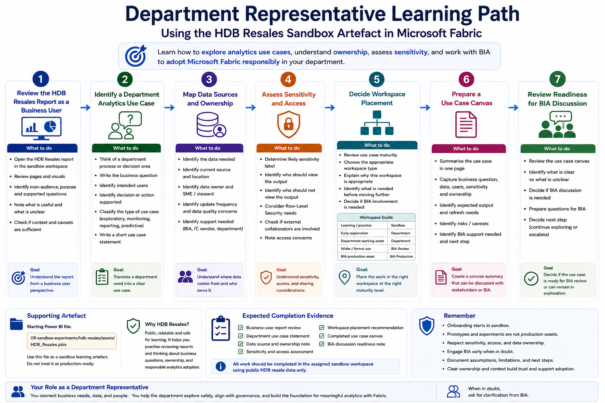

# Department Representative Pathway

This pathway is for department representatives who are exploring how Microsoft Fabric may support department-level analytics use cases.

Department representatives do not need to become deep technical experts in every Fabric workload. Their role is to understand the operating model, identify possible use cases, coordinate with stakeholders, understand data and access boundaries, and work with BIA where support, review, or productionisation may be needed.

This pathway uses the **HDB Resales** sandbox report as a safe example for thinking about department use cases, dashboard interpretation, ownership, and responsible analytics adoption.

## Who this pathway is for

Choose this pathway if you mainly need to:

- Represent a department in Fabric onboarding
- Explore potential department analytics use cases
- Understand what can be done in sandbox versus department workspace
- Coordinate with BIA on access, workspace, or productionisation questions
- Help identify data owners, report users, and business questions
- Review whether an output makes sense from a business perspective
- Understand sensitivity, sharing, and governance expectations
- Avoid treating prototypes as production-ready assets

## Learning objectives

By the end of this pathway, users should be able to:

- Explain the difference between sandbox, department, and BIA production workspaces
- Use the sandbox workspace to explore Fabric safely
- Review the HDB Resales sandbox report from a business-user perspective
- Identify what makes a dashboard useful or not useful
- Translate a department need into an initial analytics use case statement
- Identify likely data sources, data owners, users, and sensitivity considerations
- Distinguish between exploratory assets and production-facing assets
- Know when to involve BIA for review, support, or productionisation

## Prerequisites

Before starting this pathway, users should have completed:

1. [Start Here](../../00-start-here/)
2. [Security, Access and Governance](../../01-security-access-governance/)
3. [Licensing, Capacity and Compute Awareness](../../02-licensing-capacity/)
4. [Fabric Workspace Operating Model](../../03-workspace-operating-model/)
5. [Start Using Fabric](../../04-start-using-fabric/)
6. [Report Consumer Pathway](../report-consumer/), recommended

Users should also know which sandbox workspace they have been assigned to.

## Sandbox-first activity

All hands-on activities in this pathway should be completed in the assigned sandbox workspace.

The HDB Resales report is used because it is based on public data and provides a safe way to practise reviewing a dashboard, asking business questions, and thinking about ownership and use case readiness.

Users should not upload real department data for this pathway unless explicitly instructed and approved.



## Supporting artefacts

This pathway uses the HDB Resales report as an example and a use case canvas as the main working artefact.

```text
09-sandbox-experiments/hdb-resales/assets/HDB_Resales.pbix
09-sandbox-experiments/hdb-resales/templates/use-case-canvas.md
```

The HDB Resales report is used only as a safe example of how analytics outputs may support interpretation and discussion. The main focus of this pathway is not report development. The main focus is use case framing, ownership, access, sensitivity, and readiness for BIA discussion.

## Activity 1: Review the HDB Resales report as a business user

### Goal

Practise reviewing a report from the perspective of a department stakeholder.

### Steps

1. Open the assigned sandbox workspace.
2. Open the HDB Resales report.
3. Review the report pages.
4. Identify the main audience of the report.
5. Identify the main decisions or questions the report appears to support.
6. Identify what is useful and what is unclear.
7. Note whether the report provides enough context for interpretation.

### Expected output

Users should complete:

```text
Report name:
Main audience:
Main purpose:
Useful parts of the report:
Unclear parts of the report:
Questions a business user may ask:
```

### Reflection questions

- Is the report easy for a non-technical user to understand?
- Is the purpose of the report clear?
- Are the filters and slicers useful?
- Are definitions and caveats visible enough?
- What would make the report more actionable?

## Activity 2: Identify a department analytics use case

### Goal

Practise converting a department need into a clearer analytics use case.

### Steps

1. Think of one department process, report, or decision area that could benefit from better analytics.
2. Write the business question.
3. Identify the intended users.
4. Identify what decision or action the analytics output may support.
5. Identify whether the use case is exploratory, monitoring-focused, reporting-focused, or predictive.
6. Write a short use case statement.

### Expected output

Users should complete:

```text
Use case title:
Department or team:
Business question:
Intended users:
Decision or action supported:
Type of use case:
Expected output:
```

### Example

```text
Use case title:
Course Enrolment Monitoring

Department or team:
Example Department

Business question:
Which courses are approaching enrolment capacity and may require planning attention?

Intended users:
Programme administrators and managers

Decision or action supported:
Support earlier discussion on course capacity, class planning, and student communication

Type of use case:
Monitoring and reporting

Expected output:
Dashboard showing enrolment by course, capacity, trend, and risk indicators
```

### Reflection questions

- Is the use case specific enough?
- Who will actually use the output?
- What decision will be better because of this analytics output?
- Is the output a one-off analysis or an ongoing dashboard?

## Activity 3: Map data sources and ownership

### Goal

Understand that every analytics use case depends on clear data ownership.

### Steps

1. Identify the data needed for the use case.
2. Identify where the data currently resides.
3. Identify who owns or understands the data.
4. Identify whether the data is manually maintained, system-generated, or extracted from another platform.
5. Identify whether the data is complete, reliable, and regularly updated.
6. Identify whether BIA, IT, vendor, or department support may be required.

### Expected output

Users should complete:

```text
Data needed:
Current source:
Data owner:
Data steward or subject matter expert:
Update frequency:
Known data quality concerns:
Support needed:
```

### Reflection questions

- Is the data already available?
- Is the data reliable enough for the use case?
- Who understands the meaning of each field?
- Who can approve use of the data?
- What happens if the data changes or stops updating?

## Activity 4: Assess sensitivity and access

### Goal

Practise identifying access and sensitivity considerations early.

### Steps

1. Identify whether the use case involves personal, operational, financial, student, staff, donor, or other sensitive data.
2. Identify the likely sensitivity label.
3. Identify who should be allowed to view the output.
4. Identify whether different users should see different data.
5. Consider whether Row-Level Security may be required.
6. Identify whether external collaborators are involved.

### Expected output

Users should complete:

```text
Likely sensitivity label:
Who should view the output:
Who should not view the output:
Is Row-Level Security likely needed?
Are external collaborators involved?
Access concerns:
```

### Reflection questions

- Could the output expose information to the wrong audience?
- Is the intended audience clearly defined?
- Are there different user groups with different access needs?
- Should the use case be discussed with BIA before proceeding?

## Activity 5: Decide whether the use case belongs in sandbox, department workspace, or BIA production

### Goal

Understand where different types of work should happen.

### Steps

1. Review the use case.
2. Decide whether the use case is for learning, exploration, department use, or formal production.
3. Identify the appropriate workspace type.
4. Explain why the workspace type is appropriate.
5. Identify what would be needed before moving to the next level.

### Expected output

Users should complete:

```text
Use case:
Current maturity:
Recommended workspace:
Reason:
What is needed before moving further:
BIA involvement needed: Yes / No
```

### Suggested interpretation

| Use Case Maturity | Suitable Workspace |
|---|---|
| Learning or practice | Sandbox Workspace |
| Early department exploration | Department Workspace |
| Department working asset | Department Workspace, with clear ownership |
| Formal or wider organisational use | Review with BIA |
| BIA-managed production asset | BIA Production Workspace |

### Reflection questions

- Is this still just an idea?
- Is the data approved for use?
- Who owns the output?
- Who will maintain it?
- Who will validate it?
- Does it need to become a BIA-managed production asset?

## Activity 6: Prepare a simple use case canvas

### Goal

Create a concise summary that can be discussed with BIA or department stakeholders.

### Steps

1. Use the outputs from earlier activities.
2. Summarise the use case in one page.
3. Identify business question, data, users, sensitivity, and ownership.
4. Identify whether support from BIA is needed.
5. Identify immediate next steps.

### Expected output

Users should complete this use case canvas:

```text
Use case title:

Business question:

Intended users:

Decision or action supported:

Data needed:

Data owner:

Likely sensitivity label:

Workspace type:

Expected output:

Refresh or update frequency:

Owner after creation:

BIA support needed:

Key risks or caveats:

Next step:
```

### Reflection questions

- Is the use case clear enough for someone outside the department to understand?
- Is ownership clear?
- Is the expected output realistic?
- Are the risks and caveats visible?
- What should happen next?

## Activity 7: Review whether the use case is ready for BIA discussion

### Goal

Practise deciding when a use case should be escalated.

### Steps

1. Review the use case canvas.
2. Identify what is already clear.
3. Identify what remains unclear.
4. Decide whether the department can continue exploring in sandbox or department workspace.
5. Decide whether BIA review is needed.
6. Prepare questions for BIA if needed.

### Expected output

Users should complete:

```text
Ready for department exploration: Yes / No
Ready for BIA discussion: Yes / No
What is clear:
What is unclear:
Questions for BIA:
Suggested next step:
```

### Reflection questions

- Is the use case still exploratory?
- Is there a production expectation?
- Is sensitive data involved?
- Is the request mainly about tool usage, data access, governance, or productionisation?
- Who should be involved in the next discussion?

## Expected completion evidence

At the end of this pathway, users should be able to provide:

- A business-user review of the HDB Resales report
- One department analytics use case statement
- A data source and ownership note
- A sensitivity and access assessment
- A workspace placement recommendation
- A completed use case canvas
- A BIA discussion readiness note

## Related sandbox experiments

Recommended sandbox activities for department representatives:

| Sandbox Experiment | Purpose | Status |
|---|---|---|
| [HDB Resales: Report Consumer Walkthrough](../../09-sandbox-experiments/hdb-resales/01-report-consumer-walkthrough/) | Practise reviewing a report as a business user using public HDB resale data | Planned |
| [HDB Resales: Dashboard Design and Storytelling](../../09-sandbox-experiments/hdb-resales/02-dashboard-design-and-storytelling/) | Understand how dashboard design affects business interpretation | Planned |
| [HDB Resales: AI-Ready Data and Semantic Layer](../../09-sandbox-experiments/hdb-resales/09-ai-ready-data-and-semantic-layer/) | Understand how meaning, definitions, and documentation support scalable analytics and AI-readiness | Planned |

## Minimum checklist

Before completing this pathway, users should confirm:

- [ ] I understand that onboarding starts in sandbox
- [ ] I can review a report from a business-user perspective
- [ ] I can identify a department analytics use case
- [ ] I can describe the business question and intended users
- [ ] I can identify likely data sources and owners
- [ ] I can consider sensitivity and access implications
- [ ] I can decide whether the work belongs in sandbox, department workspace, or requires BIA review
- [ ] I can complete a simple use case canvas
- [ ] I know when to escalate a request to BIA

## References and further learning

| Resource | Purpose |
|---|---|
| [Microsoft Fabric adoption roadmap](https://learn.microsoft.com/en-us/power-bi/guidance/fabric-adoption-roadmap) | Provides guidance on adoption, ownership, governance, support, and enablement for Fabric and Power BI |
| [Maturity levels for Microsoft Fabric adoption](https://learn.microsoft.com/en-us/power-bi/guidance/fabric-adoption-roadmap-maturity-levels) | Useful for understanding how analytics maturity evolves over time |
| [Power BI implementation planning: BI strategy overview](https://learn.microsoft.com/en-us/power-bi/guidance/powerbi-implementation-planning-bi-strategy-overview) | Helps stakeholders think about BI strategy, ownership, and alignment with business needs |
| [Power BI implementation planning: Tenant-level workspace planning](https://learn.microsoft.com/en-us/power-bi/guidance/powerbi-implementation-planning-tenant-level-workspace-planning) | Useful for understanding workspace planning, ownership, and collaboration patterns |
| [Power BI guidance documentation](https://learn.microsoft.com/en-us/power-bi/guidance/) | Central Microsoft guidance area for Power BI and Fabric planning, governance, and adoption topics |

## Next pathway

Proceed to:

[Workspace Owner Pathway](../workspace-owner/)
