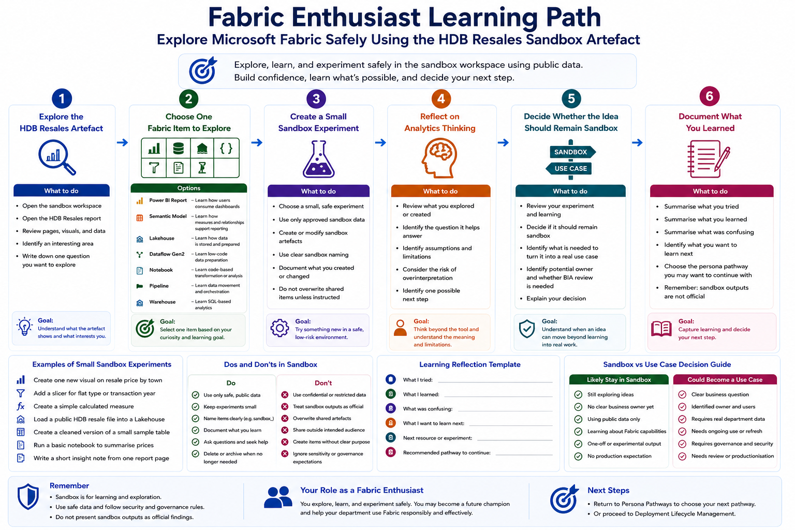

# Fabric Enthusiast Pathway

This pathway is for users who are curious about Microsoft Fabric and want to explore its capabilities before they have a formal department use case.

Fabric enthusiasts are important because they may become future champions, early adopters, or informed collaborators. However, enthusiasm should be channelled safely. Exploration should happen in the sandbox workspace using safe data, and outputs should not be treated as official or production-ready.

This pathway uses the **HDB Resales** sandbox artefact as a safe and relatable starting point for exploration.

## Who this pathway is for

Choose this pathway if you mainly want to:

- Explore Microsoft Fabric out of interest
- Learn what Fabric can do before having a formal use case
- Try reports, Lakehouses, semantic models, notebooks, pipelines, or Dataflows Gen2
- Practise using safe public data
- Build confidence before working on department use cases
- Understand how analytics assets are created and connected
- Reflect on what would be needed before an experiment becomes useful in real work

## Learning objectives

By the end of this pathway, users should be able to:

- Access the assigned sandbox workspace
- Explain why sandbox is the correct place for early experimentation
- Open or use the HDB Resales sandbox artefact
- Try at least one Fabric item or activity safely
- Document what was created or explored
- Explain what was learned
- Identify what would be needed before applying the idea to a real department use case
- Avoid using confidential or restricted data in sandbox
- Avoid presenting sandbox outputs as official findings

## Prerequisites

Before starting this pathway, users should have completed:

1. [Start Here](../../00-start-here/)
2. [Security, Access and Governance](../../01-security-access-governance/)
3. [Licensing, Capacity and Compute Awareness](../../02-licensing-capacity/)
4. [Fabric Workspace Operating Model](../../03-workspace-operating-model/)
5. [Start Using Fabric](../../04-start-using-fabric/)

Users should also know which sandbox workspace they have been assigned to.

## Sandbox-first activity

All hands-on activities in this pathway should be completed in the assigned sandbox workspace.

The HDB Resales artefact is used because it is based on public data and can support many types of exploration, including report consumption, dashboard design, data analysis, data engineering, semantic modelling, and advanced analytics.

Users should not upload real confidential or restricted data for this pathway.



## Supporting artefact

The starting Power BI file for this sandbox series is stored at:

```text
09-sandbox-experiments/hdb-resales/assets/HDB_Resales.pbix
```

This file should be treated as a sandbox learning artefact and may be repurposed for onboarding activities.

## Activity 1: Explore the HDB Resales artefact

### Goal

Get familiar with the HDB Resales sandbox artefact before creating anything new.

### Steps

1. Open the assigned sandbox workspace.
2. Locate the HDB Resales report or artefact.
3. Review the available report pages, visuals, fields, or data assets.
4. Identify what the artefact appears to show.
5. Identify one area that interests you.
6. Write down one question you would like to explore.

### Expected output

Users should complete:

```text
Artefact name:
What it appears to show:
Interesting area:
Question I want to explore:
Why this interests me:
```

### Reflection questions

- What makes this artefact useful for learning?
- What is easy to understand?
- What is unclear?
- What would you like to try next?

## Activity 2: Choose one Fabric item to explore

### Goal

Practise choosing a Fabric item based on learning interest.

### Options

| Fabric Item | Explore this if you want to learn... |
|---|---|
| Power BI Report | How users consume and interpret dashboards |
| Semantic Model | How measures, relationships, and business definitions support reporting |
| Lakehouse | How data is stored and prepared for analytics |
| Dataflow Gen2 | How low-code data preparation works |
| Notebook | How code-based data transformation or analysis works |
| Pipeline | How data movement and orchestration works |
| Warehouse | How SQL-based analytics can be supported |

### Steps

1. Select one Fabric item type to explore.
2. Explain why you chose it.
3. Identify the HDB Resales activity that is related to it.
4. Spend a short amount of time exploring the item.
5. Document what you observed.

### Expected output

Users should complete:

```text
Fabric item selected:
Reason for selection:
What I explored:
What I learned:
What I found confusing:
```

### Reflection questions

- Was the item easier or harder to understand than expected?
- What prior knowledge would help?
- What would you need to learn next?

## Activity 3: Create a small sandbox experiment

### Goal

Create a small, low-risk experiment using the HDB Resales artefact.

### Example experiments

```text
Create one new visual on resale price by town
Create a slicer for flat type or transaction year
Create a simple calculated measure
Load a public HDB resale file into a Lakehouse
Create a cleaned version of a small sample table
Run a basic notebook to summarise resale prices
Create a short insight note from one report page
```

### Steps

1. Choose one small experiment.
2. Confirm that it uses safe data.
3. Create or modify only sandbox artefacts.
4. Use a clear sandbox naming convention.
5. Document what you changed or created.
6. Avoid overwriting shared artefacts unless instructed.

### Expected output

Users should complete:

```text
Experiment title:
Fabric item used:
Data used:
What I created or changed:
File or item name:
Sandbox naming used:
```

### Reflection questions

- Was the experiment small and safe?
- Did it use only approved sandbox data?
- Could another user understand what you created?
- Did you avoid affecting shared or production artefacts?

## Activity 4: Reflect on analytics thinking

### Goal

Move beyond tool exploration and think about meaning, assumptions, and responsible use.

### Steps

1. Review what you created or explored.
2. Identify the question your experiment helps answer.
3. Identify one assumption.
4. Identify one limitation.
5. Identify one risk of overinterpretation.
6. Identify one possible next step.

### Expected output

Users should complete:

```text
Question explored:
Observation:
Assumption:
Limitation:
Risk of overinterpretation:
Possible next step:
```

### Reflection questions

- What does the output actually show?
- What does it not show?
- What could someone wrongly conclude?
- What additional context would make it more useful?

## Activity 5: Decide whether the idea should remain sandbox

### Goal

Understand the difference between a learning experiment and a real department use case.

### Steps

1. Review the experiment.
2. Decide whether it is only for learning or could become a real use case.
3. Identify what would be needed to move beyond sandbox.
4. Identify whether a department owner is needed.
5. Identify whether BIA should be involved.
6. Explain the decision.

### Expected output

Users should complete:

```text
Should this remain sandbox?
Could it become a department use case?
What would be needed next:
Potential department owner:
BIA involvement needed:
Reason:
```

### Reflection questions

- Is there a real business question?
- Is there an actual user or owner?
- Is real data required?
- Would access, sensitivity, refresh, or productionisation need review?
- Is this better treated as learning only?

## Activity 6: Document what you learned

### Goal

Create a short learning note that can help the learner and others.

### Steps

1. Summarise what you tried.
2. Summarise what you learned.
3. Summarise what was confusing.
4. Identify one resource or pathway to continue with.
5. Identify whether you want to continue as a report developer, data analyst, data engineer, data scientist, department representative, or workspace owner.

### Expected output

Users should complete:

```text
What I tried:
What I learned:
What was confusing:
What I want to learn next:
Recommended pathway to continue:
```

### Reflection questions

- Which Fabric capability interested you most?
- Which persona pathway seems most relevant now?
- What support would help you continue learning?
- What should you avoid doing without approval?

## Expected completion evidence

At the end of this pathway, users should be able to provide:

- A short note on the HDB Resales artefact
- A selected Fabric item to explore
- One small sandbox experiment
- An analytics thinking reflection
- A sandbox-versus-use-case decision
- A learning note with next pathway recommendation

## Related sandbox experiments

Recommended sandbox activities for Fabric enthusiasts:

| Sandbox Experiment | Purpose | Status |
|---|---|---|
| [HDB Resales: Report Consumer Walkthrough](../../09-sandbox-experiments/hdb-resales/01-report-consumer-walkthrough/) | Start by opening, filtering, and interpreting the HDB Resales report | Planned |
| [HDB Resales: Dashboard Design and Storytelling](../../09-sandbox-experiments/hdb-resales/02-dashboard-design-and-storytelling/) | Explore how dashboard design affects interpretation |
| [HDB Resales: Lakehouse Ingestion and Cleaning](../../09-sandbox-experiments/hdb-resales/04-lakehouse-ingestion-and-cleaning/) | Try a data engineering-oriented activity |
| [HDB Resales: Market Segmentation](../../09-sandbox-experiments/hdb-resales/05-market-segmentation/) | Try an advanced analytics-oriented activity |
| [HDB Resales: AI-Ready Data and Semantic Layer](../../09-sandbox-experiments/hdb-resales/09-ai-ready-data-and-semantic-layer/) | Explore semantic meaning and AI-ready data concepts |

## Minimum checklist

Before completing this pathway, users should confirm:

- [ ] I understand that sandbox is for learning and experimentation
- [ ] I can access the assigned sandbox workspace
- [ ] I can open or use the HDB Resales artefact
- [ ] I selected one Fabric item to explore
- [ ] I completed one small sandbox experiment
- [ ] I used only safe data
- [ ] I named my work clearly
- [ ] I documented what I learned
- [ ] I understand that sandbox outputs are not official
- [ ] I know which persona pathway I may want to continue with

## References and further learning

| Resource | Purpose |
|---|---|
| [Microsoft Fabric documentation](https://learn.microsoft.com/en-us/fabric/) | Official starting point for Fabric concepts, workloads, and product capabilities |
| [Microsoft Learn: Get started with Microsoft Fabric](https://learn.microsoft.com/en-us/training/paths/get-started-fabric/) | Beginner learning path for users who want a broad introduction to Fabric |
| [What is Microsoft Fabric?](https://learn.microsoft.com/en-us/fabric/fundamentals/microsoft-fabric-overview) | Explains Fabric as an end-to-end analytics platform |
| [Power BI service basic concepts](https://learn.microsoft.com/en-us/power-bi/fundamentals/service-basic-concepts) | Useful for understanding workspaces, reports, dashboards, and semantic models |
| [Fabric adoption roadmap](https://learn.microsoft.com/en-us/power-bi/guidance/fabric-adoption-roadmap) | Useful for understanding how Fabric adoption, governance, enablement, and maturity evolve |

## Next section

Return to:

[Persona Pathways](../)

Or proceed to:

[Deployment Lifecycle Management](../../06-deployment-lifecycle-management/)
