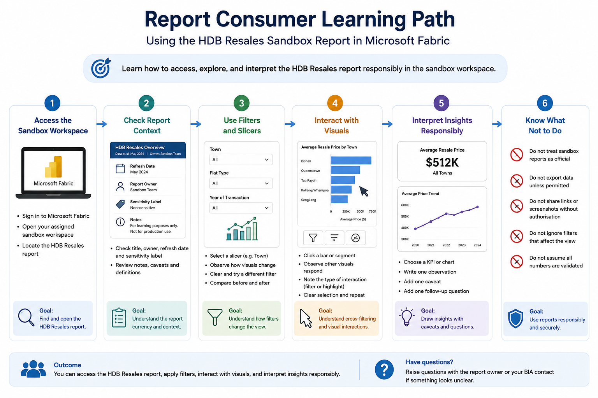

# Report Consumer Pathway

This pathway is for users who mainly need to view, filter, interpret, and use Power BI reports or dashboards responsibly.

Report consumers are not expected to build data pipelines, create Lakehouses, write notebooks, or design semantic models. Their main responsibility is to understand how to use reports safely, interpret outputs correctly, and avoid inappropriate sharing or export.

This pathway uses the **HDB Resales** sandbox report as the common learning artefact.

## Who this pathway is for

Choose this pathway if you mainly need to:

- Open assigned reports or dashboards
- Use filters, slicers, and report navigation
- Interpret visuals and summary metrics
- Understand report refresh dates and ownership
- Know whether a report is sandbox, departmental, or production-facing
- Avoid unauthorised sharing, screenshots, or exports
- Raise questions when numbers look incorrect

## Learning objectives

By the end of this pathway, users should be able to:

- Access the assigned sandbox workspace
- Open the HDB Resales sandbox report
- Navigate report pages
- Use filters, slicers, and basic visual interactions
- Check report title, owner, refresh date, and sensitivity label, if applicable
- Understand the difference between sandbox output and production output
- Explain one insight from the report with appropriate caveats
- Know when to ask for clarification or escalate an issue

## Prerequisites

Before starting this pathway, users should have completed:

1. [Start Here](../../00-start-here/)
2. [Security, Access and Governance](../../01-security-access-governance/)
3. [Licensing, Capacity and Compute Awareness](../../02-licensing-capacity/)
4. [Fabric Workspace Operating Model](../../03-workspace-operating-model/)
5. [Start Using Fabric](../../04-start-using-fabric/)

Users should also know which sandbox workspace they have been assigned to.

## Sandbox-first activity

All hands-on activities in this pathway should be completed in the assigned sandbox workspace.

The HDB Resales report is used because it is based on a public and relatable dataset. It allows users to practise report consumption and interpretation without using confidential institutional data.

Users should not upload real confidential or restricted data for this pathway.



## Activity 1: Open the HDB Resales sandbox report

### Goal

Learn how to find and open a report in the sandbox workspace using the HDB Resales report.

### Steps

1. Sign in to Microsoft Fabric.
2. Open the assigned sandbox workspace.
3. Locate the HDB Resales report.
4. Open the report in reading mode.
5. Identify the report title and purpose.
6. Confirm that the report is a sandbox learning artefact.

### Expected output

Users should be able to state:

```text
Report name:
Workspace:
Report purpose:
Report status: Sandbox / learning artefact
```

### Reflection questions

- Is it clear what the report is about?
- Is it clear whether this report is official or only for learning?
- What would you need to know before using this type of report for a real decision?

## Activity 2: Check report context

### Goal

Learn to check whether a report is current, relevant, and safe to use.

### Steps

1. Check the report title.
2. Check the report owner or contact point, if available.
3. Check the refresh date or data currency indicator, if available.
4. Check whether a sensitivity label is applied.
5. Check whether there are notes, caveats, or definitions.
6. Identify the source or semantic model, if visible to you.

### Expected output

Users should complete a short report context note:

```text
Report name:
Workspace:
Report purpose:
Report owner or contact:
Refresh date:
Sensitivity label:
Important caveats:
Questions to clarify:
```

### Reflection questions

- Is the report recent enough for its intended purpose?
- Are the measures or terms clearly defined?
- Is there any warning that the report should not be used as an official source?
- Who would you ask if the numbers appear incorrect?

## Activity 3: Use filters and slicers

### Goal

Learn how filters and slicers affect what is shown in a report.

### Steps

1. Open the HDB Resales report.
2. Select one slicer or filter, such as town, flat type, year, or resale price range.
3. Observe how the visuals change.
4. Clear the filter.
5. Apply a different filter.
6. Compare the result before and after filtering.
7. Note whether the filter changes one visual, one page, or the whole report.

### Expected output

Users should write a short note:

```text
Filter or slicer used:
What changed:
What did not change:
Possible interpretation:
Possible caveat:
```

### Reflection questions

- Did the filter affect all visuals or only some visuals?
- Could a user misinterpret the report if they forget a filter is applied?
- Does the report make it clear when filters are active?

## Activity 4: Interact with visuals

### Goal

Learn how selecting a visual may cross-filter or cross-highlight other visuals.

### Steps

1. Select a bar, segment, point, or category in one visual.
2. Observe how other visuals respond.
3. Check whether the interaction filters, highlights, or does not affect other visuals.
4. Clear the selection.
5. Repeat with another visual.

### Expected output

Users should describe one visual interaction:

```text
Visual selected:
Other visuals affected:
Type of effect observed:
Insight gained:
Possible caveat:
```

### Reflection questions

- Did the interaction make the pattern clearer?
- Could the interaction accidentally hide important context?
- Would another user understand that a visual selection is active?

## Activity 5: Interpret one insight responsibly

### Goal

Practise writing a simple interpretation without overclaiming.

### Steps

1. Choose one chart or KPI from the HDB Resales report.
2. Apply one appropriate filter, if useful.
3. Write one observation.
4. Add one caveat.
5. Add one follow-up question.

### Expected output

Users should write a short interpretation using this structure:

```text
Observation:
The report appears to show that...

Caveat:
This should be interpreted carefully because...

Follow-up question:
Before using this for a real decision, I would ask...
```

### Example

```text
Observation:
The report appears to show that resale prices differ across towns and flat types.

Caveat:
This should be interpreted carefully because price differences may also be affected by flat size, remaining lease, storey range, transaction year, and location-specific factors.

Follow-up question:
Before using this for a real decision, I would ask whether the report controls for flat type, floor area, remaining lease, and transaction period.
```

## Activity 6: Know what not to do

### Goal

Understand responsible behaviour when consuming reports.

Report consumers should not:

- Treat sandbox reports as official reports
- Export data unless permitted
- Forward screenshots without context
- Share report links with unauthorised users
- Assume that all numbers are validated for production use
- Ignore filters or slicers that may affect the view
- Use outdated reports for current decisions
- Interpret a visual without understanding the definition behind it

### Reflection questions

- What could go wrong if a screenshot is forwarded without the applied filters?
- What could go wrong if a filtered view is mistaken for the full picture?
- What could go wrong if a sandbox report is treated as production-ready?

## Expected completion evidence

At the end of this pathway, users should be able to provide:

- The name of the HDB Resales report used
- A completed report context note
- One filter or slicer observation
- One visual interaction observation
- One responsible interpretation with caveat
- One question they would ask before using the report for a real decision

## Related sandbox experiments

Recommended sandbox activity for report consumers:

| Sandbox Experiment | Purpose | Status |
|---|---|---|
| [HDB Resales: Report Consumer Walkthrough](../../09-sandbox-experiments/hdb-resales/01-report-consumer-walkthrough/) | Practise opening, filtering, and interpreting a Power BI report using public HDB resale data | Planned |

The HDB Resales sandbox series uses public HDB resale flat data as a safe and relatable dataset for Fabric onboarding.

## Supporting artefact

The starting Power BI file for this sandbox series is stored at:

```text
09-sandbox-experiments/hdb-resales/assets/HDB_Resales.pbix
```

This file should be treated as a sandbox learning artefact and may be repurposed for onboarding activities.

## Minimum checklist

Before completing this pathway, users should confirm:

- [ ] I can access the assigned sandbox workspace
- [ ] I can open the HDB Resales report
- [ ] I can identify the report purpose
- [ ] I can check report owner, refresh date, and sensitivity label, if available
- [ ] I can use filters and slicers
- [ ] I understand that filters affect interpretation
- [ ] I can write one insight with a caveat
- [ ] I understand that sandbox reports are not official production reports
- [ ] I know not to export, screenshot, or share unless permitted
- [ ] I know who to ask if something looks wrong

## References and further learning

| Resource | Purpose |
|---|---|
| [Interact with reports and dashboards in the Power BI service](https://learn.microsoft.com/en-us/power-bi/explore-reports/end-user-reading-view) | Explains how report consumers use Reading view, filters, Q&A, alerts, and subscriptions |
| [Navigate the Power BI service](https://learn.microsoft.com/en-us/power-bi/explore-reports/end-user-experience) | Helps users understand dashboards, reports, apps, and workspaces in the Power BI service |
| [Power BI service basic concepts](https://learn.microsoft.com/en-us/power-bi/fundamentals/service-basic-concepts) | Explains key Power BI concepts such as workspaces, reports, dashboards, and semantic models |
| [How visuals cross-filter each other in a Power BI report](https://learn.microsoft.com/en-us/power-bi/explore-reports/end-user-interactions) | Explains cross-filtering and cross-highlighting when users interact with visuals |
| [Feature availability for users in the Power BI service](https://learn.microsoft.com/en-us/power-bi/fundamentals/end-user-features) | Explains that available features depend on licensing, permissions, and where content is stored |

## Next pathway

Proceed to:

[Report Developer Pathway](../report-developer/)
