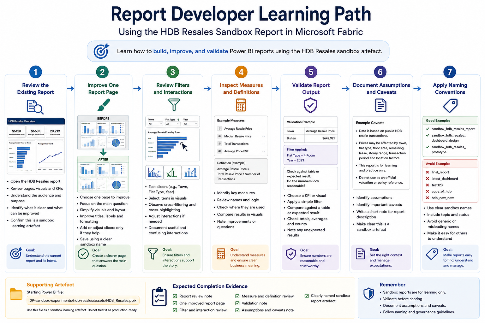

# Report Developer Pathway

This pathway is for users who need to build, improve, or maintain Power BI reports in Microsoft Fabric.

Report developers are expected to go beyond report consumption. They should understand how reports connect to semantic models, how visuals are designed, how measures are interpreted, and why reuse, validation, and naming conventions matter.

This pathway uses the **HDB Resales** sandbox report and PBIX artefact as the common learning artefact.

## Who this pathway is for

Choose this pathway if you mainly need to:

- Build Power BI reports
- Improve report layout and usability
- Work with existing semantic models
- Create or edit simple measures
- Use slicers, filters, and visual interactions intentionally
- Validate report numbers before sharing
- Apply clear naming and documentation
- Understand when Row-Level Security may be needed
- Avoid creating duplicate or conflicting report assets

## Learning objectives

By the end of this pathway, users should be able to:

- Open the assigned sandbox workspace
- Locate or upload the HDB Resales PBIX artefact where instructed
- Understand the relationship between report visuals and the underlying semantic model
- Build or improve a simple Power BI report page
- Use filters, slicers, and visual interactions intentionally
- Review basic measures and business definitions
- Apply clear naming conventions
- Validate report output against expected results
- Document assumptions, caveats, and limitations
- Understand that sandbox reports are not production-ready assets

## Prerequisites

Before starting this pathway, users should have completed:

1. [Start Here](../../00-start-here/)
2. [Security, Access and Governance](../../01-security-access-governance/)
3. [Licensing, Capacity and Compute Awareness](../../02-licensing-capacity/)
4. [Fabric Workspace Operating Model](../../03-workspace-operating-model/)
5. [Start Using Fabric](../../04-start-using-fabric/)
6. [Report Consumer Pathway](../report-consumer/)

Users should also know which sandbox workspace they have been assigned to.

## Sandbox-first activity

All hands-on activities in this pathway should be completed in the assigned sandbox workspace.

The HDB Resales report is used because it is based on a public and relatable dataset. It allows report developers to practise report design, measure interpretation, and semantic model awareness without using confidential institutional data.

Users should not upload real confidential or restricted data for this pathway.



## Supporting artefacts

This pathway mainly uses the HDB Resales Power BI file and its report pages as the learning artefact.

```text
09-sandbox-experiments/hdb-resales/assets/HDB_Resales.pbix
```

The PBIX may be used to practise:

- Reviewing report structure
- Improving report pages
- Inspecting visuals and interactions
- Reviewing measures and fields
- Understanding the relationship between report pages and the semantic model

If the PBIX is published into the sandbox workspace, users may also work with the published report and semantic model.

Report developers may modify a copy of the PBIX or sandbox report where instructed, but should not overwrite shared starter artefacts.

## Activity 1: Review the existing report

### Goal

Understand the current HDB Resales report before changing it.

### Steps

1. Open the assigned sandbox workspace.
2. Open the HDB Resales report or PBIX file as instructed.
3. Review the report pages.
4. Identify the main audience of the report.
5. Identify the key visuals and metrics.
6. Note any unclear titles, labels, filters, or definitions.
7. Identify whether the report is clearly marked as sandbox or training material.

### Expected output

Users should complete a short report review note:

```text
Report name:
Main audience:
Main purpose:
Key visuals:
Key measures:
What is clear:
What is unclear:
Potential improvement:
```

### Reflection questions

- Does the report have a clear story?
- Is the intended audience obvious?
- Are the visuals easy to interpret?
- Are there too many visuals on any page?
- Are the measures or terms clearly explained?

## Activity 2: Improve one report page

### Goal

Practise improving a report page for clarity and usability.

### Steps

1. Choose one report page from the HDB Resales report.
2. Identify the main question the page should answer.
3. Remove or reposition visuals that distract from the main question.
4. Improve titles, labels, or visual formatting.
5. Add or adjust slicers only if they support interpretation.
6. Check whether the page still answers the intended question.
7. Save the revised version using a sandbox naming convention.

### Expected output

Users should produce:

- One revised report page
- A short explanation of what changed
- A short explanation of why the change improves usability

Suggested explanation structure:

```text
Page revised:
Main question:
Changes made:
Reason for changes:
Remaining limitations:
```

### Reflection questions

- What is the most important message on the page?
- Does each visual support that message?
- Could a new user understand the page without explanation?
- Are filters and slicers helpful or distracting?

## Activity 3: Review filters and interactions

### Goal

Understand how filters, slicers, and visual interactions affect report interpretation.

### Steps

1. Select one slicer, such as town, flat type, or year.
2. Observe which visuals change.
3. Select one visual element, such as a bar or category.
4. Observe whether other visuals cross-filter or cross-highlight.
5. Check whether any interactions are confusing or unintended.
6. Adjust interactions if the exercise requires it.
7. Document one interaction that is useful and one that may confuse users.

### Expected output

Users should complete:

```text
Useful interaction:
Why it helps:

Potentially confusing interaction:
Why it may confuse users:

Recommended change:
```

### Reflection questions

- Do visual interactions support the report story?
- Could users accidentally misread a filtered view?
- Are there enough cues to show when a filter is active?

## Activity 4: Inspect measures and definitions

### Goal

Understand that report visuals depend on measures, definitions, and modelling choices.

### Steps

1. Identify at least two measures used in the report.
2. Review their names.
3. Check whether the names are business-friendly.
4. Check whether the calculation logic is clear.
5. Compare the measure output against a visual.
6. Note any measure that needs a clearer definition.

### Expected output

Users should complete:

```text
Measure reviewed:
What it appears to calculate:
Where it is used:
Is the name clear?
Is the definition clear?
Question or improvement:
```

### Reflection questions

- Would a report consumer understand this measure name?
- Could two users interpret the measure differently?
- Is the measure suitable for reuse in another report?
- Should this measure be documented in a data dictionary or glossary?

## Activity 5: Validate report output

### Goal

Practise checking that report visuals and numbers make sense before sharing.

### Steps

1. Pick one KPI or chart from the report.
2. Apply a simple filter, such as one town or one flat type.
3. Compare the output against a table or expected result, if available.
4. Check whether totals, averages, and counts behave as expected.
5. Note any unexpected result.
6. Write down what should be checked before using the report for real decisions.

### Expected output

Users should complete:

```text
KPI or visual checked:
Filter applied:
Expected result:
Observed result:
Does it look reasonable?
What needs further validation?
```

### Reflection questions

- Are the values plausible?
- Is the aggregation method correct?
- Could the result be affected by missing data, filter context, or modelling choices?
- Who should validate the number if this were a real department report?

## Activity 6: Document assumptions and caveats

### Goal

Practise documenting report limitations clearly.

### Steps

1. Review the report and identify at least two assumptions.
2. Identify at least two caveats.
3. Write a short note that could appear in a report description or documentation page.
4. Make clear that the report is for sandbox learning.

### Expected output

Example documentation note:

```text
This HDB Resales report is a sandbox learning artefact based on public resale transaction data. It is intended for onboarding and practice only.

Users should interpret resale price patterns carefully because prices may be affected by town, flat type, floor area, remaining lease, storey range, transaction period, and other location-specific factors.

The report should not be treated as an official valuation tool or used as a substitute for formal housing, finance, or policy advice.
```

### Reflection questions

- What assumptions are built into the report?
- What important context is missing?
- What should users avoid concluding from this report?
- Where should caveats be placed so users can see them?

## Activity 7: Apply naming conventions

### Goal

Practise naming reports clearly so others understand their purpose and status.

Recommended naming examples:

```text
sandbox_hdb_resales_report
sandbox_hdb_resales_dashboard_design
sandbox_hdb_resales_report_prototype
```

Avoid names such as:

```text
final_report
latest_dashboard
test123
copy_of_hdb
hdb_new_new
```

### Expected output

Users should rename or save their work using a clear sandbox naming convention.

### Reflection questions

- Can another user tell this is a sandbox artefact?
- Can another user tell what the report is about?
- Can another user tell whether this is draft, prototype, or production-facing?

## Expected completion evidence

At the end of this pathway, users should be able to provide:

- A report review note
- One revised report page
- One filter or interaction review
- One measure or definition review
- One validation note
- One assumptions and caveats note
- A clearly named sandbox report artefact

## Related sandbox experiments

Recommended sandbox activities for report developers:

| Sandbox Experiment | Purpose | Status |
|---|---|---|
| [HDB Resales: Dashboard Design and Storytelling](../../09-sandbox-experiments/hdb-resales/02-dashboard-design-and-storytelling/) | Practise improving dashboard clarity, layout, and visual storytelling using the HDB Resales report | Planned |
| [HDB Resales: Semantic Model and KPI Definitions](../../09-sandbox-experiments/hdb-resales/03-semantic-model-and-kpi-definitions/) | Practise understanding measures, definitions, and semantic model reuse | Planned |

## Minimum checklist

Before completing this pathway, users should confirm:

- [ ] I can access the assigned sandbox workspace
- [ ] I can open the HDB Resales report or PBIX artefact
- [ ] I can explain the purpose of the report
- [ ] I can improve one report page for clarity
- [ ] I can review filters, slicers, and interactions
- [ ] I can inspect basic measures and definitions
- [ ] I can validate at least one KPI or visual
- [ ] I can document assumptions and caveats
- [ ] I can name my sandbox artefact clearly
- [ ] I understand that sandbox reports are not production assets

## References and further learning

| Resource | Purpose |
|---|---|
| [Prepare and visualize data with Microsoft Power BI](https://learn.microsoft.com/en-us/training/paths/prepare-visualize-data-power-bi/) | Microsoft Learn pathway for connecting to data and creating interactive Power BI visuals |
| [Design effective reports in Power BI](https://learn.microsoft.com/en-us/training/paths/power-bi-effective/) | Microsoft Learn pathway on report design, storytelling, and user-focused visualisation |
| [Build Power BI reports with Direct Lake tables](https://learn.microsoft.com/en-us/fabric/fundamentals/building-reports) | Explains report creation paths in the Power BI service and Fabric portal using semantic models |
| [Power BI semantic models in Microsoft Fabric](https://learn.microsoft.com/en-us/fabric/data-warehouse/semantic-models) | Explains semantic models as a business-friendly analytical layer with metrics and relationships |
| [Direct Lake overview](https://learn.microsoft.com/en-us/fabric/fundamentals/direct-lake-overview) | Explains Direct Lake as a semantic model storage mode option available in Microsoft Fabric |
| [Power BI service basic concepts](https://learn.microsoft.com/en-us/power-bi/fundamentals/service-basic-concepts) | Explains basic Power BI concepts such as workspaces, reports, dashboards, and semantic models |

## Next pathway

Proceed to:

[Data Analyst Pathway](../data-analyst/)
