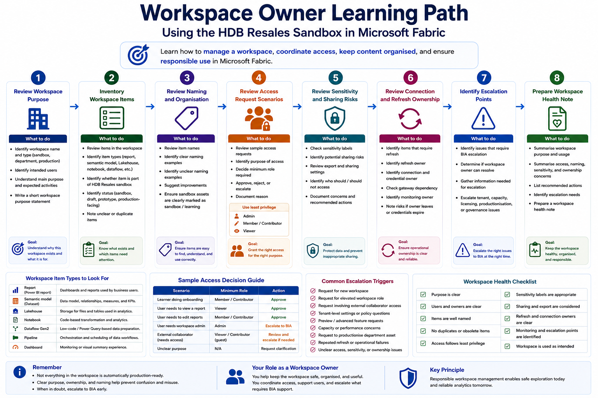

# Workspace Owner Pathway

This pathway is for users who are responsible for helping manage a Fabric workspace, coordinate access, keep content organised, and ensure responsible use.

Workspace owners do not need to be experts in every Fabric workload, but they should understand workspace purpose, role assignment, naming, item ownership, sensitivity expectations, refresh ownership, and when issues should be escalated to BIA.

This pathway uses a **sample workspace inventory** and **workspace health checklist** as the main working artefacts. The HDB Resales sandbox artefacts are used only as sample items to review.

## Who this pathway is for

Choose this pathway if you mainly need to:

- Help manage a sandbox or department workspace
- Coordinate workspace access requests
- Understand workspace roles and responsibilities
- Keep workspace content organised
- Review whether assets are clearly named and owned
- Understand sensitivity label expectations
- Track who owns reports, semantic models, connections, and refreshes
- Identify obsolete, duplicate, or unmanaged items
- Escalate tenant settings, capacity, licensing, or productionisation requests to BIA

## Learning objectives

By the end of this pathway, users should be able to:

- Explain the purpose of a workspace
- Distinguish between sandbox, department, and BIA production workspaces
- Review the types of items inside a workspace
- Identify item owners and unclear ownership
- Review access requests using least privilege and purpose-based access
- Identify whether sensitivity labels are applied appropriately
- Identify whether refresh, connection, and monitoring ownership is clear
- Recognise when an issue should be escalated to BIA
- Support responsible workspace use without treating all assets as production-ready

## Prerequisites

Before starting this pathway, users should have completed:

1. [Start Here](../../00-start-here/)
2. [Security, Access and Governance](../../01-security-access-governance/)
3. [Licensing, Capacity and Compute Awareness](../../02-licensing-capacity/)
4. [Fabric Workspace Operating Model](../../03-workspace-operating-model/)
5. [Start Using Fabric](../../04-start-using-fabric/)
6. [Department Representative Pathway](../department-representative/), recommended

Users should also know which sandbox workspace they have been assigned to.

## Sandbox-first activity

All hands-on activities in this pathway should be completed in the assigned sandbox workspace.

The HDB Resales sandbox artefacts are used because they provide safe sample items for reviewing workspace content, naming, ownership, and responsible use without involving confidential institutional data.

Users should not upload real department data for this pathway unless explicitly instructed and approved.



## Supporting artefacts

This pathway mainly uses a workspace inventory template and workspace health checklist.

```text
09-sandbox-experiments/hdb-resales/templates/workspace-inventory-template.md
09-sandbox-experiments/hdb-resales/templates/workspace-health-note.md
11-templates-checklists/workspace-health-checklist.md
```

The HDB Resales sandbox items may be used as sample items to review, such as:

```text
09-sandbox-experiments/hdb-resales/assets/HDB_Resales.pbix
09-sandbox-experiments/hdb-resales/data/
09-sandbox-experiments/hdb-resales/notebooks/
09-sandbox-experiments/hdb-resales/templates/
```

The main focus of this pathway is workspace ownership, not report development or data modelling.

## Activity 1: Review workspace purpose

### Goal

Understand why the workspace exists and what kind of work should happen there.

### Steps

1. Open the assigned sandbox workspace.
2. Identify the workspace name.
3. Identify whether it is sandbox, department, or production.
4. Identify the intended users.
5. Identify the expected type of activity.
6. Write a short workspace purpose statement.

### Expected output

Users should complete:

```text
Workspace name:
Workspace type:
Intended users:
Main purpose:
Activities allowed:
Activities not allowed:
```

### Reflection questions

- Is the workspace purpose clear?
- Would a new user know what the workspace is for?
- Are there activities that should not happen in this workspace?
- Is the workspace being used consistently with its purpose?

## Activity 2: Inventory workspace items

### Goal

Practise reviewing what exists inside a workspace.

### Steps

1. Review the list of items in the workspace.
2. Identify each item type, such as report, semantic model, Lakehouse, notebook, dataflow, pipeline, or dashboard.
3. Identify whether the item is part of the HDB Resales sandbox series.
4. Identify whether the item appears experimental, draft, or production-facing.
5. Note unclear or duplicate items.

### Expected output

Users should complete:

```text
Item name:
Item type:
Likely purpose:
Owner, if known:
Status: sandbox / draft / prototype / production-facing
Action needed:
```

### Reflection questions

- Are item names clear?
- Are there duplicate or obsolete items?
- Can users tell which items are safe to use?
- Is it clear which items belong to the onboarding exercise?

## Activity 3: Review naming and organisation

### Goal

Understand how naming supports workspace usability and governance.

### Steps

1. Review item names in the sandbox workspace.
2. Identify examples of clear naming.
3. Identify examples of unclear naming.
4. Suggest improvements.
5. Check whether sandbox artefacts are clearly marked as sandbox or learning assets.

### Recommended naming examples

```text
sandbox_hdb_resales_report
sandbox_hdb_resales_semantic_model
sandbox_hdb_resales_lakehouse
sandbox_hdb_resales_pipeline
```

Avoid names such as:

```text
final_report
latest_version
test123
copy_of_report
new_dashboard
```

### Expected output

Users should complete:

```text
Clear naming examples:
Unclear naming examples:
Suggested renamed item:
Reason for suggestion:
```

### Reflection questions

- Can users understand item purpose from the name?
- Can users identify whether an item is sandbox or production-facing?
- Could unclear naming lead to incorrect use or duplication?

## Activity 4: Review access request scenarios

### Goal

Practise applying least privilege and purpose-based access.

### Steps

1. Review a sample access request.
2. Identify the requester.
3. Identify the reason for access.
4. Decide the minimum role required.
5. Decide whether the request should be approved, rejected, or escalated.
6. Document the reason.

### Example access scenarios

| Scenario | Possible Decision |
|---|---|
| A learner needs to complete onboarding exercises | Grant sandbox access with appropriate role |
| A department user only needs to view a report | Viewer access may be sufficient |
| A user wants to edit a production report | Escalate to BIA |
| An external collaborator needs to edit a report | Review guest account, licensing, sensitivity, and time-bound access |
| A user requests access but gives no purpose | Ask for clarification before granting access |

### Expected output

Users should complete:

```text
Requester:
Purpose:
Workspace:
Requested role:
Recommended role:
Decision:
Reason:
Escalation needed:
```

### Reflection questions

- Is the request purpose clear?
- What is the minimum access needed?
- Does the request involve confidential or restricted data?
- Should access be time-bound?
- Should BIA review the request?

## Activity 5: Review sensitivity and sharing risks

### Goal

Practise identifying when content may require stronger handling.

### Steps

1. Review the workspace items.
2. Check whether sensitivity labels are applied where relevant.
3. Identify whether content includes or could include sensitive data.
4. Identify whether users may export or share outputs.
5. Identify whether sharing should be restricted.
6. Document any concerns.

### Expected output

Users should complete:

```text
Item reviewed:
Sensitivity label:
Potential sharing risk:
Export concern:
Recommended action:
```

### Reflection questions

- Is the sensitivity label appropriate?
- Could the item be shared beyond the intended audience?
- Could a screenshot expose information without context?
- Should export be restricted or discouraged?

## Activity 6: Review connection and refresh ownership

### Goal

Understand that workspace ownership includes operational accountability.

### Steps

1. Identify reports, semantic models, pipelines, dataflows, or Lakehouses that may depend on refresh.
2. Identify whether the refresh owner is clear.
3. Identify whether the connection or credential owner is clear.
4. Identify whether any item depends on a gateway.
5. Identify what could happen if the owner leaves or credentials expire.
6. Note any unclear ownership.

### Expected output

Users should complete:

```text
Item:
Refresh required: Yes / No
Connection owner:
Credential owner:
Gateway required:
Monitoring owner:
Concern:
Recommended action:
```

### Reflection questions

- Who will know if the refresh fails?
- Who can fix the connection?
- Is the credential tied to an individual?
- What happens if the original creator leaves?
- Should ownership be transferred or documented?

## Activity 7: Identify escalation points

### Goal

Know when a workspace issue should be escalated to BIA.

Issues that may require escalation include:

- Request for new workspace
- Request for elevated workspace role
- Request involving external collaborator access
- Request involving tenant-level settings
- Request involving preview or advanced features
- Request involving capacity-heavy workloads
- Request involving BIA production workspace
- Request to productionise a department asset
- Unclear access, sensitivity, or refresh ownership
- Repeated refresh or operational failures

### Expected output

Users should complete:

```text
Issue:
Can workspace owner resolve it?
Should BIA be involved?
Reason:
Information needed before escalation:
```

### Reflection questions

- Is this a local workspace issue or platform-level issue?
- Does it affect security, capacity, licensing, or production?
- Is enough information available for BIA to review the request?

## Activity 8: Prepare a workspace health note

### Goal

Summarise the state of a workspace in a simple review note.

### Steps

1. Use the outputs from earlier activities.
2. Summarise workspace purpose.
3. Summarise access and ownership concerns.
4. Summarise naming and organisation concerns.
5. Summarise refresh and operational concerns.
6. Identify recommended actions.

### Expected output

Users should complete:

```text
Workspace name:
Workspace type:
Purpose:
Main users:
Items reviewed:
Access concerns:
Naming or organisation concerns:
Sensitivity or sharing concerns:
Refresh or ownership concerns:
Recommended actions:
Escalation needed:
```

### Reflection questions

- Is the workspace healthy enough for its purpose?
- What should be cleaned up?
- What should be documented?
- What requires BIA review?

## Expected completion evidence

At the end of this pathway, users should be able to provide:

- A workspace purpose statement
- An item inventory note
- A naming and organisation review
- An access request decision note
- A sensitivity and sharing review
- A connection and refresh ownership review
- An escalation decision note
- A workspace health note

## Related sandbox experiments

Recommended sandbox activities for workspace owners:

| Sandbox Experiment | Purpose | Status |
|---|---|---|
| [HDB Resales: Report Consumer Walkthrough](../../09-sandbox-experiments/hdb-resales/01-report-consumer-walkthrough/) | Understand how sandbox reports are consumed and interpreted |
| [HDB Resales: Semantic Model and KPI Definitions](../../09-sandbox-experiments/hdb-resales/03-semantic-model-and-kpi-definitions/) | Understand why semantic model ownership and measure definitions matter |
| [HDB Resales: Lakehouse Ingestion and Cleaning](../../09-sandbox-experiments/hdb-resales/04-lakehouse-ingestion-and-cleaning/) | Understand why source, table, and transformation ownership matter |

## Minimum checklist

Before completing this pathway, users should confirm:

- [ ] I understand the purpose of the workspace
- [ ] I can identify whether a workspace is sandbox, department, or BIA production
- [ ] I can review item types in a workspace
- [ ] I can identify unclear naming or duplication
- [ ] I can apply least privilege thinking to access requests
- [ ] I can identify sensitivity and sharing risks
- [ ] I can identify connection and refresh ownership concerns
- [ ] I know when to escalate requests to BIA
- [ ] I can prepare a simple workspace health note

## References and further learning

| Resource | Purpose |
|---|---|
| [Workspaces in Microsoft Fabric and Power BI](https://learn.microsoft.com/en-us/fabric/fundamentals/workspaces) | Explains how workspaces are used to collaborate and manage Fabric items |
| [Roles in workspaces in Microsoft Fabric](https://learn.microsoft.com/en-us/fabric/fundamentals/roles-workspaces) | Explains workspace roles such as Admin, Member, Contributor, and Viewer |
| [Give users access to workspaces](https://learn.microsoft.com/en-us/fabric/fundamentals/give-access-workspaces) | Explains how users can be granted workspace roles |
| [Workspace admin settings](https://learn.microsoft.com/en-us/fabric/admin/portal-workspace) | Explains admin-controlled workspace settings such as workspace creation and cross-workspace semantic model use |
| [Manage workspaces](https://learn.microsoft.com/en-us/fabric/admin/portal-workspaces) | Provides admin guidance for managing workspaces and assigning workspaces to capacities |
| [Microsoft Fabric adoption roadmap: System oversight](https://learn.microsoft.com/en-us/power-bi/guidance/fabric-adoption-roadmap-system-oversight) | Provides guidance on governance, tenant administration, monitoring, and oversight |

## Next pathway

Proceed to:

[Fabric Enthusiast Pathway](../fabric-enthusiast/)
