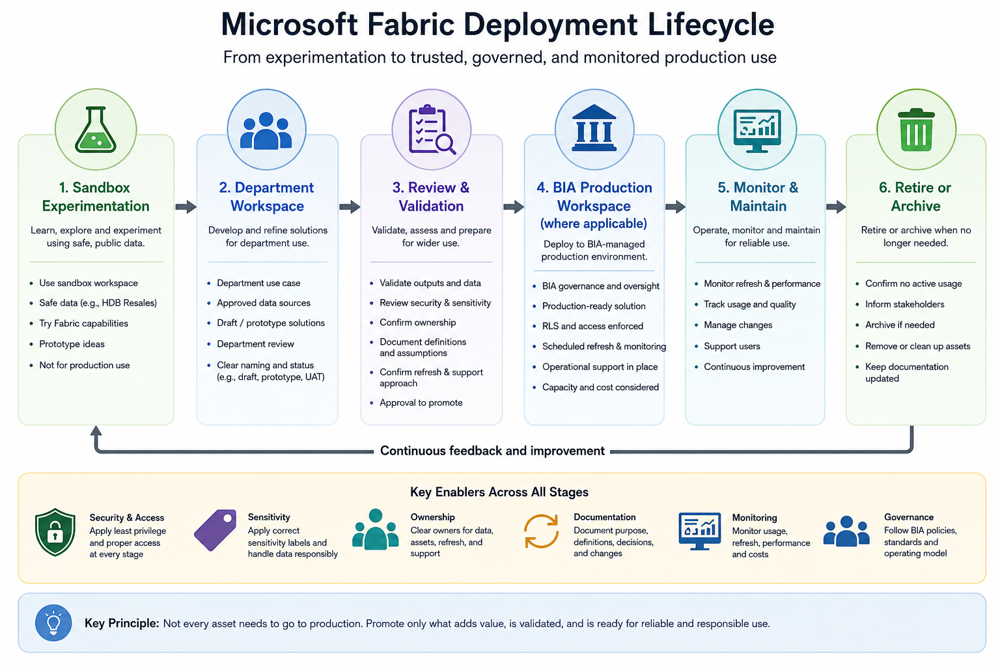

# Deployment Lifecycle Management

This section explains how Fabric assets should move from learning and experimentation towards reviewed, reliable, and production-facing use.

Deployment lifecycle management is important because creating a report, semantic model, Lakehouse, pipeline, or notebook is only one part of the work. Users also need to understand how assets are reviewed, validated, promoted, maintained, and retired.

In the current operating model, onboarding activities begin in the assigned Fabric Sandbox Workspace. Department workspaces support approved department-level exploration and development. BIA Production Workspaces are reserved for BIA-managed production assets, with direct workspace access restricted to BIA users.

## Why lifecycle management matters

A Fabric asset may work once in sandbox, but that does not mean it is ready for wider use.

Before an asset becomes department-facing or production-facing, users should consider:

* Has the purpose been clearly defined?
* Has the data been approved for use?
* Has the output been validated?
* Is the owner known?
* Is there a deputy owner for department workspace work?
* Is refresh or update responsibility clear?
* Are access and sensitivity expectations understood?
* Are measures and definitions documented?
* Is Row-Level Security required?
* Is BIA review required?
* Does the asset need to be monitored or supported?



## Current deployment model

The current deployment model is intentionally simple.

```text
Personal exploration
   ↓
Sandbox Workspace
   ↓
Department Workspace, where there is an approved department use case
   ↓
Review and validation
   ↓
BIA Production Workspace, only where applicable
```

Not every personal draft becomes a sandbox asset.

Not every sandbox asset becomes a department asset.

Not every department workspace asset needs to become a BIA production asset.

Some assets may remain as department-level working assets. Productionisation is only relevant when the asset is intended for formal reporting, wider organisational use, monitored operation, or BIA-managed production deployment.

BIA Production Workspace membership is restricted to BIA users. Non-BIA users should consume approved production outputs through approved report or app sharing channels, not direct workspace membership.

## Personal exploration to sandbox

A personal workspace may be used for private drafts or individual exploration using safe data.

However, personal workspace content should not be treated as team-owned, department-owned, or production-facing.

If an idea becomes useful beyond private exploration, it should be reviewed before being recreated, copied, or transitioned into the assigned sandbox or department workspace.

Before moving beyond personal exploration, confirm:

* The idea has a clear learning or business purpose
* The data is public, mocked, synthetic, or approved non-sensitive data
* The work is not being treated as official
* The next workspace is appropriate
* The workspace owner or BIA contact is consulted where needed

## Sandbox to department workspace

Sandbox is used for learning, experimentation, and practice.

An asset may move from sandbox thinking into a department workspace only when there is a clearer department use case.

Before moving beyond sandbox, confirm:

* There is a real department use case
* The department workspace owner is known
* The deputy workspace owner is known
* The data source is approved
* The data sensitivity is understood
* The intended users are known
* The expected output is clear
* The asset is still exploratory or departmental, not production-facing
* BIA has been consulted where needed

Sandbox artefacts should not simply be copied into department workspaces without review.

## Department workspace development

Department workspaces support department-level exploration and development.

They may contain:

* Draft reports
* Prototype dashboards
* Department-level semantic models
* Local analysis outputs
* Early-stage Lakehouses or data preparation workflows
* Department-specific use case artefacts

Department workspace assets should be clearly labelled and named so users understand whether they are draft, prototype, UAT, or department working assets.

Department workspace requests should identify both a workspace owner and deputy workspace owner.

Recommended status indicators include:

```text
sandbox
draft
prototype
uat
department
```

Avoid using `prod` unless the asset has gone through an appropriate productionisation process.

## Review and validation

Before wider sharing, a Fabric asset should be reviewed.

The review should consider:

| Review Area | Questions to Ask                                               |
| ----------- | -------------------------------------------------------------- |
| Purpose     | What question does the asset answer?                           |
| Audience    | Who is allowed to use it?                                      |
| Data        | Is the source approved and understood?                         |
| Sensitivity | Is the correct sensitivity label applied?                      |
| Definitions | Are measures and KPIs clearly defined?                         |
| Accuracy    | Have outputs been validated against source or expected values? |
| Access      | Are workspace permissions and sharing settings appropriate?    |
| RLS         | Is Row-Level Security required and tested?                     |
| Refresh     | Is refresh required and owned?                                 |
| Support     | Who fixes issues after release?                                |
| Continuity  | Is there a deputy owner or backup support arrangement?         |

Validation should involve the relevant business owner, data owner, or subject matter expert where appropriate.

## Moving towards BIA production

BIA Production Workspaces are reserved for BIA-managed production analytics assets and are restricted to BIA users.

An asset may be considered for BIA production when:

* It supports formal or wider organisational use
* It requires stronger governance and monitoring
* It depends on BIA-managed data or semantic models
* It requires controlled access or Row-Level Security
* It needs scheduled refresh and operational support
* It is expected to be used beyond a small department working group

Before an asset can be moved or rebuilt into BIA production, BIA should review:

* Use case purpose
* Data sources
* Ownership
* Sensitivity labels
* Access requirements
* Semantic model design
* Refresh and connection ownership
* Validation evidence
* Support expectations
* Capacity implications
* How non-BIA users will consume approved outputs

Non-BIA users should not be granted direct BIA Production Workspace membership.

Where approved BIA production reports or outputs need to be shared with non-BIA users, sharing should happen through approved report or app sharing channels.

## Productionisation criteria

A Fabric asset should not be treated as production-ready unless the following are clear:

* [ ] Business purpose is documented
* [ ] Business owner is identified
* [ ] Data owner or subject matter expert is identified
* [ ] Workspace owner is identified
* [ ] Deputy workspace owner is identified, where applicable
* [ ] Data source is approved
* [ ] Sensitivity label is applied where needed
* [ ] Access model is agreed
* [ ] RLS is designed and tested, if required
* [ ] Measures and definitions are documented
* [ ] Output has been validated
* [ ] Refresh approach is confirmed
* [ ] Connection and credential ownership is clear
* [ ] Monitoring and support responsibilities are assigned
* [ ] BIA review is completed, where applicable
* [ ] If moving into BIA production, direct workspace access remains restricted to BIA users
* [ ] Non-BIA users consume approved production outputs through approved report or app sharing channels

## Deployment pipelines and Git integration

Microsoft Fabric supports more formal lifecycle management patterns, including deployment pipelines and Git integration.

These tools can support:

* Development, test, and production stages
* Version control
* Collaboration between developers
* More reliable promotion of content
* Comparison of content across stages
* Controlled deployment of selected items

However, not every sandbox or department workspace needs full CI/CD.

In the current onboarding context, deployment pipelines and Git integration should be understood as maturity options. They are more relevant when assets become more complex, shared, production-facing, or maintained by multiple developers.

Where deployment pipelines or Git integration are needed, BIA should be involved in the review because these features may require additional permissions, workspace planning, repository access, and lifecycle governance.

## Git integration considerations

Git integration can help developers track and manage changes to Fabric items.

However, users should understand that:

* Git integration is not just a technical switch
* Repository ownership must be clear
* Workspace permissions and repository permissions are both important
* Collaboration practices must be agreed
* Branching and deployment rules should be defined
* Not all users need Git access
* Not all Fabric items may be equally suitable for Git-based workflows

Git integration should be introduced carefully and only where the team has the capability to maintain it.

## Deployment pipeline considerations

Deployment pipelines can help move content through stages such as development, test, and production.

Before using deployment pipelines, confirm:

* What workspaces represent development, test, and production?
* Who can deploy content?
* What should be deployed?
* What should not be deployed?
* What validation must happen before deployment?
* Are deployment rules required?
* Are connections, parameters, or workspace-specific settings different across stages?
* Who approves promotion to production?
* If the target is BIA production, will direct workspace access remain restricted to BIA users?

Deployment pipelines should support governance. They should not be used to bypass review.

## Release notes and change history

When an asset is shared more widely or moved towards production, changes should be documented.

A simple release note should include:

```text
Asset name:
Version or release date:
Owner:
Deputy owner, where applicable:
What changed:
Why it changed:
Data source affected:
Users affected:
Validation completed:
Known issues:
Support contact:
```

Release notes help users understand what changed and provide a record for troubleshooting.

## Retirement and clean-up

Lifecycle management also includes knowing when to retire or clean up assets.

Assets may need to be retired when:

* They are no longer used
* They are outdated
* They duplicate another asset
* The owner has left
* The data source is no longer valid
* The report has been replaced
* The workspace is cluttered with obsolete experiments

Before retiring an asset, confirm:

* Whether anyone still uses it
* Whether it is linked to another report, semantic model, or pipeline
* Whether users need to be informed
* Whether documentation should be updated
* Whether the asset should be archived before deletion
* Whether ownership records need to be updated

## Minimum checklist

Before moving an asset beyond sandbox, users should confirm:

* [ ] The use case is clear
* [ ] The intended audience is known
* [ ] The data source is approved
* [ ] Sensitivity and access expectations are understood
* [ ] The output has been reviewed
* [ ] The workspace owner is known
* [ ] The deputy workspace owner is known, where applicable
* [ ] Refresh or update needs are understood
* [ ] Sharing expectations are clear
* [ ] BIA review is requested if productionisation may be required

Before moving towards BIA production, users should confirm:

* [ ] Business owner is identified
* [ ] Data owner or subject matter expert is identified
* [ ] Validation evidence is available
* [ ] Measures and definitions are documented
* [ ] RLS is tested, if required
* [ ] Connection and refresh ownership is clear
* [ ] Monitoring and support responsibilities are assigned
* [ ] Production release has been agreed with BIA
* [ ] Direct BIA Production Workspace access remains restricted to BIA users
* [ ] Non-BIA users will consume approved outputs through approved report or app sharing channels

## References and further learning

| Resource                                                                                                                                    | Purpose                                                                                                       |
| ------------------------------------------------------------------------------------------------------------------------------------------- | ------------------------------------------------------------------------------------------------------------- |
| [Fabric application lifecycle management documentation](https://learn.microsoft.com/en-us/fabric/cicd/)                                     | Microsoft documentation hub for Fabric lifecycle management, CI/CD, Git integration, and deployment pipelines |
| [Introduction to CI/CD in Microsoft Fabric](https://learn.microsoft.com/en-us/fabric/cicd/cicd-overview)                                    | Explains how Git integration and deployment pipelines support Fabric development and release workflows        |
| [Tutorial: Application lifecycle management in Fabric](https://learn.microsoft.com/en-us/fabric/cicd/cicd-tutorial)                         | End-to-end tutorial on using Git integration and deployment pipelines together                                |
| [Best practices for lifecycle management in Fabric](https://learn.microsoft.com/en-us/fabric/cicd/best-practices-cicd)                      | Provides guidance on permissions, workspace planning, Git integration, and deployment pipeline practices      |
| [Overview of Fabric deployment pipelines](https://learn.microsoft.com/en-us/fabric/cicd/deployment-pipelines/intro-to-deployment-pipelines) | Explains deployment pipelines and how content can move across lifecycle stages                                |
| [Overview of Fabric Git integration](https://learn.microsoft.com/en-us/fabric/cicd/git-integration/intro-to-git-integration)                | Explains how Fabric workspaces can integrate with Git repositories for source control                         |

## Next section

Proceed to:

[Connections, Refresh and Monitoring](../07-connections-refresh-monitoring/)
