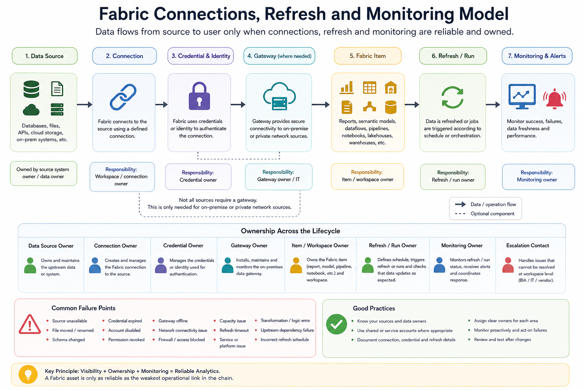

# Connections, Refresh and Monitoring

This section explains how Fabric assets stay connected, refreshed, monitored, and reliable after they are created.

Getting something to work once is not the same as operating it reliably. A report, semantic model, Lakehouse, pipeline, notebook, or dataflow may depend on data sources, credentials, gateways, refresh schedules, ownership, and monitoring. If these are not planned, assets can become stale, broken, or difficult to support.

## Why this matters

Many analytics issues are not caused by dashboard design. They are caused by unclear operational ownership.

Common problems include:

* A report stops refreshing
* A data source changes format
* A credential expires
* The original creator leaves
* A gateway is unavailable
* A pipeline fails silently
* A semantic model refresh takes too long
* Users continue using stale data
* No one knows who owns the connection
* No one knows who should fix the failure

This section helps users understand the operational side of Fabric usage.



## Core principle

A Fabric asset should have clear ownership across its lifecycle.

This includes ownership for:

| Area             | Question                                                          |
| ---------------- | ----------------------------------------------------------------- |
| Data source      | Where does the data come from?                                    |
| Connection       | How does Fabric connect to the data?                              |
| Credential       | Whose account or identity is used?                                |
| Gateway          | Is a gateway required to reach the source?                        |
| Refresh          | How often should the data update?                                 |
| Monitoring       | Who checks whether refresh succeeded?                             |
| Failure handling | Who fixes issues when refresh fails?                              |
| Escalation       | When should BIA, IT, vendor, or department owner be involved?     |
| Continuity       | Who can take over if the original owner leaves or is unavailable? |

## Connections

Connections define how Fabric reaches a data source.

A connection may point to:

* A file location
* A database
* A cloud storage location
* An API
* A Lakehouse
* A Warehouse
* A semantic model
* An on-premises or private network source

Before creating or using a connection, users should ask:

```text
What is the data source?
Who owns the source?
Is the source approved for use?
Is the data public, unrestricted, restricted, or confidential?
Is the connection personal, shared, or workspace-based?
Who will maintain the connection?
What happens if the source changes?
```

Users should not casually create connections to sensitive or operational systems without understanding ownership and approval.

## Credentials

Credentials determine how Fabric authenticates to a source.

Credential ownership matters because refresh may fail when:

* A password changes
* An account is disabled
* A user leaves the organisation
* Permissions are removed
* Multi-factor authentication or conditional access affects the connection
* A source system changes authentication requirements

For sandbox exercises, users should avoid setting up long-term operational dependencies using personal credentials.

For department or production-facing work, credential ownership should be reviewed carefully.

## Gateway

A gateway may be required when Fabric needs to connect to on-premises or private network data sources.

Users should not assume that every source can be connected directly from Fabric.

A gateway may be relevant when:

* The data source is on-premises
* The data source is behind a private network
* The source cannot be reached directly from the cloud
* IT-managed connectivity is required
* Refresh depends on an installed gateway service

Gateway-related issues may require coordination with BIA, IT, the source system owner, or vendor support.

## Refresh

Refresh determines how data is updated.

Different Fabric items may have different refresh or run behaviours, such as:

| Item Type       | Refresh or Run Consideration                                                      |
| --------------- | --------------------------------------------------------------------------------- |
| Power BI report | Depends on semantic model refresh or Direct Lake / live connection behaviour      |
| Semantic model  | May require scheduled refresh, on-demand refresh, or Direct Lake behaviour        |
| Dataflow Gen2   | May need scheduled refresh or pipeline orchestration                              |
| Pipeline        | May run manually, on schedule, or as part of an orchestration flow                |
| Notebook        | May run manually or be scheduled through orchestration                            |
| Lakehouse table | May be updated through ingestion, transformation, pipeline, notebook, or shortcut |
| Warehouse       | May be updated through SQL, pipeline, or upstream processes                       |

Users should understand whether the item is refreshed manually, automatically, or through another process.

## Refresh frequency

Not every asset needs frequent refresh.

Before setting refresh frequency, users should ask:

```text
How often does the source data change?
How often do users need updated data?
Is near-real-time data actually required?
What is the capacity impact?
Who will monitor failures?
What happens if refresh fails?
```

Excessive refresh schedules can consume shared capacity unnecessarily.

Examples:

| Refresh Need           | Possible Interpretation                         |
| ---------------------- | ----------------------------------------------- |
| Learning exercise      | Usually no scheduled refresh needed             |
| Static public dataset  | Occasional refresh may be enough                |
| Monthly reporting      | Monthly or controlled refresh may be suitable   |
| Operational monitoring | More frequent refresh may be justified          |
| Production dashboard   | Refresh should be planned, monitored, and owned |

## Monitoring

Monitoring ensures that refreshes, pipelines, notebooks, and other jobs are working as expected.

Monitoring may include checking:

* Refresh history
* Pipeline run history
* Notebook run status
* Dataflow refresh status
* Semantic model refresh status
* Error messages
* Duration trends
* Failed runs
* Data freshness indicators
* User-reported issues

For production-facing assets, monitoring should not depend only on users noticing that numbers look outdated.

## Failure handling

When something fails, users should avoid random fixes without understanding the cause.

Common failure areas include:

| Failure Area     | Example                                                |
| ---------------- | ------------------------------------------------------ |
| Source issue     | Source file moved, renamed, deleted, or changed format |
| Credential issue | Password expired or account no longer has access       |
| Gateway issue    | Gateway offline or unavailable                         |
| Schema issue     | Column renamed, removed, or changed type               |
| Capacity issue   | Workload too heavy or competing with other workloads   |
| Permission issue | User or service account lacks required access          |
| Logic issue      | Transformation or calculation breaks                   |
| Dependency issue | Upstream table, file, or semantic model changed        |

A failure should be documented with enough detail for the right person to investigate.

## Suggested failure note

When reporting a refresh or connection issue, include:

```text
Asset name:
Workspace:
Item type:
Owner:
Deputy owner, where applicable:
Data source:
Refresh or run type:
Last successful refresh:
Failure date and time:
Error message:
Recent changes:
Business impact:
Who has already checked:
Escalation needed:
```

## Ownership and handover

Every recurring or production-facing asset should have an ownership plan.

Ownership should include:

* Business owner
* Technical owner
* Data source owner
* Connection or credential owner
* Refresh or monitoring owner
* Support or escalation contact
* Deputy owner or backup support arrangement, where applicable

For department workspace assets, both the workspace owner and deputy workspace owner should be known.

If the original creator leaves or changes role, ownership should be transferred.

Unowned assets create risk because they may continue to be used even when no one is maintaining them.

## Sandbox expectations

For sandbox work:

* Use safe data
* Avoid unnecessary scheduled refresh
* Avoid connecting to restricted or confidential systems
* Avoid using personal credentials for long-term workflows
* Document what the experiment depends on
* Treat failures as learning opportunities
* Do not escalate every sandbox failure as a production issue

Sandbox refresh and monitoring should be lightweight unless the exercise is specifically about operations.

## Department workspace expectations

For department workspace work:

* Identify the workspace owner
* Identify the deputy workspace owner
* Confirm the data source is approved
* Confirm whether refresh is needed
* Confirm who maintains the connection
* Confirm who monitors failures
* Confirm whether BIA or IT support is needed
* Document refresh assumptions
* Update ownership records when the owner or deputy owner changes

Department assets should not become unmanaged operational dependencies.

## BIA production expectations

For BIA production assets:

* Refresh should be planned and owned
* Connections and credentials should be reviewed
* Monitoring should be active
* Failure escalation should be clear
* Changes should follow lifecycle practices
* Users should know the support contact
* Staleness or failure should be visible where appropriate
* Direct BIA Production Workspace access should remain restricted to BIA users

Production assets require stronger reliability and support expectations.

Non-BIA users should consume approved production outputs through approved report or app sharing channels, not direct BIA Production Workspace membership.

## Minimum checklist

Before setting up or relying on refresh, users should confirm:

* [ ] I know the data source
* [ ] I know who owns the data source
* [ ] I know whether the source is approved for use
* [ ] I know what connection is being used
* [ ] I know what credential or identity is being used
* [ ] I know whether a gateway is required
* [ ] I know whether refresh is manual or scheduled
* [ ] I know the required refresh frequency
* [ ] I know who monitors refresh failures
* [ ] I know who fixes connection or refresh issues
* [ ] I know whether there is a deputy owner or backup support arrangement, where applicable
* [ ] I know when to escalate to BIA, IT, vendor, or department owner

## References and further learning

| Resource                                                                                                                                     | Purpose                                                                                               |
| -------------------------------------------------------------------------------------------------------------------------------------------- | ----------------------------------------------------------------------------------------------------- |
| [Data Factory in Microsoft Fabric](https://learn.microsoft.com/en-us/fabric/data-factory/)                                                   | Official documentation for Fabric Data Factory, including pipelines, Dataflow Gen2, and data movement |
| [Data pipelines in Microsoft Fabric](https://learn.microsoft.com/en-us/fabric/data-factory/pipeline-overview)                                | Explains Fabric data pipelines and orchestration concepts                                             |
| [Dataflow Gen2 in Microsoft Fabric](https://learn.microsoft.com/en-us/fabric/data-factory/dataflows-gen2-overview)                           | Explains low-code data preparation and transformation using Dataflow Gen2                             |
| [Semantic model refresh activity](https://learn.microsoft.com/en-us/fabric/data-factory/semantic-model-refresh-activity)                     | Explains how Fabric pipelines can refresh Power BI semantic models                                    |
| [On-premises data gateway documentation](https://learn.microsoft.com/en-us/data-integration/gateway/service-gateway-onprem)                  | Explains how the on-premises data gateway supports access to on-premises data sources                 |
| [Troubleshoot Power BI refresh scenarios](https://learn.microsoft.com/en-us/power-bi/connect-data/refresh-troubleshooting-refresh-scenarios) | Useful for understanding common refresh failures and troubleshooting patterns                         |

## Next section

Proceed to:

[Data and Semantic Modelling](../08-data-and-semantic-modelling/)
