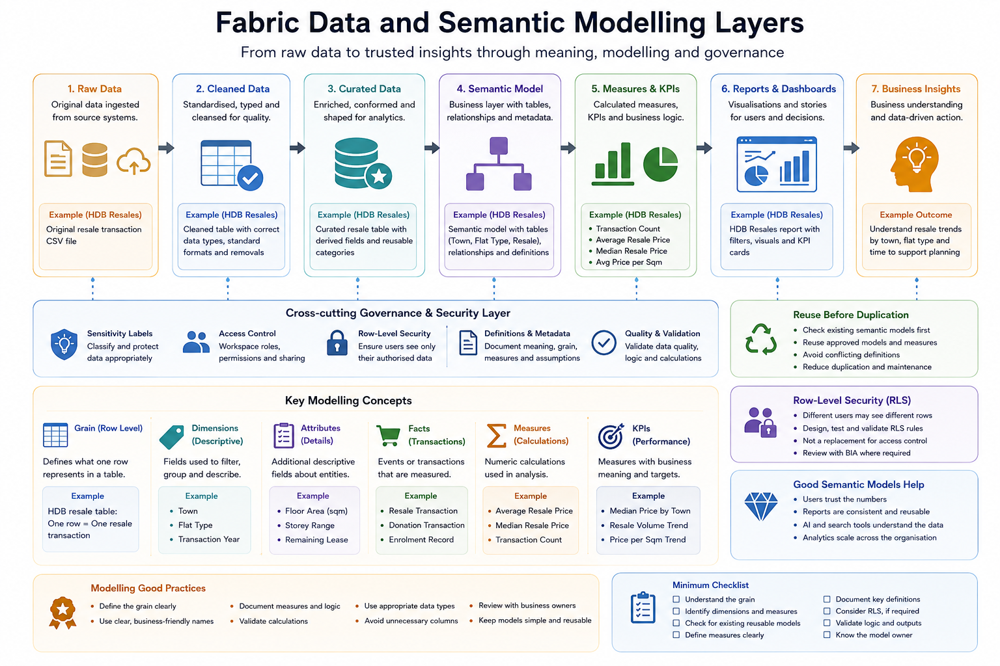

# Data and Semantic Modelling

This section explains how data should be shaped, described, modelled, and reused in Microsoft Fabric.

Data and semantic modelling are important because analytics assets are only as useful as the meaning behind the data. A dashboard may look polished, but if the underlying fields, measures, relationships, and definitions are unclear, users may interpret the output incorrectly.

This section introduces practical modelling concepts for Fabric users, especially report developers, data analysts, data engineers, and advanced users working in sandbox or department workspaces.

## Why this matters

Microsoft Fabric allows users to work with many types of data and analytics assets, including Lakehouses, Warehouses, semantic models, reports, notebooks, pipelines, and Dataflows Gen2.

However, simply loading data into Fabric does not automatically make it ready for reporting or analysis.

Users should understand:

* What each row represents
* What each field means
* Which fields are dimensions, attributes, measures, or identifiers
* Which definitions are official, draft, or experimental
* Whether measures are calculated consistently
* Whether the model is reusable
* Whether Row-Level Security is required
* Whether the asset is suitable for AI-assisted or semantic discovery later



## Core principle

Data should be made meaningful before it is widely reused.

A good semantic model should help users understand:

| Area             | Question                                      |
| ---------------- | --------------------------------------------- |
| Business meaning | What does this field, table, or measure mean? |
| Grain            | What does one row represent?                  |
| Relationship     | How do tables relate to one another?          |
| Calculation      | How is this measure calculated?               |
| Reuse            | Can this model support more than one report?  |
| Security         | Should different users see different rows?    |
| Trust            | Has the model been reviewed or validated?     |
| Ownership        | Who maintains the definition?                 |

## Workspace boundary reminder

Semantic models and curated data assets should be created and reused in the correct workspace context.

| Workspace Type           | Modelling Expectation                                                                                                                 |
| ------------------------ | ------------------------------------------------------------------------------------------------------------------------------------- |
| Personal Workspace       | Suitable only for private drafts and individual exploration using safe data                                                           |
| Sandbox Workspace        | Suitable for learning, experimentation, and guided modelling practice using public, mocked, synthetic, or approved non-sensitive data |
| Department Workspace     | Suitable for approved department-level models and working assets, with clear owner and deputy owner                                   |
| BIA Production Workspace | Suitable for BIA-managed production semantic models and curated assets, with direct workspace access restricted to BIA users          |

Sandbox models are learning artefacts.

Department models may support department work, but they are not automatically production models.

BIA Production Workspace membership is restricted to BIA users. Non-BIA users should consume approved production outputs through approved report or app sharing channels.

## From data to semantic model

A simplified flow looks like this:

```text
Raw data
   ↓
Cleaned data
   ↓
Curated data
   ↓
Semantic model
   ↓
Measures and KPIs
   ↓
Reports and dashboards
   ↓
Business interpretation
```

Each layer adds more structure, meaning, and responsibility.

## Raw, cleaned, and curated data

Users may hear terms such as Bronze, Silver, and Gold data layers.

For onboarding purposes, they can be interpreted simply:

| Layer            | Practical Meaning                                                | Example in HDB Resales Sandbox                                       |
| ---------------- | ---------------------------------------------------------------- | -------------------------------------------------------------------- |
| Raw / Bronze     | Original ingested data, preserved as close to source as possible | Original HDB resale transaction file                                 |
| Cleaned / Silver | Standardised, typed, cleaned, and lightly transformed data       | Cleaned transaction table with correct data types                    |
| Curated / Gold   | Reporting-ready or analysis-ready data                           | Curated HDB resale table with derived fields and reusable categories |

Not every sandbox exercise needs a full enterprise data architecture. However, users should understand why raw data should not be overwritten casually and why curated tables need clearer definitions.

## Grain

Grain refers to what one row in a table represents.

This is one of the most important modelling questions.

Examples:

| Dataset                      | Possible Grain                       |
| ---------------------------- | ------------------------------------ |
| HDB resale transaction table | One row per resale transaction       |
| Student enrolment table      | One row per student-course enrolment |
| Course feedback table        | One row per survey response          |
| Report usage table           | One row per report access event      |
| Donor transaction table      | One row per donation transaction     |

If the grain is unclear, measures may be misunderstood or calculated incorrectly.

Before using a table, users should ask:

```text
What does one row represent?
Can there be duplicates?
Can one person, flat, student, or course appear multiple times?
At what level should the data be aggregated?
```

## Dimensions, facts, and measures

A simple way to think about modelling is:

| Concept   | Meaning                                                                | Example                                          |
| --------- | ---------------------------------------------------------------------- | ------------------------------------------------ |
| Fact      | A transaction, event, or measurable record                             | HDB resale transaction                           |
| Dimension | A descriptive category used for filtering or grouping                  | Town, flat type, year                            |
| Attribute | A descriptive field belonging to an entity                             | Floor area, storey range, remaining lease        |
| Measure   | A calculated value used in analysis                                    | Average resale price, transaction count          |
| KPI       | A measure with business meaning, target, or performance interpretation | Median resale price by town, resale volume trend |

Users do not need to use technical terms perfectly at the start, but they should understand the difference between descriptive fields and calculated measures.

## Semantic models

A semantic model provides a business-friendly layer for reporting and analysis.

It may include:

* Tables
* Relationships
* Measures
* Hierarchies
* Formatting
* Business definitions
* Security rules
* Reusable fields
* Certified or endorsed status, where applicable

A semantic model should not be treated as just a technical dataset. It is where data becomes easier for users to interpret and reuse.

## Reuse before duplication

Users should check whether an existing semantic model or curated data asset already exists before creating a new one.

Duplication can create problems such as:

* Conflicting KPI definitions
* Multiple versions of the same measure
* Reports showing different numbers for the same concept
* More refreshes consuming capacity
* More assets to maintain
* More confusion for users

Before creating a new semantic model, ask:

```text
Does a similar model already exist?
Can I reuse an approved model?
Am I creating a temporary sandbox model or a reusable department model?
Who will maintain this model?
Are the definitions documented?
```

In sandbox, users may create learning models. These should be clearly named as sandbox or experimental.

## Measures and KPI definitions

Measures should be named and defined clearly.

For example, in the HDB Resales sandbox:

| Measure                        | Possible Definition                                         |
| ------------------------------ | ----------------------------------------------------------- |
| Transaction Count              | Number of resale transaction records                        |
| Average Resale Price           | Average of resale price across selected records             |
| Median Resale Price            | Median resale price across selected records                 |
| Average Price per Square Metre | Average resale price divided by floor area, where available |
| Resale Volume by Year          | Count of resale transactions grouped by transaction year    |

Users should avoid measure names that are vague, such as:

```text
Total
Amount
Count
Value
Metric 1
Average
```

Better names include:

```text
Total Transactions
Average Resale Price
Median Resale Price
Average Price per Square Metre
Resale Transaction Count
```

## Data dictionary

A data dictionary explains the meaning of fields, tables, and measures.

A simple data dictionary should include:

```text
Field name:
Display name:
Table:
Description:
Data type:
Allowed values:
Example value:
Business definition:
Notes or caveats:
Owner:
```

For sandbox exercises, a lightweight data dictionary is enough. For production-facing assets, definitions should be reviewed more carefully.

## Row-Level Security

Row-Level Security, or RLS, controls which rows of data different users are allowed to see.

RLS may be needed when:

* The same report is shared across schools or departments
* Users should only see records belonging to their own unit
* Sensitive data must be filtered by user identity or role
* A central semantic model serves multiple audiences

Example:

| User Group               | Expected Access              |
| ------------------------ | ---------------------------- |
| School A users           | See only School A records    |
| School B users           | See only School B records    |
| Central authorised users | See all records, if approved |

RLS should be designed, tested, and validated carefully.

RLS is not a substitute for workspace access control, sensitivity labels, or sharing governance. It is one layer of access control.

## RLS testing checklist

Before using RLS beyond sandbox, confirm:

* [ ] The access logic is documented
* [ ] The user-to-access mapping is clear
* [ ] Test users have been checked
* [ ] Users with no mapping behave as expected
* [ ] Central users have the correct access
* [ ] Department users cannot see other department records
* [ ] The business owner validates the access rules
* [ ] BIA review is completed where required

## Direct Lake and storage mode awareness

Fabric introduces modern ways for Power BI semantic models to work with data in OneLake, including Direct Lake.

Users do not need to master all storage modes at onboarding stage, but they should understand that semantic models may connect to data in different ways.

At a high level:

| Mode or Pattern | General Idea                                                                               |
| --------------- | ------------------------------------------------------------------------------------------ |
| Import          | Data is imported into the semantic model                                                   |
| DirectQuery     | Queries are sent back to the source at interaction time                                    |
| Direct Lake     | Semantic model reads from OneLake data without traditional import in some Fabric scenarios |
| Live connection | Report connects to an existing semantic model or analytical source                         |

The appropriate mode depends on data size, performance, refresh needs, modelling design, and governance requirements.

Users should not choose a storage mode only because it sounds more advanced.

## AI-ready data and semantic meaning

As AI-assisted analytics and data agents become more common, semantic meaning becomes more important.

AI-ready data is not just data stored in a modern platform. It should be:

* Well described
* Consistently defined
* Properly governed
* Accessible to the right users
* Structured for reuse
* Linked to business meaning
* Supported by clear measures and definitions
* Protected by appropriate security and sensitivity controls

Without semantic clarity, AI tools may retrieve the wrong data, misunderstand fields, or generate misleading interpretations.

## HDB Resales example

The HDB Resales sandbox can be used to practise semantic modelling concepts safely.

Example modelling questions:

```text
What does one row represent?
Which fields are dimensions?
Which fields are numeric measures?
Should average or median resale price be used?
How should town, flat type, and transaction year be used?
Which derived fields are useful?
What caveats should be attached to resale price comparisons?
```

Example semantic model artefacts:

```text
Tables:
- hdb_resales_raw
- hdb_resales_cleaned
- hdb_resales_curated

Measures:
- Transaction Count
- Average Resale Price
- Median Resale Price
- Average Price per Square Metre

Dimensions:
- Town
- Flat Type
- Transaction Year
- Storey Range
```

## Minimum checklist

Before creating or reusing a semantic model, users should confirm:

* [ ] I understand what one row represents
* [ ] I know which fields are dimensions and which are measures
* [ ] I know whether an existing model can be reused
* [ ] I have avoided unnecessary duplication
* [ ] I have named measures clearly
* [ ] I have documented key definitions
* [ ] I understand important caveats
* [ ] I know whether RLS is required
* [ ] I know who owns the model
* [ ] I know whether there is a deputy owner or backup owner for department workspace models
* [ ] I know whether the model is sandbox, department-facing, or production-facing
* [ ] I know whether BIA review is required before wider use
* [ ] I understand that BIA Production Workspace access is restricted to BIA users

## References and further learning

| Resource                                                                                                                                 | Purpose                                                                                         |
| ---------------------------------------------------------------------------------------------------------------------------------------- | ----------------------------------------------------------------------------------------------- |
| [Power BI semantic models in Microsoft Fabric](https://learn.microsoft.com/en-us/fabric/data-warehouse/semantic-models)                  | Explains semantic models as a business-friendly analytical layer with metrics and relationships |
| [Work with semantic models in Microsoft Fabric](https://learn.microsoft.com/en-us/training/paths/work-semantic-models-microsoft-fabric/) | Microsoft Learn pathway for understanding and working with semantic models                      |
| [Direct Lake overview](https://learn.microsoft.com/en-us/fabric/fundamentals/direct-lake-overview)                                       | Explains Direct Lake as a semantic model storage mode in Microsoft Fabric                       |
| [Model data with Power BI](https://learn.microsoft.com/en-us/training/paths/model-data-power-bi/)                                        | Microsoft Learn pathway introducing relationships, calculations, and modelling concepts         |
| [Row-level security with Power BI](https://learn.microsoft.com/en-us/fabric/security/service-admin-row-level-security)                   | Explains Row-Level Security concepts and configuration in Power BI and Fabric contexts          |
| [Guidance for Power BI semantic models](https://learn.microsoft.com/en-us/power-bi/guidance/)                                            | Provides Microsoft guidance for modelling, performance, governance, and solution design         |

## Next section

Proceed to:

[Sandbox Experiments](../09-sandbox-experiments/)
