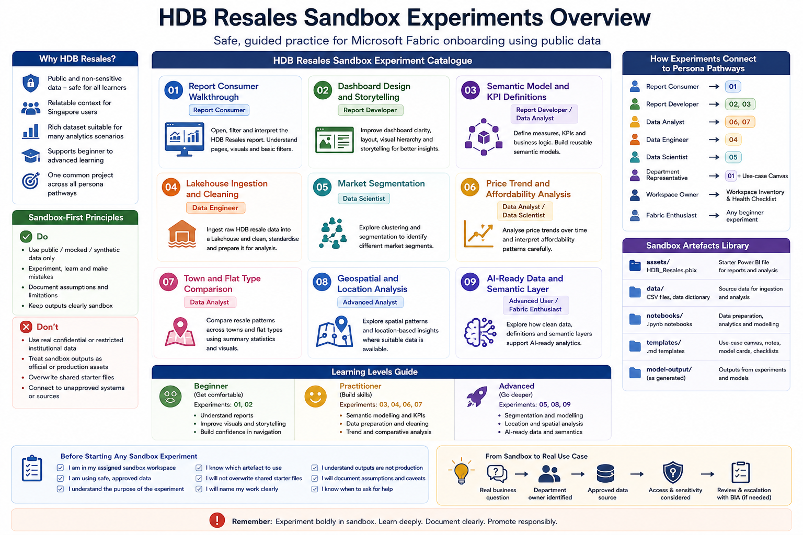

# HDB Resales Sandbox Series

The HDB Resales Sandbox Series is the first hands-on learning project for the Fabric Onboarding Experience.

It uses public HDB resale flat data as a safe, relatable, and practical dataset for learning Microsoft Fabric. The same sandbox project supports different learning pathways, from basic report consumption to dashboard design, data analysis, data engineering, semantic modelling, and advanced analytics.

## Why HDB Resales is used

The HDB Resales dataset is useful for onboarding because it is:

* Public and non-sensitive
* Familiar to many users in Singapore
* Suitable for report consumption and dashboard design
* Rich enough for data analysis and trend interpretation
* Suitable for data engineering practice in a Lakehouse
* Useful for semantic modelling and measure definition exercises
* Extendable into segmentation, modelling, geospatial thinking, and AI-ready data discussions

This makes it a good anchor project for onboarding at scale.

## What this series helps learners practise

Learners can use the HDB Resales Sandbox Series to practise:

* Opening and interpreting reports
* Using filters, slicers, and visual interactions
* Improving dashboard layout and storytelling
* Reviewing semantic models, measures, and definitions
* Exploring data quality and analytical questions
* Loading and preparing data in a Lakehouse
* Running simple notebooks or modelling experiments
* Documenting assumptions, caveats, and limitations
* Deciding whether an output should remain sandbox or move towards a real use case

## Sandbox-first principle

All activities in this series should be completed in the assigned Fabric Sandbox Workspace.

This series should use only:

* Public data
* Mocked data
* Synthetic data
* Approved non-sensitive data

Do not use:

* Real confidential institutional data
* Real restricted institutional data
* Student personal data
* Staff personal data
* Financial records
* Donor records
* Operational production data
* Any data that has not been approved for sandbox use

Sandbox outputs are for learning and experimentation only. They are not official reports, production semantic models, operational dashboards, or formal decision-support tools.

## Repo versus Fabric Sandbox Workspace

The HDB Resales Sandbox Series uses both this GitHub repo and a Fabric Sandbox Workspace.

The repo explains what to do. The Fabric Sandbox Workspace is where the hands-on work happens.

| Area                     | Purpose                                                                                                       |
| ------------------------ | ------------------------------------------------------------------------------------------------------------- |
| GitHub repo              | Stores onboarding instructions, README files, templates, checklists, source references, and learning guidance |
| Fabric Sandbox Workspace | Hosts the working artefacts that learners open, run, edit, copy, and practise with                            |

Learners should perform hands-on work in the Fabric Sandbox Workspace, not directly inside the GitHub repo.

## Accessing the Fabric Sandbox Workspace

To begin the HDB Resales Sandbox Series:

1. Go to https://app.fabric.microsoft.com/
2. Sign in using your University account.
3. In the left navigation menu, select **Workspaces**.
4. Open the assigned Fabric Sandbox Workspace.

The specific report, semantic model, Lakehouse, notebook, or other artefact to use will be stated in each experiment page.

The actual workspace and artefact links are shared through internal BIA onboarding channels and are not published in this public repo.

If you cannot see the assigned Fabric Sandbox Workspace, check with the workspace owner or BIA contact.

## Access notes

* Do not request access unless you are part of the onboarding activity.
* Do not forward internal workspace or report links publicly.
* Do not use **Publish to web**.
* Do not upload confidential or restricted institutional data into the sandbox workspace.
* Do not treat access to the workspace as permission to reuse, export, or redistribute data.

## Where learners will work

Most learners will use the HDB Resales artefacts prepared in the Fabric Sandbox Workspace.

| Artefact                   | Where Learners Use It    | Purpose                                                                           |
| -------------------------- | ------------------------ | --------------------------------------------------------------------------------- |
| HDB Resales report         | Fabric Sandbox Workspace | Used for report consumption and report development activities                     |
| HDB Resales semantic model | Fabric Sandbox Workspace | Used for report development, semantic model review, and KPI definition activities |
| HDB Resales Lakehouse      | Fabric Sandbox Workspace | Used for data ingestion, cleaning, and data engineering activities                |
| HDB Resales source data    | Fabric Sandbox Workspace | Used for data analysis, data engineering, and modelling activities                |
| HDB Resales notebooks      | Fabric Sandbox Workspace | Used for data preparation, segmentation, and modelling activities                 |
| HDB Resales output tables  | Fabric Sandbox Workspace | Used to store sandbox analysis or model outputs                                   |
| Templates and checklists   | GitHub repo              | Used to document context, assumptions, caveats, and review notes                  |

## Learning map



## How this series is organised in the repo

This folder contains the guide, supporting files, and experiment pages for the HDB Resales Sandbox Series.

```text
09-sandbox-experiments/
└── hdb-resales/
    ├── README.md
    ├── data/
    │   ├── hdb_resales_sample.csv
    │   ├── hdb_resales_data_dictionary.md
    │   └── hdb_resales_modelling_sample.csv
    ├── notebooks/
    │   ├── hdb_resales_data_preparation.ipynb
    │   ├── hdb_resales_market_segmentation.ipynb
    │   └── hdb_resales_price_band_prediction.ipynb
    ├── templates/
    │   ├── report-context-note.md
    │   ├── insight-summary-template.md
    │   ├── use-case-canvas.md
    │   ├── workspace-inventory-template.md
    │   ├── workspace-health-note.md
    │   └── model-card-template.md
    ├── model-output/
    ├── 01-report-consumer-walkthrough/
    │   └── README.md
    ├── 02-dashboard-design-and-storytelling/
    │   └── README.md
    ├── 03-semantic-model-and-kpi-definitions/
    │   └── README.md
    ├── 04-lakehouse-ingestion-and-cleaning/
    │   └── README.md
    ├── 05-market-segmentation/
    │   └── README.md
    ├── 06-price-trend-and-affordability-analysis/
    │   └── README.md
    ├── 07-town-and-flat-type-comparison/
    │   └── README.md
    ├── 08-geospatial-location-analysis/
    │   └── README.md
    └── 09-ai-ready-data-and-semantic-layer/
        └── README.md
```

The experiment folders contain the step-by-step learning activities.

The `data`, `notebooks`, `templates`, and `model-output` folders provide supporting materials and references for the series.

The PBIX file is not stored in this repo. Learners should access the published HDB Resales report directly from the Fabric Sandbox Workspace.

## Working artefacts in the Fabric Sandbox Workspace

Learners will use the working artefacts in the Fabric Sandbox Workspace.

The exact workspace item names may vary, but the artefacts should be clearly labelled as sandbox learning assets.

| Fabric Item                                | Purpose                                                                   |
| ------------------------------------------ | ------------------------------------------------------------------------- |
| HDB Resales report                         | Published report used for report consumer and report developer activities |
| HDB Resales semantic model                 | Model used for reporting, measure review, and semantic model exercises    |
| HDB Resales Lakehouse                      | Stores HDB resale source data, cleaned tables, and curated tables         |
| HDB Resales data preparation notebook      | Prepares and cleans HDB resale data                                       |
| HDB Resales market segmentation notebook   | Supports clustering or segmentation exercises                             |
| HDB Resales price band prediction notebook | Supports simple modelling or prediction exercises                         |
| HDB Resales Dataflow Gen2                  | Supports low-code data preparation exercises                              |
| HDB Resales pipeline                       | Supports orchestration exercises                                          |
| HDB Resales model output table             | Stores sandbox model or segmentation outputs                              |

## Supporting files in the repo

The repo stores learning materials and source references.

| Folder             | Purpose                                                                        |
| ------------------ | ------------------------------------------------------------------------------ |
| `data/`            | Stores public HDB resale sample data and data dictionary files, where provided |
| `notebooks/`       | Stores source copies of notebook exercises, where provided                     |
| `templates/`       | Stores exercise-specific copies of templates used during sandbox activities    |
| `model-output/`    | Stores sample sandbox model outputs, where provided                            |
| Experiment folders | Store step-by-step README files for each guided activity                       |

The repo version is for documentation and source reference.

The Fabric Sandbox Workspace version is for hands-on practice.

## HDB Resales report

The HDB Resales report is published in the Fabric Sandbox Workspace.

Learners should access the report directly from the Fabric Sandbox Workspace rather than downloading a PBIX file from this repo.

The published report is used for:

* Report consumer walkthrough
* Dashboard design and storytelling
* Report developer practice
* Semantic model review
* Measure and KPI definition review
* Demonstrating how curated data becomes a report

Report consumers should interact with the published report in reading mode.

Report developers may work on a copy of the report or semantic model inside the Fabric Sandbox Workspace where instructed. They should not overwrite the shared starter artefact.

## HDB Resales data

For data analysis, data engineering, and data science exercises, learners will use the HDB Resales data prepared in the Fabric Sandbox Workspace.

The repo may also contain public sample data and a data dictionary for reference:

```text
09-sandbox-experiments/hdb-resales/data/
```

The HDB Resales data supports:

* Data analyst activities
* Data engineer activities
* Data scientist activities
* Semantic modelling activities
* AI-ready data activities

Derived datasets, cleaned tables, curated tables, and model outputs should be clearly marked as sandbox or experimental.

## HDB Resales notebooks

For notebook-based activities, learners will use the notebooks prepared in the Fabric Sandbox Workspace.

The repo may also contain notebook source copies for reference:

```text
09-sandbox-experiments/hdb-resales/notebooks/
```

Notebook activities may support:

* Data preparation
* Data quality checks
* Market segmentation
* Price band prediction
* Model output review
* AI-ready data preparation

Notebooks should be used only in sandbox unless reviewed and approved for a department or production use case.

## Templates and documentation aids

Learners should use templates and checklists to document their work.

Useful templates include:

| Template                                                                                                | Purpose                                                                         |
| ------------------------------------------------------------------------------------------------------- | ------------------------------------------------------------------------------- |
| [Report Context Note](../../11-templates-checklists/templates/report-context-note.md)                   | Record report purpose, owner, refresh date, caveats, and questions              |
| [Insight Summary Template](../../11-templates-checklists/templates/insight-summary-template.md)         | Write an observation with caveat and follow-up question                         |
| [Use Case Canvas](../../11-templates-checklists/templates/use-case-canvas.md)                           | Frame a department analytics use case                                           |
| [Workspace Inventory Template](../../11-templates-checklists/templates/workspace-inventory-template.md) | Review items inside a workspace                                                 |
| [Workspace Health Note](../../11-templates-checklists/templates/workspace-health-note.md)               | Summarise workspace access, ownership, naming, refresh, and escalation concerns |
| [Model Card Template](../../11-templates-checklists/templates/model-card-template.md)                   | Document a model, clustering output, or advanced analytics experiment           |

## Experiment catalogue

| No. | Experiment                                                                             | Main Persona                      | Purpose                                                                              | Status  |
| --- | -------------------------------------------------------------------------------------- | --------------------------------- | ------------------------------------------------------------------------------------ | ------- |
| 01  | [Report Consumer Walkthrough](./01-report-consumer-walkthrough/)                       | Report Consumer                   | Practise opening, filtering, and interpreting the HDB Resales report                 | Drafted |
| 02  | [Dashboard Design and Storytelling](./02-dashboard-design-and-storytelling/)           | Report Developer                  | Improve dashboard clarity, layout, and visual storytelling                           | Planned |
| 03  | [Semantic Model and KPI Definitions](./03-semantic-model-and-kpi-definitions/)         | Report Developer / Data Analyst   | Practise measure definitions, semantic modelling, and reuse                          | Planned |
| 04  | [Lakehouse Ingestion and Cleaning](./04-lakehouse-ingestion-and-cleaning/)             | Data Engineer                     | Load, clean, and prepare HDB resale data in a Lakehouse                              | Planned |
| 05  | [Market Segmentation](./05-market-segmentation/)                                       | Data Scientist                    | Explore clustering or segmentation of resale market patterns                         | Planned |
| 06  | [Price Trend and Affordability Analysis](./06-price-trend-and-affordability-analysis/) | Data Analyst / Data Scientist     | Analyse resale price trends and interpret them cautiously                            | Planned |
| 07  | [Town and Flat Type Comparison](./07-town-and-flat-type-comparison/)                   | Data Analyst                      | Compare resale patterns across towns and flat types                                  | Planned |
| 08  | [Geospatial and Location Analysis](./08-geospatial-location-analysis/)                 | Advanced Analyst                  | Explore location-related patterns where suitable data is available                   | Planned |
| 09  | [AI-Ready Data and Semantic Layer](./09-ai-ready-data-and-semantic-layer/)             | Advanced User / Fabric Enthusiast | Explore how clean data, definitions, and semantic meaning support AI-ready analytics | Planned |

## Relationship with persona pathways

The persona pathways explain what users should learn.

The HDB Resales experiments provide the hands-on practice.

| Persona Pathway                                                                   | Recommended Starting Point                                                                |
| --------------------------------------------------------------------------------- | ----------------------------------------------------------------------------------------- |
| [Report Consumer](../../05-persona-pathways/report-consumer/)                     | [01 Report Consumer Walkthrough](./01-report-consumer-walkthrough/)                       |
| [Report Developer](../../05-persona-pathways/report-developer/)                   | [02 Dashboard Design and Storytelling](./02-dashboard-design-and-storytelling/)           |
| [Data Analyst](../../05-persona-pathways/data-analyst/)                           | [06 Price Trend and Affordability Analysis](./06-price-trend-and-affordability-analysis/) |
| [Data Engineer](../../05-persona-pathways/data-engineer/)                         | [04 Lakehouse Ingestion and Cleaning](./04-lakehouse-ingestion-and-cleaning/)             |
| [Data Scientist](../../05-persona-pathways/data-scientist/)                       | [05 Market Segmentation](./05-market-segmentation/)                                       |
| [Department Representative](../../05-persona-pathways/department-representative/) | [01 Report Consumer Walkthrough](./01-report-consumer-walkthrough/) and Use Case Canvas   |
| [Workspace Owner](../../05-persona-pathways/workspace-owner/)                     | Workspace inventory and workspace health activities                                       |
| [Fabric Enthusiast](../../05-persona-pathways/fabric-enthusiast/)                 | Any beginner experiment based on interest                                                 |

## Learning levels

| Level        | Suitable Experiments | Focus                                                                                 |
| ------------ | -------------------- | ------------------------------------------------------------------------------------- |
| Beginner     | 01, 02               | Report consumption, navigation, dashboard interpretation, dashboard design            |
| Practitioner | 03, 04, 06, 07       | Semantic modelling, data preparation, analytical comparison, trend interpretation     |
| Advanced     | 05, 08, 09           | Segmentation, location analysis, AI-ready semantic layer, advanced analytics thinking |

Users should not rush into advanced experiments before understanding safe data use, workspace context, and responsible interpretation.

## Naming convention for HDB Resales sandbox work

Use names that clearly show the work is sandbox or experimental.

Recommended examples:

```text
sandbox_hdb_resales_report
sandbox_hdb_resales_semantic_model
sandbox_hdb_resales_lakehouse
sandbox_hdb_resales_dataflow
sandbox_hdb_resales_pipeline
sandbox_hdb_resales_segmentation_notebook
sandbox_hdb_resales_price_trend_analysis
```

Avoid names such as:

```text
final_report
official_dashboard
prod_hdb_report
latest_version
test123
copy_of_copy_final
```

## Before starting an experiment

Before starting any HDB Resales sandbox experiment, confirm:

* [ ] I am working in the assigned Fabric Sandbox Workspace
* [ ] I am using only public, mocked, synthetic, or approved non-sensitive data
* [ ] I understand the purpose of the experiment
* [ ] I know which Fabric artefact I should use
* [ ] I will not overwrite shared starter artefacts
* [ ] I will name my work clearly
* [ ] I understand that sandbox outputs are not production assets
* [ ] I will document assumptions, caveats, and limitations
* [ ] I know when to ask for help

## When a sandbox idea becomes a real use case

A sandbox experiment may inspire a real department use case.

Before moving beyond sandbox, confirm:

* There is a real business question
* There is a department owner
* The intended users are known
* The data source is approved
* Sensitivity and access expectations are understood
* Refresh and ownership responsibilities are considered
* BIA is involved if productionisation may be required

Sandbox work should not be copied into department or production workspaces without review.

## Related sections

| Section                                                            | Purpose                                                                        |
| ------------------------------------------------------------------ | ------------------------------------------------------------------------------ |
| [Sandbox Experiments](../)                                         | Return to the overall sandbox experiment catalogue                             |
| [Persona Pathways](../../05-persona-pathways/)                     | Choose a role-based learning pathway                                           |
| [Templates and Checklists](../../11-templates-checklists/)         | Use reusable templates and checklists for documentation and review             |
| [Curated Learning Resources](../../10-curated-learning-resources/) | Refer to Microsoft Learn, Microsoft documentation, and curated video resources |

## References and further learning

| Resource                                                                                                                                                                         | Purpose                                                                                                     |
| -------------------------------------------------------------------------------------------------------------------------------------------------------------------------------- | ----------------------------------------------------------------------------------------------------------- |
| [Microsoft Fabric documentation](https://learn.microsoft.com/en-us/fabric/)                                                                                                      | Official Microsoft documentation for Fabric concepts, workloads, and platform capabilities                  |
| [Microsoft Learn: Get started with Microsoft Fabric](https://learn.microsoft.com/en-us/training/paths/get-started-fabric/)                                                       | Beginner learning pathway for users starting with Fabric                                                    |
| [Create a lakehouse, ingest sample data, and build a report](https://learn.microsoft.com/en-us/fabric/data-engineering/tutorial-build-lakehouse)                                 | Useful end-to-end tutorial for Lakehouse, ingestion, transformation, semantic model, and reporting concepts |
| [Prepare and visualize data with Microsoft Power BI](https://learn.microsoft.com/en-us/training/paths/prepare-visualize-data-power-bi/)                                          | Useful for report development, dashboard design, and visual analysis                                        |
| [Implement a data science and machine learning solution with Microsoft Fabric](https://learn.microsoft.com/en-us/training/paths/implement-data-science-machine-learning-fabric/) | Useful for advanced learners exploring data science and machine learning in Fabric                          |

## Next experiment

Proceed to:

[HDB Resales: Report Consumer Walkthrough](./01-report-consumer-walkthrough/)
