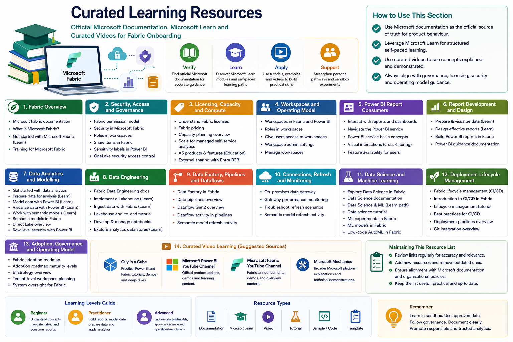

# Curated Learning Resources

This section collects useful Microsoft documentation, Microsoft Learn modules, and selected video learning resources that support the Fabric Onboarding Experience.

The main onboarding guide is written for our operating context. These resources provide official product documentation, deeper technical learning, and optional self-paced study.



## How to use this section

Use this section when you want to:

- Verify official Microsoft product behaviour
- Learn a Fabric concept in more detail
- Find a Microsoft Learn pathway for self-paced study
- Support a persona pathway with additional learning
- Supplement sandbox experiments with official tutorials
- Find curated video explanations for practical understanding

Users should treat Microsoft documentation as the official product reference. Curated videos can be helpful for explanation and demonstration, but they should not replace official documentation for governance, licensing, security, or production decisions.

## Microsoft Fabric overview

| Resource | Purpose |
|---|---|
| [Microsoft Fabric documentation](https://learn.microsoft.com/en-us/fabric/) | Official documentation hub for Fabric concepts, workloads, and product capabilities |
| [What is Microsoft Fabric?](https://learn.microsoft.com/en-us/fabric/fundamentals/microsoft-fabric-overview) | Introduction to Fabric as an end-to-end analytics platform |
| [Microsoft Learn: Get started with Microsoft Fabric](https://learn.microsoft.com/en-us/training/paths/get-started-fabric/) | Beginner learning path for understanding Fabric capabilities and core concepts |
| [Training for Microsoft Fabric](https://learn.microsoft.com/en-us/training/fabric/) | Microsoft Learn landing page for Fabric-related training resources |

## Security, access and governance

| Resource | Purpose |
|---|---|
| [Microsoft Fabric permission model](https://learn.microsoft.com/en-us/fabric/security/permission-model) | Explains how different Fabric permissions work together to control data access |
| [Security in Microsoft Fabric](https://learn.microsoft.com/en-us/fabric/security/security-overview) | Overview of Fabric security concepts, workspace access, and item permissions |
| [Roles in workspaces in Microsoft Fabric](https://learn.microsoft.com/en-us/fabric/fundamentals/roles-workspaces) | Explains workspace roles such as Admin, Member, Contributor, and Viewer |
| [Share items in Microsoft Fabric](https://learn.microsoft.com/en-us/fabric/fundamentals/share-items) | Explains how Fabric item sharing and item permissions work |
| [Sensitivity labels in Power BI](https://learn.microsoft.com/en-us/fabric/enterprise/powerbi/service-security-sensitivity-label-overview) | Explains how Microsoft Purview sensitivity labels apply to Power BI content |
| [OneLake security access control model](https://learn.microsoft.com/en-us/fabric/onelake/security/data-access-control-model) | Explains how OneLake security interacts with workspace permissions and data access controls |

## Licensing, capacity and compute

| Resource | Purpose |
|---|---|
| [Understand Microsoft Fabric licenses](https://learn.microsoft.com/en-us/fabric/enterprise/licenses) | Explains how Fabric licenses and capacities affect creating, sharing, and viewing items |
| [Microsoft Fabric pricing](https://azure.microsoft.com/en-us/pricing/details/microsoft-fabric/) | Provides Microsoft Fabric capacity pricing and SKU information |
| [Microsoft Fabric capacity planning overview](https://learn.microsoft.com/en-us/fabric/enterprise/capacity-planning-overview) | Starting point for Fabric capacity planning guidance |
| [Scale for centralized and managed self-service analytics](https://learn.microsoft.com/en-us/fabric/enterprise/capacity-planning-enterprise-managed-self-service-solutions) | Useful for understanding capacity planning across centralised and self-service analytics scenarios |
| [A5 products and features list for Microsoft 365 Education](https://learn.microsoft.com/en-us/microsoft-365/education/guide/0-start-advanced/advanced-products-features) | Provides Microsoft’s education-specific product and feature information |
| [Distribute Power BI content to external guest users with Microsoft Entra B2B](https://learn.microsoft.com/en-us/fabric/enterprise/powerbi/service-admin-entra-b2b) | Explains how Power BI supports external sharing through Microsoft Entra B2B guest users |

## Workspaces and operating model

| Resource | Purpose |
|---|---|
| [Workspaces in Microsoft Fabric and Power BI](https://learn.microsoft.com/en-us/fabric/fundamentals/workspaces) | Explains how workspaces are used to collaborate and manage Fabric items |
| [Roles in workspaces in Microsoft Fabric](https://learn.microsoft.com/en-us/fabric/fundamentals/roles-workspaces) | Explains workspace roles and permission levels |
| [Give users access to workspaces](https://learn.microsoft.com/en-us/fabric/fundamentals/give-access-workspaces) | Explains how users can be granted workspace roles |
| [Workspace admin settings](https://learn.microsoft.com/en-us/fabric/admin/portal-workspace) | Explains admin-controlled workspace settings |
| [Manage workspaces](https://learn.microsoft.com/en-us/fabric/admin/portal-workspaces) | Provides admin guidance for workspace management and capacity assignment |

## Power BI report consumers

| Resource | Purpose |
|---|---|
| [Interact with reports and dashboards in the Power BI service](https://learn.microsoft.com/en-us/power-bi/explore-reports/end-user-reading-view) | Explains how users interact with reports in Reading view |
| [Navigate the Power BI service](https://learn.microsoft.com/en-us/power-bi/explore-reports/end-user-experience) | Helps users understand dashboards, reports, apps, and workspaces |
| [Power BI service basic concepts](https://learn.microsoft.com/en-us/power-bi/fundamentals/service-basic-concepts) | Explains basic concepts such as reports, dashboards, semantic models, and workspaces |
| [How visuals cross-filter each other in a Power BI report](https://learn.microsoft.com/en-us/power-bi/explore-reports/end-user-interactions) | Explains visual interactions, cross-filtering, and cross-highlighting |
| [Feature availability for users in the Power BI service](https://learn.microsoft.com/en-us/power-bi/fundamentals/end-user-features) | Explains that available features depend on licensing, permissions, and content location |

## Report development and dashboard design

| Resource | Purpose |
|---|---|
| [Prepare and visualize data with Microsoft Power BI](https://learn.microsoft.com/en-us/training/paths/prepare-visualize-data-power-bi/) | Microsoft Learn pathway for preparing data and creating interactive Power BI visuals |
| [Design effective reports in Power BI](https://learn.microsoft.com/en-us/training/paths/power-bi-effective/) | Microsoft Learn pathway on report design, storytelling, and user-focused visualisation |
| [Build Power BI reports with Direct Lake tables](https://learn.microsoft.com/en-us/fabric/fundamentals/building-reports) | Explains report creation paths in Fabric and Power BI using semantic models |
| [Power BI guidance documentation](https://learn.microsoft.com/en-us/power-bi/guidance/) | Microsoft guidance for building effective, governed Power BI solutions |

## Data analytics and modelling

| Resource | Purpose |
|---|---|
| [Get started with Microsoft data analytics](https://learn.microsoft.com/en-us/training/paths/data-analytics-microsoft/) | Microsoft Learn pathway introducing data analytics concepts and Power BI |
| [Prepare data for analysis with Power BI](https://learn.microsoft.com/en-us/training/paths/prepare-data-power-bi/) | Useful for learning data preparation and cleaning concepts |
| [Model data with Power BI](https://learn.microsoft.com/en-us/training/paths/model-data-power-bi/) | Introduces relationships, calculations, and modelling concepts |
| [Visualize data with Power BI](https://learn.microsoft.com/en-us/training/paths/visualize-data-power-bi/) | Helps learners communicate insights using Power BI visuals |
| [Work with semantic models in Microsoft Fabric](https://learn.microsoft.com/en-us/training/paths/work-semantic-models-microsoft-fabric/) | Microsoft Learn pathway for understanding and working with semantic models |
| [Power BI semantic models in Microsoft Fabric](https://learn.microsoft.com/en-us/fabric/data-warehouse/semantic-models) | Explains semantic models as a business-friendly analytical layer |
| [Direct Lake overview](https://learn.microsoft.com/en-us/fabric/fundamentals/direct-lake-overview) | Explains Direct Lake as a semantic model storage mode in Fabric |
| [Row-level security with Power BI](https://learn.microsoft.com/en-us/fabric/security/service-admin-row-level-security) | Explains Row-Level Security concepts and configuration |

## Data engineering

| Resource | Purpose |
|---|---|
| [Fabric Data Engineering documentation](https://learn.microsoft.com/en-us/fabric/data-engineering/) | Official documentation for Fabric Data Engineering, Lakehouses, notebooks, and tutorials |
| [Implement a Lakehouse with Microsoft Fabric](https://learn.microsoft.com/en-us/training/paths/implement-lakehouse-microsoft-fabric/) | Microsoft Learn pathway covering Lakehouse concepts, ingestion, orchestration, and transformation |
| [Ingest data with Microsoft Fabric](https://learn.microsoft.com/en-us/training/paths/ingest-data-with-microsoft-fabric/) | Microsoft Learn pathway on ingesting and orchestrating data using dataflows, notebooks, and pipelines |
| [Create a lakehouse, ingest sample data, and build a report](https://learn.microsoft.com/en-us/fabric/data-engineering/tutorial-build-lakehouse) | End-to-end tutorial for Lakehouse, ingestion, transformation, semantic model, and reporting concepts |
| [Develop, execute, and manage Microsoft Fabric notebooks](https://learn.microsoft.com/en-us/fabric/data-engineering/author-execute-notebook) | Explains how to author and manage Fabric notebooks for Spark jobs and data engineering tasks |
| [Explore analytics data stores in Microsoft Fabric](https://learn.microsoft.com/en-us/training/paths/explore-analytics-data-stores/) | Microsoft Learn pathway introducing Lakehouses, Warehouses, and analytics data stores |

## Data Factory, pipelines and Dataflow Gen2

| Resource | Purpose |
|---|---|
| [Data Factory in Microsoft Fabric](https://learn.microsoft.com/en-us/fabric/data-factory/) | Official documentation for Fabric Data Factory |
| [Data pipelines in Microsoft Fabric](https://learn.microsoft.com/en-us/fabric/data-factory/pipeline-overview) | Explains Fabric data pipelines and orchestration concepts |
| [Dataflow Gen2 in Microsoft Fabric](https://learn.microsoft.com/en-us/fabric/data-factory/dataflows-gen2-overview) | Explains low-code data preparation and transformation using Dataflow Gen2 |
| [Dataflow activity in Microsoft Fabric pipelines](https://learn.microsoft.com/en-us/fabric/data-factory/dataflow-activity) | Explains how Dataflow activities can be used within Fabric pipelines |
| [Semantic model refresh activity](https://learn.microsoft.com/en-us/fabric/data-factory/semantic-model-refresh-activity) | Explains how Fabric pipelines can refresh Power BI semantic models |

## Connections, gateways, refresh and monitoring

| Resource | Purpose |
|---|---|
| [On-premises data gateway documentation](https://learn.microsoft.com/en-us/data-integration/gateway/service-gateway-onprem) | Explains how the on-premises data gateway supports access to on-premises data sources |
| [Monitor and optimize on-premises data gateway performance](https://learn.microsoft.com/en-us/data-integration/gateway/service-gateway-performance) | Explains gateway performance monitoring and optimisation considerations |
| [Troubleshoot Power BI refresh scenarios](https://learn.microsoft.com/en-us/power-bi/connect-data/refresh-troubleshooting-refresh-scenarios) | Useful for understanding common refresh failures and troubleshooting patterns |
| [Semantic model refresh activity](https://learn.microsoft.com/en-us/fabric/data-factory/semantic-model-refresh-activity) | Explains pipeline-based semantic model refresh in Fabric Data Factory |

## Data science and machine learning

| Resource | Purpose |
|---|---|
| [Explore Data Science in Microsoft Fabric](https://learn.microsoft.com/en-us/fabric/data-science/data-science-overview) | Introduces the Fabric Data Science experience and end-to-end workflow |
| [Fabric Data Science documentation](https://learn.microsoft.com/en-us/fabric/data-science/) | Official documentation for Fabric data science, model training, scoring, notebooks, and AI samples |
| [Implement a data science and machine learning solution with Microsoft Fabric](https://learn.microsoft.com/en-us/training/paths/implement-data-science-machine-learning-fabric/) | Microsoft Learn pathway for data science and machine learning in Fabric |
| [Data science tutorial: get started with Microsoft Fabric](https://learn.microsoft.com/en-us/fabric/data-science/tutorial-data-science-introduction) | End-to-end tutorial covering ingestion, preparation, model training, insights, and reporting |
| [Machine learning experiments in Microsoft Fabric](https://learn.microsoft.com/en-us/fabric/data-science/machine-learning-experiment) | Explains how Fabric ML experiments track parameters, metrics, outputs, and runs |
| [Machine learning models in Microsoft Fabric](https://learn.microsoft.com/en-us/fabric/data-science/machine-learning-model) | Explains model creation, versioning, comparison, scoring, and inferencing |
| [Use the low-code AutoML interface in Fabric](https://learn.microsoft.com/en-us/fabric/data-science/low-code-automl) | Explains Fabric AutoML and low-code model training options |

## Deployment lifecycle management

| Resource | Purpose |
|---|---|
| [Fabric application lifecycle management documentation](https://learn.microsoft.com/en-us/fabric/cicd/) | Microsoft documentation hub for Fabric lifecycle management, CI/CD, Git integration, and deployment pipelines |
| [Introduction to CI/CD in Microsoft Fabric](https://learn.microsoft.com/en-us/fabric/cicd/cicd-overview) | Explains how Git integration and deployment pipelines support development and release workflows |
| [Tutorial: Application lifecycle management in Fabric](https://learn.microsoft.com/en-us/fabric/cicd/cicd-tutorial) | End-to-end tutorial on using Git integration and deployment pipelines together |
| [Best practices for lifecycle management in Fabric](https://learn.microsoft.com/en-us/fabric/cicd/best-practices-cicd) | Guidance on permissions, workspace planning, Git integration, and deployment pipeline practices |
| [Overview of Fabric deployment pipelines](https://learn.microsoft.com/en-us/fabric/cicd/deployment-pipelines/intro-to-deployment-pipelines) | Explains how deployment pipelines move content across lifecycle stages |
| [Overview of Fabric Git integration](https://learn.microsoft.com/en-us/fabric/cicd/git-integration/intro-to-git-integration) | Explains how Fabric workspaces can integrate with Git repositories for source control |

## Adoption, governance and operating model

| Resource | Purpose |
|---|---|
| [Microsoft Fabric adoption roadmap](https://learn.microsoft.com/en-us/power-bi/guidance/fabric-adoption-roadmap) | Provides guidance on adoption, ownership, governance, support, and enablement |
| [Maturity levels for Microsoft Fabric adoption](https://learn.microsoft.com/en-us/power-bi/guidance/fabric-adoption-roadmap-maturity-levels) | Useful for understanding how analytics maturity evolves |
| [Power BI implementation planning: BI strategy overview](https://learn.microsoft.com/en-us/power-bi/guidance/powerbi-implementation-planning-bi-strategy-overview) | Helps stakeholders think about BI strategy, ownership, and alignment with business needs |
| [Power BI implementation planning: Tenant-level workspace planning](https://learn.microsoft.com/en-us/power-bi/guidance/powerbi-implementation-planning-tenant-level-workspace-planning) | Useful for workspace planning, ownership, and collaboration patterns |
| [Microsoft Fabric adoption roadmap: System oversight](https://learn.microsoft.com/en-us/power-bi/guidance/fabric-adoption-roadmap-system-oversight) | Guidance on governance, tenant administration, monitoring, and oversight |

## Curated video learning (Placeholder)

Video resources can be useful for seeing concepts demonstrated in practice.

Suggested channels or sources to curate:

| Source | Suggested Use |
|---|---|
| Guy in a Cube | Practical Power BI and Fabric explanations, demos, and feature walkthroughs |
| Microsoft Power BI official YouTube channel | Official product updates, demos, and learning content |
| Microsoft Fabric official YouTube content | Fabric announcements, demos, and overview content |
| Microsoft Mechanics | Broader Microsoft platform explanations and demonstrations |

When adding a video, use the following format:

```markdown
| [Video title](URL) | Source | Topic | Why this is useful | Last reviewed |
|---|---|---|---|---|
```

Recommended review criteria:

- Is the video current?
- Is the presenter credible?
- Is the topic relevant to onboarding?
- Does it align with official Microsoft documentation?
- Is it suitable for beginners, practitioners, or advanced users?
- Does it avoid encouraging unsafe or inappropriate shortcuts?

## Suggested video inventory template

Use this table when adding curated videos.

| Video | Source | Topic | Level | Why useful | Last reviewed |
|---|---|---|---|---|---|
| To be added | Guy in a Cube | Power BI / Fabric | Beginner / Practitioner | Practical walkthrough | YYYY-MM-DD |
| To be added | Microsoft | Fabric overview | Beginner | Official explanation | YYYY-MM-DD |
| To be added | Microsoft Mechanics | Platform concepts | Practitioner | Broader platform context | YYYY-MM-DD |

## How to maintain this resource list

This section should be reviewed periodically because Microsoft Fabric evolves quickly.

When reviewing resources:

- Check whether links still work
- Check whether product names have changed
- Check whether preview features have become generally available
- Check whether guidance has changed
- Remove outdated or misleading resources
- Add new Microsoft Learn pathways where useful
- Add curated videos only when they genuinely support onboarding

## Next section

Proceed to:

[Templates and Checklists](../11-templates-checklists/)
