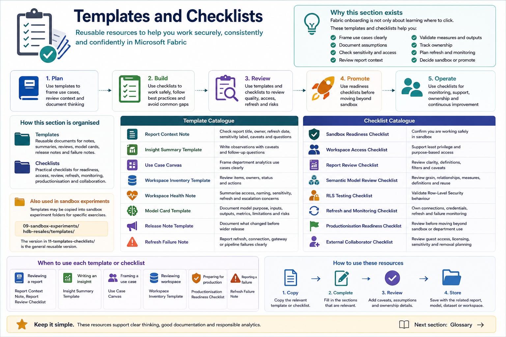

# Templates and Checklists

This section provides reusable templates and checklists for Fabric onboarding, sandbox learning, workspace management, deployment review, and productionisation readiness.

Templates help users document their thinking clearly. Checklists help users avoid missing important security, access, ownership, refresh, and governance considerations.

## Why templates matter

Fabric onboarding is not only about learning where to click.

Users also need to learn how to:

- Frame use cases clearly
- Document assumptions
- Check sensitivity and access
- Review report context
- Validate measures and outputs
- Track ownership
- Plan refresh and monitoring
- Decide whether an asset should remain sandbox or move beyond sandbox

Templates make these practices easier to repeat.



> Image: Overview showing templates and checklists for report context, insight summaries, use case canvas, workspace health, production readiness, refresh ownership, RLS testing, and sandbox experiment review.

## Suggested folder structure

Use this structure:

```text
11-templates-checklists/
├── README.md
├── templates/
│   ├── report-context-note.md
│   ├── insight-summary-template.md
│   ├── use-case-canvas.md
│   ├── workspace-inventory-template.md
│   ├── workspace-health-note.md
│   ├── model-card-template.md
│   ├── release-note-template.md
│   └── refresh-failure-note.md
│
└── checklists/
    ├── sandbox-readiness-checklist.md
    ├── workspace-access-checklist.md
    ├── report-review-checklist.md
    ├── semantic-model-review-checklist.md
    ├── rls-testing-checklist.md
    ├── refresh-monitoring-checklist.md
    ├── productionisation-readiness-checklist.md
    └── external-collaborator-checklist.md
```

Some templates may also be copied into the HDB Resales sandbox folder when they are used for specific exercises:

```text
09-sandbox-experiments/hdb-resales/templates/
```

The version in `11-templates-checklists/` should be treated as the general reusable version.

## Template catalogue

| Template | Purpose | File |
|---|---|---|
| Report Context Note | Helps users check report title, owner, refresh date, sensitivity label, caveats, and questions | [report-context-note.md](./templates/report-context-note.md) |
| Insight Summary Template | Helps analysts write observations with caveats and follow-up questions | [insight-summary-template.md](./templates/insight-summary-template.md) |
| Use Case Canvas | Helps department representatives frame analytics use cases clearly | [use-case-canvas.md](./templates/use-case-canvas.md) |
| Workspace Inventory Template | Helps workspace owners review items, owners, status, and actions | [workspace-inventory-template.md](./templates/workspace-inventory-template.md) |
| Workspace Health Note | Helps workspace owners summarise access, naming, sensitivity, refresh, and escalation concerns | [workspace-health-note.md](./templates/workspace-health-note.md) |
| Model Card Template | Helps data scientists document model purpose, inputs, outputs, metrics, limitations, and risks | [model-card-template.md](./templates/model-card-template.md) |
| Release Note Template | Helps teams document what changed before wider release | [release-note-template.md](./templates/release-note-template.md) |
| Refresh Failure Note | Helps users report refresh, connection, gateway, or pipeline failures clearly | [refresh-failure-note.md](./templates/refresh-failure-note.md) |

## Checklist catalogue

| Checklist | Purpose | File |
|---|---|---|
| Sandbox Readiness Checklist | Confirms users are working safely in sandbox | [sandbox-readiness-checklist.md](./checklists/sandbox-readiness-checklist.md) |
| Workspace Access Checklist | Supports least privilege and purpose-based access decisions | [workspace-access-checklist.md](./checklists/workspace-access-checklist.md) |
| Report Review Checklist | Supports review of report clarity, definitions, filters, and caveats | [report-review-checklist.md](./checklists/report-review-checklist.md) |
| Semantic Model Review Checklist | Supports review of grain, relationships, measures, definitions, reuse, and ownership | [semantic-model-review-checklist.md](./checklists/semantic-model-review-checklist.md) |
| RLS Testing Checklist | Supports validation of Row-Level Security behaviour | [rls-testing-checklist.md](./checklists/rls-testing-checklist.md) |
| Refresh and Monitoring Checklist | Supports ownership of connections, credentials, refresh, and failure monitoring | [refresh-monitoring-checklist.md](./checklists/refresh-monitoring-checklist.md) |
| Productionisation Readiness Checklist | Supports review before moving assets beyond sandbox or department use | [productionisation-readiness-checklist.md](./checklists/productionisation-readiness-checklist.md) |
| External Collaborator Checklist | Supports review of guest account, licensing, access, sensitivity, and removal planning | [external-collaborator-checklist.md](./checklists/external-collaborator-checklist.md) |

## When to use each template

| Situation | Recommended template or checklist |
|---|---|
| Reviewing a report | Report Context Note, Report Review Checklist |
| Writing an analytical finding | Insight Summary Template |
| Framing a department use case | Use Case Canvas |
| Reviewing workspace content | Workspace Inventory Template |
| Checking workspace health | Workspace Health Note |
| Documenting a model or clustering output | Model Card Template |
| Preparing a release or update | Release Note Template |
| Reporting refresh or gateway failure | Refresh Failure Note |
| Starting sandbox work | Sandbox Readiness Checklist |
| Reviewing access requests | Workspace Access Checklist |
| Testing Row-Level Security | RLS Testing Checklist |
| Preparing for productionisation | Productionisation Readiness Checklist |
| Onboarding an external collaborator | External Collaborator Checklist |

## How to use these templates

Users should copy the relevant template into the working folder for their exercise or project.

For example:

```text
09-sandbox-experiments/hdb-resales/templates/
```

or into a project-specific documentation folder.

Templates should be kept simple enough for users to complete. The goal is to support good thinking, not create unnecessary paperwork.

## Maintenance expectations

Templates and checklists should be reviewed periodically.

Review them when:

- The Fabric operating model changes
- Workspace practices change
- Security or access expectations change
- Sensitivity label guidance changes
- Deployment or productionisation practices mature
- New onboarding pathways are added
- Users find a template too difficult or too vague

## Next section

Proceed to:

[Glossary](../glossary.md)
